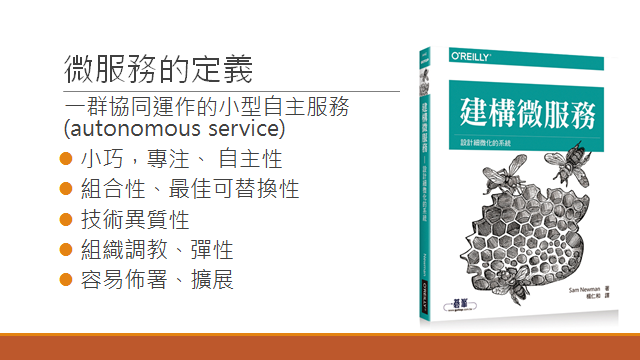
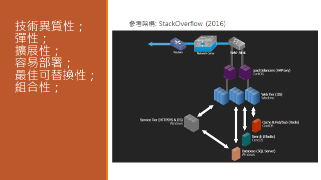

微服務這系列的文章暫停了三個月，不是沒興趣寫了，而是這幾個月都在 "還債" + "充電"，換了另一種形式在產出分享內容，同時
也花了些時間累積微服務的基礎建設研究及評估經驗。我想分享的都是實際的開發及導入經驗，如果沒實際做過是寫不出來的.. 因此才暫停
文章的寫作計畫一陣子。

這幾個月，工作的方向做了些轉變，不變的是我仍然在 .NET & 微服務架構開發與導入這領域努力。在這陣子，幾個單位
也不約而同的找我分享這些內容，因此就 microservices & windows containers 這領域，有這幾場現場的演講 & 互動:

1. [DevOps Taipei](https://www.facebook.com/groups/DevOpsTaiwan/?fref=ts), [這一夜讓我們來聊聊 Microservices](http://devops.kktix.cc/events/meetup4-cm-tools-96091c-b7dd89)
> http://blog.chengweichen.com/2017/02/devops-taiwan-meetup-4.html

微服務的架構與觀念，以及導入時要留意的陷阱。導入微服務架構，最重要的是了解微服務能解決你現有的那些問題，最忌諱的就是一窩蜂的
改寫 + 擁抱新技術，這樣會得不償失。這個 session 則是我親身執行過的案例經驗分享。

1. [Study4.TW](https://www.facebook.com/Study4.tw/?fref=ts), [Visual Studio Everywhere 台北場](http://study4-tw.kktix.cc/events/study4devtaipei)
> https://www.facebook.com/pg/Study4.tw/photos/?tab=album&album_id=1263376603748230

專注在 .NET 開發人員，為甚麼一定要關注 windows container 這項技術? 容器化的部署方式，已經是大家關注的焦點了。
也被認定是要落實 DevOps 的必要技術之一。不過身為 .NET 開發人員，總覺得 container 技術離 .NET 還很遙遠，因為
目前主流的容器化應用，都還是在 linux 平台上面的 docker. windows container 在去年年底推出，讓 .NET 開發人員也開始
有機會接觸容器化的部署技術了。這個 session 則是針對 .NET 開發人員的 windows container 介紹及 demo 。

1. [TibaMe](), 線上課程

windows container 入門，與 docker / microservice 的背景介紹。課程要傳遞的概念與 VS Everywhere 的那場一樣，只是
形式是以線上課程 (video) 為主。總時數約 6 hr, 因此在觀念，架構以及實作 Labs 講得比較仔細。

1. [TibaMe](), 線上讀書會

windows container 入門，以及實際的開發 / 部署 demo。包含 windows container, hyper-v container, docker-compose
這是 TibaMe 配合線上課程安排的推廣活動之一，因此內容也是線上課程的延伸。時間只有一個小時，因此我把重點擺在觀念介紹 (15min)，
而保留大部分時間在操作及 demo, 同時也保留了 20min 給現場在線上的朋友們提問及討論。希望藉著線上互動的方式，解決自己在看
影片或是文章時，無法搞清楚的一些細節及觀念問題。

四個場子的屬性都不大一樣，每場講的都是 .NET + Microservices + Windows Container, 只不過重點擺的地方都不同。
每場講完都覺得有點缺憾，有些重點沒時間帶到。我還是擅長用寫的啊，寫下來的東西總是比用講的精確。因此我就補了這篇文章，
希望把這四個場次的分享重點都串起來。沒機會參加前面幾場的朋友們，可以看這篇文章；有參加過的朋友也可以看看文章，補上了
我沒機會在現場提到的重點。

<!--more-->



--

## 本文開始

1. "微服務" 是什麼?

先寫在前面，微服務只是個架構的設計參考方向，他並不是個 "問題"，也不應該是個 "目標"，他只是解決某些問題的 "方法"。因此，
若你不清楚你面對的是什麼問題，也不清楚你期望的目標是什麼，就只因為聽到微服務很棒，就要毅然決然地把整套系統砍掉重練，改成
微服務架構，那是很不切實際的。錯誤的決定，很有可能拖垮整個團隊。因此說明清楚這些前因後果，就是我這個段落主要的目的。

我先簡單的對 "微服務" 下個定義吧。字面上來說，就是把單體式的系統 (monolitch), 拆解成多個獨立的小服務, 再靠 API 把彼此
串聯起來的架構，就是 "微服務" 了。

微服務會變熱門，基本 (理想的) 概念就是: 現今軟體的複雜度越來越高，越大型的軟體，維護的成本是呈指數上升的。一個規模是 N 倍的軟體，維護
成本可能是 N^2 .. 若把它拆成 N 個獨立的服務，那麼維護的成本就變成線性的 N 倍了..

不過別忘了，微服務本身就是個分散式系統，分散式系統有它先天的複雜度，包含網路通訊不可靠，要維持資料的一致性就是個考驗，加上
跨服務的 bug 追查難度更高等等，都是個挑戰，都會讓維護的成本上升。

貼一下我在 DevOps #4 這場分享的幾張投影片:

就上面講的特性，我把常見的幾個關鍵字抓出來了。如果你對這些微服務的設計 guideline 有興趣，那右邊那本書很推薦，值得一讀。

這兩張投影片，我想表達的是同一件事，就是你的商業邏輯，到底要按照什麼樣的法則來切割才洽當? 整個微服務架構導入的過程中，我認為
最困難的就是這點了。這才是關鍵啊! 在談論這點之前，先來看看有那些部分是技術上 "適合" 切割的?

若你檢視你的系統架構，發現有明顯的系統邊界 (如上圖)，有某些模組之間有很複雜的連結 (高內聚)，某些模組之間的關聯則很鬆散 (低耦合)，
那麼這些地方就是技術上適合切割微服務的點。問題是，只要有這種狀況，都是適合切割的地方嗎?

答案是否定的。這是很容易犯的錯誤，別說是新手了，連我都踩進這個陷阱好幾次。很多時候，技術導向的團隊，很容易把一切決策都導向到
技術角度來判斷。我問這個問題很明顯是個陷阱，真正的狀況應該是: 你要評估切割之後，是否有解決你的問題? 康威定律提到一點，系統的架構
會跟組織的架構有高度相關，你的組織怎麼分工的，也會連帶影響到你的系統架構設計。這裡就是一例，你應該回頭檢視，切割之後是否你的系統
架構，會更貼近你組織的運作方式? 如果答案是肯定的，這樣的切割才會對你的整體運作有幫助。

其實這不是新課題，只是因為微服務，這些議題被放大重新拿出來討論罷了。在 DevOps #4 這個場子，我提了一個觀點，也是我過去廿年來一直有的
想法。其實軟體工程講求的原則一直都沒變啊! 我永遠記得當年大學時代，我初次接觸 C++ 也初次接觸物件導向技術時，當時我的啟蒙書籍就是那本
知名的 "世紀末軟體革命"。裡面講到很重要的一點，物件導向就是在 "模擬世界、加以處理"。

這句話我到現在都還記得，因為這就是物件導向之所以能解決問題的核心概念啊! 不知各位有沒有想過，為何我們總是在抱怨客戶或是老闆改規格，
客戶嘴上說把某個按鈕拿掉，我們背後的程式碼架構就得整個翻掉? 但是總是有些厲害的團隊，就是能很快的反應客戶的需求? 我想關鍵就在於
你的系統架構有沒有跟真實的流程做對應。

使用者會認為改個按鈕很簡單，因為他的想法會建構在不改變他的流程為前提，所以他會認為改個按鈕是很容易的事情。系統能不能對應很簡單的做出
改變，關鍵就在於系統的流程跟實際的流程有多貼近了。如果你有按照 OOP 的核心概念 "模擬世界，加以處理" 來設計的話，實際處理過程中會碰到的
人、系統，傳遞的資訊，接受訊息後的反應等等，都有一一的在程式碼裡面做對應，那改變就會真的很容易。

同樣的道理，OOP 講的是在單一軟體系統架構內，你程式碼組織的方式。把這個想法擴大到整個分散式系統，那麼原本 OOP 講的 object / class, 
不就也對應的擴大到 microservices 了嗎? 如果你的服務與服務之間的架構，能跟組織裡的運作邏輯一一對應的話，那這架構就是適合你的架構。

我很常做的一件事，就是拿 UML use case diagram (雖然這是老技術了，不過你能用的透徹的話還是很好用的)，拿來跟我的微服務架構圖來對照。
如果設計得當的話，兩張圖應該是能夠對應得起來的。因此，該怎麼切割? 應該先從這個觀點來看才對! 如果架構上適合，技術上也容易執行，那是
最完美的狀況了，沒什麼好考慮的了。

若是流程上適合切割的地方，技術上卻有不少困難，那代表背後的架構跟實際的組織流程並沒有很好的對應。這時不要急著做微服務的切割 (這就是
我一直說的本末倒置)，而是先將系統重構到合理的狀況後，再來進行切割。

看到這邊，你有掉進這個問題的陷阱嗎?

## 使用微服務的理由 #2, 技術異質性

這張圖是我很喜歡舉的例子，因為我覺得她很有代表性，尤其是 stackoverflow.com 這網站在開發人員心中的價值更是無可取代。stackoverflow.com
在 2016/04 公布的這張架構圖，給我很大的啟發。為何這個全球開發人員眼中指標性的網站，願意採用這麼特別的架構? 用 .NET 開發網站的核心部分，
卻在部署時大量使用了 Linux / Open Source 的其他服務 (Redis, Elastic, HAProxy...) ?

這在我之前幾篇文章也聊過，他們絕對不會是用 "Linux免費" 這種小兒科的理由，而是有更好的理由說服他們的架構師做這樣的決定。我看了微服務架構
之後就瞬間了解了 (雖然 stackoverflow.com 還稱不上是 100% 的微服務，我把他稱作 microservice ready)，當它們能克服異質性的系統維護及部署
的門檻時，它們就會願意以架構為主，在每個不同的服務都採用業界最佳的 solution, 而不是優先考量你用的是甚麼平台? 是 Java or .NET? 思考的高度
不同，高下立判。

微服務 + 容器技術，直接把這個特色發揮到淋漓盡致了。容器化的技術大幅降低部署的困難度，Windows Container 的出現，更把這種異質性架構的
門檻降到最低了。這時平台是 windows or linux 已經不會再是左右你選擇的主要考量了，你大可挑選業界最佳的個別服務，來組裝你的 application。
包括採用的基礎建設，挑選現成的服務，以及決定自行開發的服務及平台。

這是很大的突破，轉眼間 .NET / Java / PHP 不再是派別的對立，而是可以讓團隊自由選擇採納的開發平台。唯一的考量是: 這平台適合拿來開發這服務嗎?
我的團隊對這個平台是否有足夠的掌握能力?

## 轉移: 切割服務邊界

我一項都是從 top -> down 的方向來思考的，這樣才不會被細微的技術考量牽著鼻子跑。當我看到微服務長遠帶來的效益時，接下來就不用考量要不要做了，
而是該怎樣跨出第一步?

很多有經驗的架構師都說，微服務不是 "設計" 出來的，而是調整修改，分割出來的。這講的一點都沒錯，別急著把你既有服務通通丟掉重寫 (這樣一定會失敗 XD)
而是好好地檢視你現有的系統，評估看看該如何進行重構，將他調整成適合的樣子?

在開始之前，先來看看，在軟體開發的領域內，有哪些方法可以 "reuse" 既有的服務? level 從低階到高階，分別是:

- share codes (concepts)
- share library (binaries, components)
- component (service process)
- service (service instance)

最低階的，就是 sample code 這種 level 了。我寫一段 sample 給你參考，你拿回去修修改改，放在你自己的 application 內使用，這就是最低階的 code reuse.
reuse 的部分直接緊密的混雜在你的 code 內，完全沒有隔離或是保護管理的機制。我們常常上 stackoverflow.com 查問題就是這種模式。看到有高手的 solution, 
我們就貼回來測看看，成功了就用了... 只是，往後的更新就要自己負責了。

再高階一點，就是 share library 了。這模式之下，開始有專門的人負責維護這個 library, 不定時的釋出更新版本。你不需要重新修改程式，只需要更新 DLL 就可以
了 (除非有 breaking change, 必須調整你的 code 之外)。reuse 的部分通常會有 language 或是 runtime 的機制保護隔離，例如不同 library 之間，宣告為
internal 的東西就不能跨越 library 使用。更新或部署，也是以 DLL 檔案為單位，你只要管理好版本及相依姓，你是可以個別維護及更新 library 的。
這模式下的維護成本就下降了不少，你只要記得不定期更新 DLL 即可。在一些套件管理工具的協助下 (如: NuGet)，這件事相對得更容易，你可以輕易地取得
最新版本的 library, 放在你的 application 內。

再往上一階，我把他稱作 component, 有用過當年的 COM+，或是 EJB 的朋友，可能比較能了解我想表達的。要共用的服務，已經被包裝成 component, 並且有專屬的
hosting 環境來管理你的 component. 隔離的層級更高了，通常至少都會是獨立的 process 來運行 component, 彼此支籤再透過 IPC (inter process communication)
或是 RPC 的機制溝通。只要他執行起來，就會有專屬的 process 來服務你。某種程度下，這模式已經開始嘗試解決 SOA , container 等等新技術
想解決的問題了，只是層次還差太遠，終究現在逐漸的沒落了。

最上一層，就是獨立的 service 了。跟 component 類似，他是完全獨立於你的 application 的，有可能只是不同的 process, 但是更常見的是不同的 host, 透過
網路的呼叫來溝通。這種層級之下，跨越機器的協作，靠的是約定好的 network protocol. 通常這條件下，不會限制你使用的 OS, 開發平台等等，只要大家講的
是同一個 protocol 就夠了。這是最高的層級，不但能夠跨越機器，還能採用 scale out, 採用大量的服務 instance 來提高整體效能。

為何要講這麼多? 因為這是我歸納軟體 reuse 既有的 code 的方法。微服務講求的是將 application 切割成多個獨立的服務，每個服務可以部署多個 instance.
如果你無法一步到位，你可以試著思考看看，能不能往上 (較低階) 一個層級，檢視看看是否有辦法在上一個層級完成切割? 例如你已經把邏輯獨立成 library, 
之後要將他在獨立成 componet or service, 難度就會降低了。

<!-- reference: NGINX 重構的幾種方法介紹 -->
