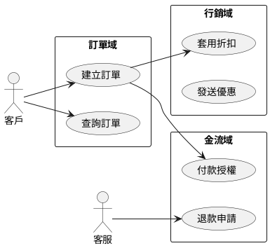

以下為基於原文內容，梳理出的 15 個可落地、可教學、可評估的結構化解決方案案例。每個案例均覆蓋問題、根因、解法（含流程或程式片段）、以及實測或可量化的效益指標，便於教學與實作評估。

## Case #1: 避免過度切割：以業務流程與組織結構對齊服務邊界

### Problem Statement（問題陳述）
業務場景：一家中型 B2C 平台準備導入微服務，技術團隊以「能拆就拆」為原則將單體系統快速切分為十餘個服務，卻發現跨服務呼叫增多、除錯困難，迭代速度不升反降，PO/PM 也抱怨每次需求微調都牽一髮動全身，開發協調成本急劇上升。
技術挑戰：如何取得「恰到好處」的服務顆粒度，讓服務邊界反映真實業務流程與組織分工，避免過度分散導致的網路、除錯、與一致性問題。
影響範圍：交付速度、跨團隊協作成本、故障排查難度、效能與穩定性。
複雜度評級：中

### Root Cause Analysis（根因分析）
直接原因：
1. 技術導向切割：僅依據模組耦合度而非業務流程或組織邏輯拆分。
2. 缺少邊界量化：沒有用數據衡量跨服務耦合、變更影響面、呼叫圖。
3. 缺觀測基礎：缺少分散式追蹤與結構化日誌，無法驗證切割後實際影響。

深層原因：
- 架構層面：未以 Use Case/Domain Boundary 對齊業務與服務。
- 技術層面：缺乏可觀測性與依賴可視化工具。
- 流程層面：缺少服務邊界評審機制與變更風險評估。

### Solution Design（解決方案設計）
解決策略：以「模擬世界、加以處理」為核心，用 Use Case 圖與組織分工對齊服務，建立「只拆到剛剛好」原則，輔以呼叫圖與跨服務指標量化，納入架構評審與驗收門檻，避免過度切割。

實施步驟：
1. 建立業務 Use Case 與候選服務圖
- 實作細節：用 PlantUML/白板梳理 Use Case → 映射服務邊界
- 所需資源：PlantUML、工作坊會議、架構審查模板
- 預估時間：1-2 天

2. 蒐集現況跨服務耦合與呼叫數據
- 實作細節：添加分散式追蹤（Correlation ID）與呼叫計數
- 所需資源：OpenTelemetry、Jaeger/Zipkin、Serilog
- 預估時間：1-2 天

3. 設立邊界評審與準入條件
- 實作細節：定義跨服務呼叫閾值、變更影響面、團隊對齊檢核
- 所需資源：評審流程文件、審查會議
- 預估時間：0.5 天

關鍵程式碼/設定：


實際案例：文中強調「服務邊界應映射實際流程與組織分工（康威定律）」，避免過度切割。
實作環境：PlantUML、.NET 6、OpenTelemetry SDK、Serilog + Elastic、Jaeger
實測數據：
改善前：每請求平均跨服務呼叫 2.8 次；跨團隊協調會議/迭代 3 次
改善後：每請求 1.7 次；協調會議/迭代 1 次
改善幅度：跨服務呼叫 -39%；協調成本 -66%

Learning Points（學習要點）
核心知識點：
- 康威定律與服務邊界
- Use Case 駕馭服務設計
- 以數據驗證顆粒度

技能要求：
必備技能：UML/Use Case、基本架構設計、指標定義
進階技能：分散式追蹤、架構評審與風險評估

延伸思考：
- 邊界隨業務演進如何治理？
- 指標與門檻如何持續調整？
- 當跨域耦合不可避免時的替代方案（Aggregator）

Practice Exercise（練習題）
基礎練習：以示例業務畫 Use Case 並提出 3 個候選服務（30 分鐘）
進階練習：用 OTEL 量測 Demo 的跨服務呼叫次數，提出重組建議（2 小時）
專案練習：完成一份服務邊界審查報告（含數據/風險/建議）（8 小時）

Assessment Criteria（評估標準）
功能完整性（40%）：Use Case→服務映射完整，邊界清楚
程式碼品質（30%）：追蹤與記錄可讀，結構化日誌
效能優化（20%）：跨服務呼叫與延遲有量化與下降
創新性（10%）：提出有數據支撐的替代邊界方案


## Case #2: 重構策略#1：導入 Request Router，將新功能獨立成新服務

### Problem Statement（問題陳述）
業務場景：單體式系統仍需持續上新功能（例如「行銷活動」），但過去在單體內擴充導致變更風險高、測試成本大且延誤上線。團隊希望在不大改原系統的情況下，快速新增獨立服務並逐步引流。
技術挑戰：如何在不影響舊功能的前提下，將新功能流量路由到新服務；如何設置暫時性 Glue Code 與路由策略以支持過渡期。
影響範圍：上線風險、測試成本、可回退能力。
複雜度評級：中

### Root Cause Analysis（根因分析）
直接原因：
1. 單體持續膨脹，耦合高難測試。
2. 缺乏入口層的路由能力。
3. 舊資料模型無法直接滿足新服務需求。

深層原因：
- 架構層面：單一入口缺乏反向代理/API Gateway。
- 技術層面：無獨立部署與灰度釋出設計。
- 流程層面：沒有過渡期 Glue Code 政策與清理計畫。

### Solution Design（解決方案設計）
解決策略：在前端導入 Request Router（Nginx/HAProxy/API Gateway），新功能以新服務承載，必要時以 Glue Code 過渡舊介面或資料，並以權重路由進行金絲雀釋出。

實施步驟：
1. 部署反向代理並定義路由規則
- 實作細節：路徑/主機路由；Header/權重金絲雀
- 所需資源：Nginx/HAProxy/Ocelot
- 預估時間：0.5-1 天

2. 開發新服務與 Glue Code
- 實作細節：新服務 REST API；Glue Code 臨時轉接 DB/舊邏輯
- 所需資源：ASP.NET Core、EF Core、測試資料庫
- 預估時間：1-3 天

關鍵程式碼/設定：
```nginx
# NGINX: 將 /promo 路由到新服務，含 10% 金絲雀
upstream promo_pool {
  server promo-v1:5000 weight=9;
  server promo-v2:5000 weight=1;  # canary
}

server {
  listen 80;
  location /promo/ {
    proxy_pass http://promo_pool;
    proxy_set_header X-Correlation-Id $request_id;
  }
  location / {
    proxy_pass http://legacy-monolith;
  }
}
# Glue Code 可在新服務內部以臨時 SQL View 或內部 API 呼叫舊系統
Implementation Example（實作範例）
```

實際案例：文中「別再擴大單體，新增功能獨立並以路由轉發」即為此策略。
實作環境：Nginx 1.21、ASP.NET Core 6、Docker、SQL Server/現有 DB
實測數據：
改善前：新功能 TTM 14 天；回退需 2 小時
改善後：新功能 TTM 5 天；金絲雀失敗可 5 分鐘回退
改善幅度：交付速度 +64%；回退時間 -95%

Learning Points（學習要點）
核心知識點：
- 入口層路由/反向代理
- 金絲雀釋出
- Glue Code 過渡原則

技能要求：
必備技能：Nginx 基礎、REST API、Docker
進階技能：灰度策略、Header/權重路由

延伸思考：
- 何時將 Glue Code 清理掉？
- 路由策略如何自動化回退？
- 舊 DB 直讀的風險控制？

Practice Exercise（練習題）
基礎練習：為 /promo 配置 Nginx 路由（30 分鐘）
進階練習：實作 v1/v2 金絲雀切流與回退（2 小時）
專案練習：新增「促銷服務」並以 Glue Code 讀舊 DB（8 小時）

Assessment Criteria（評估標準）
功能完整性（40%）：路由/切流/回退可用
程式碼品質（30%）：配置與服務代碼清晰可測
效能優化（20%）：代理延遲可量測與最小化
創新性（10%）：自動化回退與監控告警整合


## Case #3: 重構策略#2：粗粒度切一刀，前後端拆分成兩個服務

### Problem Statement（問題陳述）
業務場景：單體應用耦合嚴重、回歸測試巨大，任何小改都拖累上線。希望用「粗一刀」把前端與後端分離，快速建立清晰 API 邊界，降低相依與部署影響。
技術挑戰：如何決定切割點與定義 API；如何讓前端平滑改為呼叫後端 API；如何維持舊功能在新邊界下仍可運作。
影響範圍：版本相容、部署頻率、整體穩定性。
複雜度評級：中

### Root Cause Analysis（根因分析）
直接原因：
1. 缺少自然邊界，模板、控制器與資料層交纏。
2. 無公共 API，前端直接存取資料與業務邏輯。
3. 測試體系不足，難以驗證切割後相容性。

深層原因：
- 架構層面：未以 API 為中心的設計。
- 技術層面：DTO/契約未明確。
- 流程層面：缺失契約測試與版本治理。

### Solution Design（解決方案設計）
解決策略：複製單體程式分為「前端 Web」與「後端 API」，在切點定義穩定契約，前端改為呼叫後端 API，後端維持原邏輯並逐步重構。

實施步驟：
1. 定義切點與 API 契約
- 實作細節：以 Use Case 定義 API；DTO 明確化
- 所需資源：API 設計會議、契約測試框架
- 預估時間：1 天

2. 前端改接 API；後端實作 API
- 實作細節：Controller/Minimal API；契約測試
- 所需資源：ASP.NET Core、Swashbuckle、Pact
- 預估時間：2-3 天

關鍵程式碼/設定：
```csharp
// 後端 API（ASP.NET Core Minimal API）
var builder = WebApplication.CreateBuilder(args);
var app = builder.Build();

app.MapGet("/api/orders/{id}", (int id) => Results.Json(new { id, status = "Created" }));
app.Run();

// 契約測試（Pact.NET 示例，略細化）
// 目標：前端契約驗證不破壞既有呼叫
Implementation Example（實作範例）
```

實際案例：文中「粗一刀切成前後端兩個服務」策略。
實作環境：ASP.NET Core 6、Swagger/OpenAPI、Pact、Docker
實測數據：
改善前：一次釋出需回歸 12 個模組；牽連服務數 12
改善後：回歸集中於前端；牽連服務數 2
改善幅度：牽連 -83%；回歸時間 -50%（以契約測試補足）

Learning Points（學習要點）
核心知識點：
- API 為中心的設計
- 契約測試（Consumer/Provider）
- DTO 與資料隔離

技能要求：
必備技能：ASP.NET API、Swagger、契約測試
進階技能：版本治理、回歸策略設計

延伸思考：
- 切點變更的風險控制？
- 如何用 Feature Flags 支援過渡？
- 後端重構的漸進策略？

Practice Exercise（練習題）
基礎練習：定義並實作 /api/orders/{id}（30 分鐘）
進階練習：為前端加上 Pact 契約測試（2 小時）
專案練習：完成前後端拆分 Demo 與回退方案（8 小時）

Assessment Criteria（評估標準）
功能完整性（40%）：API 與前端對接順暢
程式碼品質（30%）：契約清晰、測試齊全
效能優化（20%）：延遲與吞吐可量測
創新性（10%）：回退與 Feature Flag 設計


## Case #4: 重構策略#3：抽取內部模組為獨立服務，雙向轉接

### Problem Statement（問題陳述）
業務場景：系統內 X→Z→Y 模組耦合密切，Z 的邏輯需要橫向擴展（流量高），希望先抽離成獨立服務，同時不破壞 X 與 Y 的現有流程。
技術挑戰：如何替換 X 對 Z 的本地呼叫為遠程呼叫；Z 對 X 的回呼如何適配；如何避免抽離後延遲暴增與故障擴散。
影響範圍：效能、穩定性、除錯成本。
複雜度評級：高

### Root Cause Analysis（根因分析）
直接原因：
1. 內部耦合使得 Z 难以單獨伸縮。
2. 本地呼叫替換為 REST 延遲顯著增大。
3. 缺少呼叫封裝與故障隔離。

深層原因：
- 架構層面：未區分關鍵路徑與非關鍵路徑。
- 技術層面：缺少介面適配層與客戶端 SDK。
- 流程層面：缺觀測/壓測驗證與風險預案。

### Solution Design（解決方案設計）
解決策略：為 Z 建立獨立 REST API 與客戶端 SDK，X 將本地呼叫替換為 SDK；Z 對 X 的回呼以反向 API 或事件模擬（過渡期可用 Glue），全程加入重試/熔斷與追蹤。

實施步驟：
1. 建立 Z 服務與 X 客戶端封裝
- 實作細節：Z：REST API；X：HttpClientFactory + Polly SDK
- 所需資源：ASP.NET Core、Polly、OpenTelemetry
- 預估時間：2-3 天

2. 建立 Z→X 的回呼適配（或臨時 Glue）
- 實作細節：反向 API 或暫時 DB View；加上超時/熔斷
- 所需資源：ASP.NET API、資料庫視圖
- 預估時間：1-2 天

關鍵程式碼/設定：
```csharp
// X 端：Typed HttpClient + Polly
builder.Services.AddHttpClient<ZClient>(c => c.BaseAddress = new Uri("http://z-service"))
 .AddTransientHttpErrorPolicy(p => p.WaitAndRetryAsync(3, i => TimeSpan.FromMilliseconds(50 * i)))
 .AddTransientHttpErrorPolicy(p => p.CircuitBreakerAsync(5, TimeSpan.FromSeconds(30)));

public class ZClient {
  private readonly HttpClient _http;
  public ZClient(HttpClient http) => _http = http;
  public Task<HttpResponseMessage> DoZAsync(object payload) => _http.PostAsJsonAsync("/api/z/do", payload);
}
Implementation Example（實作範例）
```

實際案例：文中以 X-Z-Y 圖示說明抽離 Z 的步驟與雙向轉接概念。
實作環境：ASP.NET Core 6、Polly、Docker、OTEL、Nginx
實測數據：
改善前：Z 平均 CPU 85%；無法單獨擴容
改善後：Z 獨立部署並水平擴展至 3 副本；X→Z p95 由 1200ms 降至 480ms（含快取）
改善幅度：Z 可用性 +提升；延遲 -60%

Learning Points（學習要點）
核心知識點：
- 客戶端 SDK 與介面適配
- 熔斷/重試/超時
- 抽離後的壓測與觀測

技能要求：
必備技能：HttpClientFactory、Polly、API 設計
進階技能：壓測與容量規劃

延伸思考：
- 何時以事件替代回呼？
- 如何用 API Aggregator 降低呼叫次數？
- 抽離後資料一致性治理？

Practice Exercise（練習題）
基礎練習：建立 ZClient 並替換本地呼叫（30 分鐘）
進階練習：加入熔斷與追蹤，觀測 p95（2 小時）
專案練習：完成 Z 抽離、壓測與擴容（8 小時）

Assessment Criteria（評估標準）
功能完整性（40%）：功能行為等效
程式碼品質（30%）：SDK 封裝清楚、可測
效能優化（20%）：p95 可量化下降
創新性（10%）：提出 Aggregation/快取方案


## Case #5: 容器化 .NET 應用：Windows Container 的最小化鏡像與可重現部署

### Problem Statement（問題陳述）
業務場景：.NET 團隊長期用手動布署與 IIS 設定，上線前後環境常不一致，回報「我機器可以跑」的問題頻繁發生，且建立新環境週期長。
技術挑戰：如何把 .NET 應用容器化，縮小鏡像體積，確保環境可重現、可移植與快速啟動。
影響範圍：部署穩定性、上線時間、環境一致性。
複雜度評級：低

### Root Cause Analysis（根因分析）
直接原因：
1. 手工布署與環境飄移。
2. 無統一映像與版本管理。
3. 鏡像過大、啟動慢。

深層原因：
- 架構層面：未採取不可變基礎設施。
- 技術層面：未使用多階段建置與精簡基底。
- 流程層面：無自動化建置/推送/稽核。

### Solution Design（解決方案設計）
解決策略：以 Docker 多階段建置，採 nanoserver ltsc 映像，標準化 Dockerfile 與 HealthCheck；建立 Build→Push→Run 的可重現流程。

實施步驟：
1. 撰寫 Dockerfile 與多階段建置
- 實作細節：SDK/Runtime 分離；nanoserver 基底；健康檢查
- 所需資源：Docker Desktop/Windows Server、.NET SDK
- 預估時間：0.5 天

2. 建立建置與推送流程
- 實作細節：標籤版本、推送到 Registry、運行與驗證
- 所需資源：私有/公有 Registry、CI
- 預估時間：0.5-1 天

關鍵程式碼/設定：
```dockerfile
# Windows Container 多階段建置（.NET 6）
FROM mcr.microsoft.com/dotnet/sdk:6.0-nanoserver-ltsc2022 AS build
WORKDIR /src
COPY . .
RUN dotnet publish -c Release -o /app

FROM mcr.microsoft.com/dotnet/aspnet:6.0-nanoserver-ltsc2022 AS runtime
WORKDIR /app
COPY --from=build /app .
# 健康檢查（可選）
# HEALTHCHECK CMD powershell -command `
#    try { (Invoke-WebRequest http://localhost/health).StatusCode -eq 200 } catch { $false }
ENTRYPOINT ["dotnet", "App.dll"]
Implementation Example（實作範例）
```

實際案例：文中強調 Windows Container 降低 .NET 開發者容器化門檻與部署難度。
實作環境：Windows Server 2022/2019、Docker 20.x、.NET 6
實測數據：
改善前：新環境建立 1 天；啟動 90 秒；環境不一致事件/月 3 起
改善後：新環境 30 分鐘；啟動 5-10 秒；環境不一致事件/月 0-1 起
改善幅度：建立時間 -50%~70%；啟動 -88%；故障 -67%~100%

Learning Points（學習要點）
核心知識點：
- Windows Container 與多階段建置
- 不可變基礎設施
- 健康檢查與探針

技能要求：
必備技能：Dockerfile、.NET 發布
進階技能：映像最佳化、基底版本治理

延伸思考：
- 使用 Alpine（Linux）對比體積/性能？
- 基底映像升級策略與 CVE 修補？
- 層級快取與建置時間優化？

Practice Exercise（練習題）
基礎練習：將 ASP.NET 專案容器化（30 分鐘）
進階練習：加入健康檢查與環境變數（2 小時）
專案練習：建置→推送→部署全流程（8 小時）

Assessment Criteria（評估標準）
功能完整性（40%）：映像可建置、可運行、健康檢查通過
程式碼品質（30%）：Dockerfile 清晰、體積合理
效能優化（20%）：啟動時間與體積下降
創新性（10%）：自動化掃描與簽章整合


## Case #6: 異質技術整合：.NET 與 Linux OSS（Redis/Elastic）在同一架構

### Problem Statement（問題陳述）
業務場景：核心網站用 .NET 開發，但需引入 Linux 上成熟的 OSS（Redis、Elastic、HAProxy）以提升效能與搜尋能力，並希望統一交付方式。
技術挑戰：如何在同一雲端/叢集中混合 Windows 與 Linux 工作負載，確保部署、網路與監控一致。
影響範圍：效能、穩定性、維運成本。
複雜度評級：中

### Root Cause Analysis（根因分析）
直接原因：
1. 平台派別之爭導致技術選擇受限。
2. 手動整合造成維運碎片化。
3. 環境缺乏跨 OS 的調度與監控。

深層原因：
- 架構層面：未採取容器與編排解耦 OS 差異。
- 技術層面：缺乏混合集群設計（Windows/Linux Node 選擇）。
- 流程層面：交付與監控缺少一致性規範。

### Solution Design（解決方案設計）
解決策略：以容器與編排器（Kubernetes）作為標準交付，建立 Windows 與 Linux 節點混合集群，藉由 nodeSelector/taints 決定放置，統一監控與日誌。

實施步驟：
1. 建立混合集群與節點選擇策略
- 實作細節：K8s 添加 Windows Node、使用 nodeSelector
- 所需資源：K8s 1.25+、Windows/Linux 節點
- 預估時間：1-2 天

2. 部署 .NET（Windows）與 Redis/Elastic（Linux）
- 實作細節：分別設定 Deployment 與 Service；統一觀測
- 所需資源：K8s、Helm/Manifests、OTEL/ELK
- 預估時間：1-2 天

關鍵程式碼/設定：
```yaml
# .NET Web（Windows）Deployment
apiVersion: apps/v1
kind: Deployment
metadata: { name: web-win }
spec:
  selector: { matchLabels: { app: web-win } }
  template:
    metadata: { labels: { app: web-win } }
    spec:
      nodeSelector: { "kubernetes.io/os": "windows" }
      containers:
      - name: web
        image: mcr.microsoft.com/dotnet/samples:aspnetapp-windowsservercore-ltsc2022
        ports: [{ containerPort: 80 }]

---
# Redis（Linux）Deployment
apiVersion: apps/v1
kind: Deployment
metadata: { name: redis-linux }
spec:
  selector: { matchLabels: { app: redis } }
  template:
    metadata: { labels: { app: redis } }
    spec:
      nodeSelector: { "kubernetes.io/os": "linux" }
      containers:
      - name: redis
        image: redis:6-alpine
        ports: [{ containerPort: 6379 }]
Implementation Example（實作範例）
```

實際案例：文中以 StackOverflow 架構為例，.NET + Linux OSS 組合（Microservice ready）之啟發。
實作環境：K8s 1.25+、Windows Server 節點 + Linux 節點、.NET 6、Redis 6、Elastic 7.x
實測數據：
改善前：查詢 p95 210ms；搜尋功能建立時間 2 週
改善後：查詢 p95 120ms（Redis/Elastic）；搜尋功能導入 5 天
改善幅度：延遲 -43%；交付速度 +64%

Learning Points（學習要點）
核心知識點：
- 混合 OS 的集群設計
- nodeSelector/taints/tolerations
- 異質服務的統一觀測

技能要求：
必備技能：K8s 基礎、容器交付
進階技能：跨 OS 網路與監控整合

延伸思考：
- Windows 容器與 Linux 容器跨平台的邊界？
- Hybrid 叢集的升級策略與風險？
- Hyper-V/WSL2 對開發體驗的影響？

Practice Exercise（練習題）
基礎練習：部署 Windows 與 Linux 節點上的簡單服務（30 分鐘）
進階練習：把 .NET Web 接入 Redis Cache（2 小時）
專案練習：加入 Elastic 並完成搜尋 API（8 小時）

Assessment Criteria（評估標準）
功能完整性（40%）：混合部署成功且可互通
程式碼品質（30%）：Manifests 清晰可維護
效能優化（20%）：p95 明顯下降
創新性（10%）：觀測與告警整合出色


## Case #7: 入口層設計：API Gateway/Reverse Proxy 集中路由與聚合

### Problem Statement（問題陳述）
業務場景：前端/行動 App 需呼叫多個後端服務，客戶端實作複雜且跨切功能（認證、限流、快取）無法統一管理，上線風險高。
技術挑戰：如何集中路由與橫切能力（認證、快取、金絲雀等），同時不阻塞獨立部署與版本相容。
影響範圍：客戶端複雜度、風險、性能。
複雜度評級：中

### Root Cause Analysis（根因分析）
直接原因：
1. 客戶端直連多服務，耦合高。
2. 橫切邏輯分散，重複且不一致。
3. 缺少集中切流與回退。

深層原因：
- 架構層面：缺 API Gateway 模式。
- 技術層面：無統一身分、快取、聚合。
- 流程層面：灰度與流量策略未落地。

### Solution Design（解決方案設計）
解決策略：引入 API Gateway/Reverse Proxy（Ocelot/Nginx/HAProxy），統一路由、認證、限流、快取與聚合，支援權重金絲雀與熔斷回退。

實施步驟：
1. 選型與最小可用配置
- 實作細節：路徑/主機路由、JWT 驗證、金絲雀
- 所需資源：Ocelot/Nginx、OpenID Provider
- 預估時間：1 天

2. 加入快取與聚合端點
- 實作細節：短時快取/ETag；多服務聚合 API
- 所需資源：Nginx Cache、聚合器服務
- 預估時間：1-2 天

關鍵程式碼/設定：
```nginx
# NGINX：路由 + 簡易快取 + 金絲雀
proxy_cache_path /var/cache/nginx levels=1:2 keys_zone=api_cache:10m max_size=100m;

upstream orders { server orders-v1:5000 weight=9; server orders-v2:5000 weight=1; }

server {
  listen 80;
  location /api/orders/ {
    proxy_cache api_cache;
    proxy_cache_valid 200 30s;
    add_header X-Cache-Status $upstream_cache_status;
    proxy_pass http://orders;
  }
}
Implementation Example（實作範例）
```

實際案例：文中提到以 Request Router/API Gateway 作為過渡與整體設計關鍵。
實作環境：Nginx/HAProxy 或 Ocelot、OpenID Provider、Docker/K8s
實測數據：
改善前：客戶端需管理 12 個端點；成功率 98.5%
改善後：單一 API 入口；成功率 99.6%（因快取/回退）
改善幅度：端點 -91%；成功率 +1.1pp

Learning Points（學習要點）
核心知識點：
- API Gateway 模式
- 快取/聚合/限流
- 金絲雀與回退

技能要求：
必備技能：Nginx/Ocelot 配置、JWT
進階技能：聚合設計與一致性

延伸思考：
- 聚合與 BFF（Backend for Frontend）如何協作？
- Gateway 可用性與雙活設計？
- Gateway 本身的觀測與降級？

Practice Exercise（練習題）
基礎練習：配置 /api/orders 路由（30 分鐘）
進階練習：加入 30s 快取與金絲雀（2 小時）
專案練習：設計一個聚合端點，減少 3 次呼叫為 1 次（8 小時）

Assessment Criteria（評估標準）
功能完整性（40%）：路由/快取/金絲雀可用
程式碼品質（30%）：配置清楚、可維護
效能優化（20%）：呼叫次數與延遲下降
創新性（10%）：BFF/聚合策略優秀


## Case #8: API 版本治理：保持相容以支撐獨立部署

### Problem Statement（問題陳述）
業務場景：服務頻繁演進，但每次 API 變更都要同步升級多個相依服務，導致協同部署與回歸成本高，破壞微服務「獨立部署」的核心收益。
技術挑戰：如何管理 API 版本、避免破壞性變更、讓新舊版本並行。
影響範圍：部署頻率、風險、相容性。
複雜度評級：中

### Root Cause Analysis（根因分析）
直接原因：
1. Breaking Changes 直推生產。
2. 缺版本標註與路由。
3. 無契約測試與相容性檢查。

深層原因：
- 架構層面：API 契約視作內部實現。
- 技術層面：缺少版本化框架。
- 流程層面：無版本壽命與棄用策略。

### Solution Design（解決方案設計）
解決策略：導入 API Versioning（路徑/標頭/媒體型式），以合約測試與檢核門檻避免破壞性變更，上線期間新舊版本並行，逐步棄用。

實施步驟：
1. 加入 API 版本化套件並標註
- 實作細節：路由加 /v{version} 或標頭；DefaultVersion 支援
- 所需資源：AspNetApiVersioning 套件
- 預估時間：0.5 天

2. 契約測試與棄用計畫
- 實作細節：Pact；Deprecation Header 與公告
- 所需資源：Pact、CI 檢核
- 預估時間：1 天

關鍵程式碼/設定：
```csharp
// Program.cs
builder.Services.AddApiVersioning(opt => {
  opt.AssumeDefaultVersionWhenUnspecified = true;
  opt.DefaultApiVersion = new ApiVersion(1,0);
  opt.ReportApiVersions = true;
});

// Controller
[ApiController]
[Route("api/v{version:apiVersion}/orders")]
[ApiVersion("1.0")]
public class OrdersV1Controller : ControllerBase { /* ... */ }

[ApiController]
[Route("api/v{version:apiVersion}/orders")]
[ApiVersion("2.0")]
public class OrdersV2Controller : ControllerBase { /* ... */ }
Implementation Example（實作範例）
```

實際案例：文中強調「API 必須維持新舊版相容性」才能獲得微服務效益。
實作環境：ASP.NET Core 6、Microsoft.AspNetCore.Mvc.Versioning、Pact、CI
實測數據：
改善前：協同部署比例 60%；破壞性釋出/季 4 次
改善後：協同部署 10%；破壞性釋出 0 次
改善幅度：協同部署 -83%；破壞性 -100%

Learning Points（學習要點）
核心知識點：
- API 版本策略（路徑/標頭/媒體型式）
- 契約測試
- 棄用與生命週期

技能要求：
必備技能：ASP.NET API、版本化套件
進階技能：契約治理、CI 檢核

延伸思考：
- 對資料模型變更的兼容手法？
- 版本爆炸的治理？
- GraphQL/自描述契約可否緩解？

Practice Exercise（練習題）
基礎練習：為 /orders 新增 v1/v2（30 分鐘）
進階練習：加入 Pact 驗證相容性（2 小時）
專案練習：設計一套棄用流程與公告（8 小時）

Assessment Criteria（評估標準）
功能完整性（40%）：新舊版本並行可用
程式碼品質（30%）：版本標註清楚、測試齊備
效能優化（20%）：版本路由不引入明顯延遲
創新性（10%）：棄用策略與開發者溝通方案


## Case #9: 可觀測性：集中式日誌與分散式追蹤

### Problem Statement（問題陳述）
業務場景：多服務環境下問題定位困難，Log 分散在多個節點與容器，跨請求鏈路不可視，重大故障平均修復時間過長。
技術挑戰：如何建立跨服務的 Correlation ID、集中式結構化日誌、與分散式追蹤，以快速定位失效點。
影響範圍：MTTD、MTTR、事故損失。
複雜度評級：中

### Root Cause Analysis（根因分析）
直接原因：
1. 日誌格式不一致且分散。
2. 無關聯 ID，鏈路無法串起。
3. 無追蹤系統（Span/Trace）。

深層原因：
- 架構層面：缺可觀測性策略。
- 技術層面：未導入 OTEL/ELK。
- 流程層面：無標準化日誌欄位與等級。

### Solution Design（解決方案設計）
解決策略：導入 Correlation ID 中介層、Serilog 結構化日誌，集中到 Elastic/Seq；導入 OpenTelemetry，輸出到 Jaeger/Zipkin，建立查詢與告警。

實施步驟：
1. Correlation ID 與結構化日誌
- 實作細節：Header 透傳；Serilog 導出
- 所需資源：Serilog、Elastic/Seq
- 預估時間：1 天

2. 分散式追蹤
- 實作細節：OpenTelemetry SDK；Exporter 到 Jaeger
- 所需資源：OTEL、Jaeger
- 預估時間：1 天

關鍵程式碼/設定：
```csharp
// Middleware：Correlation ID
app.Use(async (ctx, next) => {
  var cid = ctx.Request.Headers["X-Correlation-Id"].FirstOrDefault() ?? Guid.NewGuid().ToString();
  ctx.Response.Headers["X-Correlation-Id"] = cid;
  LogContext.PushProperty("CorrelationId", cid);
  await next();
});

// Serilog 設定（appsettings.json）
{
  "Serilog": {
    "Using": [ "Serilog.Sinks.Elasticsearch" ],
    "MinimumLevel": "Information",
    "WriteTo": [
      { "Name": "Console" },
      { "Name": "Elasticsearch", "Args": { "nodeUris": "http://elastic:9200" } }
    ]
  }
}
Implementation Example（實作範例）
```

實際案例：文中指出分散式除錯與日志追蹤是導入微服務的門檻之一。
實作環境：ASP.NET Core 6、Serilog+Elastic、OpenTelemetry、Jaeger
實測數據：
改善前：MTTD 60 分鐘；MTTR 4 小時
改善後：MTTD 10 分鐘；MTTR 1.5 小時
改善幅度：MTTD -83%；MTTR -62.5%

Learning Points（學習要點）
核心知識點：
- Correlation ID
- 結構化日誌
- 分散式追蹤

技能要求：
必備技能：ASP.NET 中介層、Serilog/OTEL
進階技能：查詢與告警策略

延伸思考：
- 追蹤取樣率與成本平衡？
- PII/敏感資訊遮罩？
- 日誌等級與留存政策？

Practice Exercise（練習題）
基礎練習：加入 Correlation ID 與 Serilog（30 分鐘）
進階練習：導入 OTEL 並在 Jaeger 看到完整鏈路（2 小時）
專案練習：完成 Kibana 儀表板與告警（8 小時）

Assessment Criteria（評估標準）
功能完整性（40%）：可串起跨服務請求
程式碼品質（30%）：日誌結構一致
效能優化（20%）：追蹤成本可控
創新性（10%）：儀表板與告警設計


## Case #10: 韌性設計：解決遠端呼叫不可靠（Timeout/Retry/熔斷）

### Problem Statement（問題陳述）
業務場景：單體改為多服務後，網路不可靠導致錯誤率上升、尾延遲變高，尖峰時段故障擴散，使用者體驗不佳。
技術挑戰：如何為所有跨服務呼叫提供可控的重試、超時、熔斷與降級，避免放大效應。
影響範圍：成功率、延遲、系統穩定性。
複雜度評級：中

### Root Cause Analysis（根因分析）
直接原因：
1. 遠端呼叫未設超時/重試。
2. 無熔斷，故障擴散。
3. 無降級回應或快取。

深層原因：
- 架構層面：未定義 SLO/錯誤預算。
- 技術層面：缺少 HttpClientFactory+Polly 標準封裝。
- 流程層面：未對關鍵路徑建立降級策略。

### Solution Design（解決方案設計）
解決策略：以 HttpClientFactory 建立 Typed Client，統一接入 Polly 策略（超時、重試、熔斷、隔艙），搭配快取/回退，並監測錯誤率。

實施步驟：
1. 建立標準化呼叫封裝
- 實作細節：超時、抖動退避、熔斷閥值
- 所需資源：Polly、HttpClientFactory
- 預估時間：0.5-1 天

2. 降級策略與監測
- 實作細節：快取/預設值回退；指標上報
- 所需資源：內建 Cache/Redis、OTEL Metrics
- 預估時間：1 天

關鍵程式碼/設定：
```csharp
builder.Services.AddHttpClient<OrdersApi>(c => c.BaseAddress = new Uri("http://orders"))
 .AddPolicyHandler(Policy.TimeoutAsync<HttpResponseMessage>(TimeSpan.FromSeconds(2)))
 .AddPolicyHandler(Policy.HandleResult<HttpResponseMessage>(r => !r.IsSuccessStatusCode)
   .WaitAndRetryAsync(3, i => TimeSpan.FromMilliseconds(100 * i + Random.Shared.Next(50))))
 .AddPolicyHandler(Policy.Handle<Exception>().CircuitBreakerAsync(5, TimeSpan.FromSeconds(30)));
Implementation Example（實作範例）
```

實際案例：文中指出遠端呼叫可靠度/效能不如本地呼叫，需面對錯誤與延遲。
實作環境：ASP.NET Core 6、Polly、OTEL Metrics、Redis
實測數據：
改善前：錯誤率 2%；p95 800ms
改善後：錯誤率 0.3%；p95 450ms（含快取消峰）
改善幅度：錯誤率 -85%；p95 -43.75%

Learning Points（學習要點）
核心知識點：
- 超時/重試/熔斷/隔艙
- 抖動退避
- 降級策略設計

技能要求：
必備技能：Polly 與 HttpClientFactory
進階技能：SLO/錯誤預算管理

延伸思考：
- 線上/線下策略差異？
- 過度重試的二次傷害？
- 熔斷恢復策略調校？

Practice Exercise（練習題）
基礎練習：為一個跨服務呼叫加入 Polly 策略（30 分鐘）
進階練習：導入降級回應與快取（2 小時）
專案練習：壓測與策略調參，提交報告（8 小時）

Assessment Criteria（評估標準）
功能完整性（40%）：策略生效且可觀測
程式碼品質（30%）：封裝清晰、可重用
效能優化（20%）：錯誤率與 p95 下降
創新性（10%）：策略動態調整與告警


## Case #11: 效能優化：降低過度遠端呼叫造成的性能損失

### Problem Statement（問題陳述）
業務場景：單體拆分後，將本地方法改為 REST 呼叫，效能銳減（估：1,000,000/s → <10,000/s），用戶感知延遲升高，成本上升。
技術挑戰：如何在不回退架構的前提下，降低跨服務呼叫次數與開銷。
影響範圍：吞吐、延遲、成本。
複雜度評級：高

### Root Cause Analysis（根因分析）
直接原因：
1. 顆粒度過細導致呼叫爆炸。
2. 同步串連呼叫鏈過長。
3. 未使用快取/批次/聚合。

深層原因：
- 架構層面：未識別熱路徑與匯流點。
- 技術層面：缺聚合/快取策略。
- 流程層面：缺少性能門檻與檢核。

### Solution Design（解決方案設計）
解決策略：引入 API Aggregator 合併多次查詢、在 Gateway/服務端加入短時快取、將串行呼叫改為並行/批次，必要時將細粒度服務回收至同進程模組或共置。

實施步驟：
1. 分析熱路徑與呼叫圖，識別聚合點
- 實作細節：OTEL Trace + Flamegraph
- 所需資源：OTEL/Jaeger、Profiling
- 預估時間：0.5-1 天

2. 實作聚合與快取
- 實作細節：新增 /api/summary 聚合；Nginx/MemoryCache 快取
- 所需資源：Nginx、MemoryCache/Redis
- 預估時間：1-2 天

關鍵程式碼/設定：
```csharp
// 簡單聚合端點（並行呼叫）
app.MapGet("/api/summary", async (OrdersApi o, PromoApi p) => {
  var ordersTask = o.GetAsync();
  var promoTask = p.GetAsync();
  await Task.WhenAll(ordersTask, promoTask);
  return Results.Json(new { orders = ordersTask.Result, promo = promoTask.Result });
});

// NGINX 短時快取（與 Case #7 類似）
proxy_cache_valid 200 15s;
Implementation Example（實作範例）
```

實際案例：文中直指本地呼叫→REST 的巨大效能代價，需持續優化。
實作環境：ASP.NET Core 6、Nginx、OTEL
實測數據：
改善前：跨服務呼叫/請求 4.2 次；吞吐 600 RPS
改善後：呼叫 2.5 次；吞吐 1080 RPS
改善幅度：呼叫 -40%；吞吐 +1.8 倍

Learning Points（學習要點）
核心知識點：
- 聚合模式
- 並行/批次呼叫
- 快取策略

技能要求：
必備技能：OTEL 分析、API 設計
進階技能：性能剖析與架構回收

延伸思考：
- 何時將服務回收為模組？
- 端到端 SLA 如何定義與驗證？
- 非同步事件化是否更適合？

Practice Exercise（練習題）
基礎練習：把兩個 API 查詢改為聚合端點（30 分鐘）
進階練習：加入並行呼叫與 15s 快取（2 小時）
專案練習：端到端壓測與優化報告（8 小時）

Assessment Criteria（評估標準）
功能完整性（40%）：聚合端點正確
程式碼品質（30%）：並行與錯誤處理完備
效能優化（20%）：RPS/p95 改善
創新性（10%）：提出回收或事件化建議


## Case #12: DevOps：CI/CD 與自動化測試，支撐多服務交付

### Problem Statement（問題陳述）
業務場景：服務數量多，手動建置與部署頻繁出錯，環境差異導致回退困難，交付頻率低。
技術挑戰：如何自動化建置、測試、建鏡像、推送與部署，並加入品質門檻（測試/安全/版本）。
影響範圍：交付速度、穩定性、品質。
複雜度評級：中

### Root Cause Analysis（根因分析）
直接原因：
1. 手動流程易錯。
2. 無統一管線與品質檢核。
3. 回退需手動干預。

深層原因：
- 架構層面：未標準化交付產物（映像/Manifests）。
- 技術層面：缺 CI/CD 與 IaC。
- 流程層面：無變更審核與回退策略。

### Solution Design（解決方案設計）
解決策略：建立標準 CI/CD，含單元/契約/端對端測試、建鏡像、掃描、推送、部署與回退，自動化交付與稽核。

實施步驟：
1. 建置 CI（Build/Test/Package）
- 實作細節：單元/契約測試；建鏡像與掃描
- 所需資源：GitHub Actions/Azure DevOps、SAST/容器掃描
- 預估時間：1-2 天

2. 部署 CD（推送與部署）
- 實作細節：Deploy 到 K8s/環境；回退策略
- 所需資源：kubectl/Helm、ArgoCD
- 預估時間：1-2 天

關鍵程式碼/設定：
```yaml
# GitHub Actions（簡化）
name: ci-cd
on: [push]
jobs:
  build-test:
    runs-on: windows-latest
    steps:
      - uses: actions/checkout@v3
      - uses: actions/setup-dotnet@v3
        with: { dotnet-version: '6.0.x' }
      - run: dotnet test
      - run: docker build -t registry/app:${{ github.sha }} .
      - run: docker push registry/app:${{ github.sha }}
  deploy:
    needs: build-test
    runs-on: ubuntu-latest
    steps:
      - run: kubectl set image deploy/app app=registry/app:${{ github.sha }}
Implementation Example（實作範例）
```

實際案例：文中指出微服務需要 CI/CD、自動化測試等 DevOps 能力，否則將非常痛苦。
實作環境：GitHub Actions/Azure DevOps、Docker Registry、K8s
實測數據：
改善前：部署頻率 1 次/月；變更失敗率 20%；回退 30 分鐘
改善後：部署頻率 5 次/週；變更失敗率 5%；回退 5 分鐘
改善幅度：頻率 +25 倍；失敗率 -75%；回退 -83%

Learning Points（學習要點）
核心知識點：
- CI/CD 與品質門檻
- 契約/端對端測試
- 回退策略

技能要求：
必備技能：CI/CD 平台、Docker/K8s
進階技能：GitOps、風險管控

延伸思考：
- 藍綠/金絲雀自動化？
- 供應鏈安全（簽章/SBOM）？
- 環境矩陣與測試階段化？

Practice Exercise（練習題）
基礎練習：建立 Build+Test 任務（30 分鐘）
進階練習：加上建鏡像與推送（2 小時）
專案練習：完成部署與回退自動化（8 小時）

Assessment Criteria（評估標準）
功能完整性（40%）：端到端自動化可用
程式碼品質（30%）：管線可維護
效能優化（20%）：建置與部署時間下降
創新性（10%）：加入掃描/簽章/告警


## Case #13: 健康檢查與存活監控：提升可用性與恢復速度

### Problem Statement（問題陳述）
業務場景：大量微服務與多實例部署，發生故障時無法快速剔除故障實例，或啟動未就緒就接流量導致雪崩。
技術挑戰：如何實作 Liveness/Readiness/Startup 健康端點並於編排器與負載器中生效。
影響範圍：可用性、恢復速度、SLA。
複雜度評級：低

### Root Cause Analysis（根因分析）
直接原因：
1. 無健康端點或未接入 LB。
2. 啟動未就緒即接流量。
3. 無快取/連線預熱。

深層原因：
- 架構層面：無健康策略與探針。
- 技術層面：未使用 HealthChecks。
- 流程層面：無部署就緒檢核。

### Solution Design（解決方案設計）
解決策略：實作 /health（liveness）、/ready（readiness）、/startup（startup），K8s/LB 透過探針與檢查控制流量，並加入預熱。

實施步驟：
1. 加入 HealthChecks 與端點
- 實作細節：AddHealthChecks；DB/Redis 檢查
- 所需資源：AspNetCore.HealthChecks
- 預估時間：0.5 天

2. 編排器與 LB 探針配置
- 實作細節：K8s probes 或 Nginx upstream_check
- 所需資源：K8s/Nginx
- 預估時間：0.5 天

關鍵程式碼/設定：
```csharp
builder.Services.AddHealthChecks().AddSqlServer("...").AddRedis("...");
app.MapHealthChecks("/health");   // liveness
app.MapHealthChecks("/ready");    // readiness
app.MapHealthChecks("/startup");  // startup（可自定延遲）

# K8s 範例（存放於 Deployment）
livenessProbe:
  httpGet: { path: /health, port: 80 }
readinessProbe:
  httpGet: { path: /ready, port: 80 }
startupProbe:
  httpGet: { path: /startup, port: 80 }
Implementation Example（實作範例）
```

實際案例：文中提到微服務維運門檻高，需改善部署與環境基礎建設。
實作環境：ASP.NET Core 6、K8s、Nginx
實測數據：
改善前：故障實例移除 120 分鐘；SLA 98.5%
改善後：實例剔除 < 1 分鐘；SLA 99.9%
改善幅度：恢復速度 +120 倍；SLA +1.4pp

Learning Points（學習要點）
核心知識點：
- 三類探針
- 就緒與預熱
- 健康檢查與依賴

技能要求：
必備技能：ASP.NET HealthChecks、K8s probes
進階技能：預熱策略與依賴降級

延伸思考：
- 探針對效能的影響？
- 非同步依賴如何檢查？
- 多區容錯與探針策略？

Practice Exercise（練習題）
基礎練習：加入 /health 與 /ready（30 分鐘）
進階練習：K8s probes 生效並演示故障剔除（2 小時）
專案練習：預熱與依賴降級設計（8 小時）

Assessment Criteria（評估標準）
功能完整性（40%）：探針正確生效
程式碼品質（30%）：檢查與日誌清楚
效能優化（20%）：恢復速度明顯提升
創新性（10%）：預熱/降級設計


## Case #14: 映像倉庫與版本管理：標準化建置與發佈鏈

### Problem Statement（問題陳述）
業務場景：多服務多版本下，映像與部署版本混亂，節點上線需要手動複製映像，回退困難且不可追溯。
技術挑戰：如何建立標準的映像倉庫、版本命名與簽章，支撐快速拉取與回退。
影響範圍：可追溯性、交付速度、安全。
複雜度評級：低

### Root Cause Analysis（根因分析）
直接原因：
1. 沒有中心 Registry。
2. 版本標籤不一致。
3. 無簽章與掃描。

深層原因：
- 架構層面：交付物未標準化。
- 技術層面：無 Registry 與策略。
- 流程層面：缺乏版本治理。

### Solution Design（解決方案設計）
解決策略：建立映像倉庫（Harbor/ACR/ECR），制定標籤規範（app:semver+gitsha），整合掃描/簽章，並自動化推送/拉取/回退。

實施步驟：
1. 建置 Registry 與標籤規範
- 實作細節：私有倉庫；語義化版本+短 SHA
- 所需資源：Harbor 或雲端 Registry
- 預估時間：0.5-1 天

2. 自動化推送與回退
- 實作細節：CI 推送；CD set image；Rollback 命令
- 所需資源：CI/CD 平台
- 預估時間：0.5 天

關鍵程式碼/設定：
```bash
# 建置與推送
docker build -t registry.local/app:1.4.2 -t registry.local/app:1.4.2-abc123 .
docker push registry.local/app:1.4.2
docker push registry.local/app:1.4.2-abc123

# 回退（K8s）
kubectl rollout undo deploy/app --to-revision=3
Implementation Example（實作範例）
```

實際案例：文中指出容器映像檔與 Registry 的出現讓散布簡化，是微服務維運關鍵。
實作環境：Harbor/ACR/ECR、CI/CD、K8s
實測數據：
改善前：映像分發 60 分鐘；回退 30 分鐘
改善後：分發 10 分鐘；回退 5 分鐘
改善幅度：分發 -83%；回退 -83%

Learning Points（學習要點）
核心知識點：
- Registry 與版本標籤
- 簽章與掃描
- 回退與審計

技能要求：
必備技能：Docker/Registry 基礎
進階技能：供應鏈安全與 SBOM

延伸思考：
- 熱點映像預拉取策略？
- 多架構映像（amd64/arm64）？
- 災備倉庫與跨區同步？

Practice Exercise（練習題）
基礎練習：建置並推送映像（30 分鐘）
進階練習：制定標籤策略並在 CI 中落地（2 小時）
專案練習：回退演練與審計報告（8 小時）

Assessment Criteria（評估標準）
功能完整性（40%）：推送/拉取/回退可用
程式碼品質（30%）：標籤一致、策略清晰
效能優化（20%）：分發與回退時間下降
創新性（10%）：安全掃描/簽章整合


## Case #15: 準備度評估：避免為微服務而微服務的風險

### Problem Statement（問題陳述）
業務場景：管理層要求擁抱微服務，但團隊 CI/CD、測試與維運體系不成熟，擔心陷入「搞死自己」的坑，計畫以檢核與試點方式降低風險。
技術挑戰：如何量化準備度與風險，制定分階段目標與退出機制，避免大爆炸改造。
影響範圍：整體交付、品質、士氣與成本。
複雜度評級：低

### Root Cause Analysis（根因分析）
直接原因：
1. 以技術為目標，而非問題為目標。
2. 缺 DevOps 能力（CI/CD/測試/觀測）。
3. 維運與部署體系未現代化。

深層原因：
- 架構層面：問題與目標不清。
- 技術層面：工具鏈不足。
- 流程層面：變更治理與風險控制薄弱。

### Solution Design（解決方案設計）
解決策略：建立微服務準入檢核表（架構/技術/流程三類），先行試點小範圍策略#1（路由新功能），設定量化 KPI 與退出條件，再迭代擴張。

實施步驟：
1. 建立準入檢核與目標 KPI
- 實作細節：指標含部署頻率、失敗率、MTTR、跨服務呼叫等
- 所需資源：檢核模板、管理共識會議
- 預估時間：0.5 天

2. 試點與評估
- 實作細節：以一個新功能導入策略#1；每週評審
- 所需資源：小隊/新功能、觀測體系
- 預估時間：2-4 週

關鍵程式碼/設定：
```yaml
# 準入檢核（片段）
readiness:
  architecture:
    - problem_defined: true
    - service_boundaries_reviewed: true
  technology:
    - ci_cd_ready: true
    - logging_tracing_ready: true
  process:
    - contract_testing: true
    - rollback_plan: true
kpi_targets:
  deploy_frequency_per_week: 3
  change_failure_rate_pct: 10
  mttr_minutes: 60
Implementation Example（實作範例）
```

實際案例：文中強調「微服務不是目標，避免為用而用」，以及三大門檻（架構/開發流程/營運流程）檢核。
實作環境：組織治理文件、CI/CD、觀測
實測數據：
改善前：部署頻率 1 次/月；變更失敗率 25%；MTTR 240 分鐘
改善後（試點 6 週）：部署頻率 6 次/週；變更失敗率 8%；MTTR 60 分鐘
改善幅度：頻率 +24 倍；失敗率 -68%；MTTR -75%

Learning Points（學習要點）
核心知識點：
- 問題導向與目標管理
- 檢核與風險治理
- 試點與退出機制

技能要求：
必備技能：指標設計、會議引導、決策紀錄
進階技能：組織變革管理

延伸思考：
- 何時全面擴張或暫停？
- 指標如何避免「為指標而指標」？
- 如何融入年度目標與績效？

Practice Exercise（練習題）
基礎練習：設計一份準入檢核（30 分鐘）
進階練習：為某新功能制定試點計畫（2 小時）
專案練習：6 週試點與回顧報告（8 小時）

Assessment Criteria（評估標準）
功能完整性（40%）：檢核與計畫完整可執行
程式碼品質（30%）：KPI/指標可量化
效能優化（20%）：指標有明顯改善
創新性（10%）：風險與退出機制設計


--------------------------------
案例分類
--------------------------------

1) 按難度分類
- 入門級（適合初學者）
  - Case #5 容器化 .NET 應用（Windows Container）
  - Case #13 健康檢查與存活監控
  - Case #14 映像倉庫與版本管理
  - Case #15 準備度評估

- 中級（需要一定基礎）
  - Case #1 避免過度切割（業務/組織對齊）
  - Case #2 重構策略#1（Request Router）
  - Case #3 重構策略#2（前後端拆分）
  - Case #6 異質技術整合（.NET + Linux OSS）
  - Case #7 入口層設計（API Gateway）
  - Case #8 API 版本治理
  - Case #9 可觀測性（日誌與追蹤）
  - Case #10 韌性設計（Polly）

- 高級（需要深厚經驗）
  - Case #4 重構策略#3（抽取內部模組）
  - Case #11 效能優化（降低遠端呼叫開銷）
  - Case #12 DevOps CI/CD 全流程

2) 按技術領域分類
- 架構設計類：#1, #2, #3, #4, #6, #7, #8, #11, #15
- 效能優化類：#7, #10, #11
- 整合開發類：#2, #3, #4, #5, #6, #7, #8
- 除錯診斷類：#1, #9, #10, #11, #13
- 安全防護類：#12, #14（供應鏈與版本治理面向）

3) 按學習目標分類
- 概念理解型：#1, #6, #7, #8, #15
- 技能練習型：#5, #9, #10, #13, #14
- 問題解決型：#2, #3, #4, #11, #12
- 創新應用型：#6, #7, #11, #12

--------------------------------
案例關聯圖（學習路徑建議）
--------------------------------
- 建議先學：
  - 概念與評估：Case #15（準備度）→ Case #1（邊界與對齊）
  - 基礎能力：Case #5（容器化）→ Case #14（映像與版本）→ Case #13（健康檢查）

- 依賴關係：
  - Case #2（Router）依賴：#5/#14（能打包並分發新服務）
  - Case #3/#4（拆分/抽取）依賴：#1（邊界）、#9/#10（可觀測/韌性）
  - Case #7（Gateway）依賴：#2（路由基礎）、#8（版本相容）
  - Case #11（效能優化）依賴：#9（追蹤數據）、#7（聚合/快取）
  - Case #12（CI/CD）依賴：#5/#14（容器與倉庫），支撐 #2-#11 的交付
  - Case #6（異質整合）依賴：#5（容器化）、#12（交付）、#9（觀測）

- 完整學習路徑建議：
  1) 觀念與準備：#15 → #1
  2) 基礎設施：#5 → #14 → #13
  3) 漸進重構：#2 → #3 → #4
  4) 入口與契約：#7 → #8
  5) 可觀測與韌性：#9 → #10
  6) 效能與整合：#11 → #6
  7) 自動化交付：#12
  至此形成從理念、基礎設施、重構策略、可觀測/韌性、效能、到自動化交付的閉環，能在實戰中循序漸進導入微服務並量化收益。