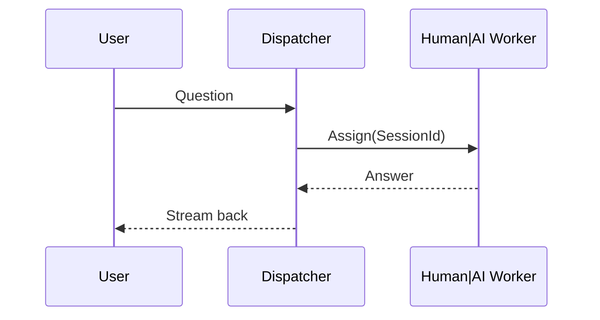

# [架構師觀點] LLM 的抽象化介面設計 – 摘要與衍生內容

## Metadata

```yaml
# 原始 Front Matter:
layout: post
title: "[架構師觀點] LLM 的抽象化介面設計"
categories:
- "系列文章: 架構師觀點"
tags: ["架構師觀點","技術隨筆"]
published: false
comments_disqus: false
comments_facebook: false
comments_gitalk: false
redirect_from:
logo:

# 自動識別關鍵字:
primary-keywords:
  - LLM 抽象化介面
  - IChatBot / IIntelligence
  - SessionState
  - 工人智慧 (Human-in-the-loop)
  - Uber-like Dispatcher
  - Turing Test
  - Tool Use
secondary-keywords:
  - Chat Completion API
  - Assistant API v2
  - Semantic Kernel
  - LangChain
  - Ollama
  - LM Studio
  - OnnxRuntime
  - Interface-oriented Design
  - Dependency Injection
  - Scale-out / Load Balance

# 技術堆疊分析:
tech_stack:
  languages:
    - C#
  frameworks:
    - .NET / ASP.NET
    - gRPC (概念)
  tools:
    - OpenAI API
    - Microsoft Semantic Kernel
    - LangChain
    - Ollama
    - LM Studio
  platforms:
    - Copilot+ PC Runtime (OnnxRuntime)
  concepts:
    - Interface Abstraction
    - Session State 管理
    - Human Worker Dispatch
    - Tool-Augmented LLM
    - Token Billing Model

# 參考資源:
references:
  internal_links: []
  external_links:
    - https://platform.openai.com/docs/
    - https://github.com/microsoft/semantic-kernel
    - https://ollama.ai/
  mentioned_tools:
    - OpenAI
    - Assistant API
    - Semantic Kernel
    - LangChain
    - Ollama
    - LM Studio
    - OnnxRuntime

# 內容特性:
content_metrics:
  word_count: 3600        # 約略估算
  reading_time: "12 分鐘"
  difficulty_level: "進階"
  content_type: "Architectural Note / POC"
```

---

## 文章摘要（10 – 20 句）

作者以「抽象化介面設計」為題，從架構師的角度探討如果要把 LLM 納入大型應用，該如何定義「乾淨且可擴充」的程式介面。文章先回溯十年前「工人智慧」(Human-in-the-loop) 平台的模式，指出聊天介面其實早已是人力外包的抽象層；LLM 只是把背後的真人換成模型，因此同樣可以用「把問題交給一個能對話的服務」來思考 API。接著作者實作了一系列 C# POC：  
1. 最精簡的 IChatBot 介面 (string → string)。  
2. 進階版 IChatBot 回傳 IEnumerable 以支援流式答案。  
3. 往後台延伸，一個 Operator/Dispatcher 會把對話分派給「真人 Worker」或「AI Worker」，形成 Uber-like 架構。  
4. 為支援上下文與 Tool Use，再加入 SessionState 與工具表，並將回傳型別改為文字與 ToolUsage 的混合序列。  

透過自行「發明輪子」，作者驗證了多數大廠 API（OpenAI Chat Completion、Assistant API、Semantic Kernel plugin model…）背後的設計動機：聊天、狀態管理、工具呼叫、計費邏輯皆可用單一介面統一。文末提出「重做一次就能洞悉差異」的學習法：只要掌握抽象層，將來 API 版本更動也能輕鬆映射，不必怕破壞性升級。適用讀者為中高階後端工程師、技術領導與對 Framework 設計有興趣的架構師。

---

## 關鍵要點

- 把 LLM 視為「可對話的服務員工」，就能用物件導向方式定義介面。  
- 最小可行介面：`string Ask(string)`；擴充後支援流式輸出、工具呼叫與 SessionState。  
- 以 Uber-like Dispatcher 管理解答工作，可無縫切換 Human Worker 與 AI Worker。  
- 抽象化設計能屏蔽不同供應商的差異（OpenAI、Ollama、OnnxRuntime…）。  
- 「自己造輪子」能快速理解大廠 API 的設計脈絡，之後只需做語法映射。  
- 良好介面 = 易於依賴注入、可平行 Scale-out、且能自然轉接計費或限流。  

---

## 段落摘要（H2 層級）

### 1. 寫在前面：「工人智慧」的介面設計
作者先用 2010 年代的外包/媒合服務舉例，說明「聊天機器人」早就是工人智慧的抽象介面。若把 LLM 看成替代真人的 Worker，只須定好「問答」協定，就能透過同一通道取得回覆。這種觀點有助於稍後推導出 IChatBot 與 Dispatcher 的類別結構。

### 2. 開始 coding
作者先定義 `IChatBot.Ask(string)`，並示範簡易 Console Chat Client；隨後把回傳型別改為 `IEnumerable<string>`，支援流式答案與中斷。這一小步驗證了「介面驅動開發」的威力：前端 UI 幾乎不用改動，即可換用不同實作。

### 3. 後端：Operator / Switch 與 Uber 範式
為了把多條對話分派給多名 Worker，作者補上一層 Operator 及 Switch。Operator 接收前端訊息，向 Switch 要一位空閒 Worker，再把 Session Context 分派過去；Worker 回完即可釋放。如此即可對真人或 LLM 混用，也能輕鬆計算「回覆 token 數」做計費。

### 4. 2024/08/02 – LLM 抽象化再深化
作者比對 OpenAI Assistant API、Semantic Kernel、LangChain 等框架，發現它們皆在解決「對話 + 工具呼叫 + 計費」三要素。為統合這些需求，他把 SessionState 擴充為：歷史訊息、可用工具目錄、計費資訊。`Ask` 回傳型別變成 `IEnumerable<string|ToolUsage>`，即可完整覆蓋現行 LLM 能力。

### 5. 圖靈測試介面推導
若要寫一個真正的 Turing Test App，只需把 HumanIntelligence 與 ArtifactIntelligence 皆實作同一 `IIntelligence` 介面，再加上可橫向擴充的 SessionFactory。如此可輕易把用戶請求路由到任何智能體，並保持可觀測性與故障隔離。

### 6. 自己發明輪子的學習法
作者總結 20 年「先做一個 POC 再看大廠解法」的經驗，指出此法能培養兩種能力：  
(1) 精準使用現有 Framework；(2) 在缺乏現成解法時能自建框架。配合平行處理、ORM、權限模型等自造輪子的往例，說明此學習模式的長期複利效應。

---

## 問答集

### Q1. 為什麼要把 LLM 視為「真人 Worker」來設計介面？
A: 因為「問一段話、等一段回覆」本質上就是人類協作工作流。以 Human-in-the-loop 為心智模型，可直接重用既有的 Dispatch、計費、限流與 Session 管理思路，並自然承接過去外包平台的成功經驗。

### Q2. `IChatBot.Ask()` 為什麼要回傳 `IEnumerable<string>` 而非單一字串？
A: 流式列舉允許前端邊收邊顯示，並保留中途取消的彈性；同時不需額外定義 WebSocket 或 SSE，就能在 Console App 內模擬 Token-stream 行為，大幅降低 POC 複雜度。

### Q3. Dispatcher 與 Worker 要如何處理「真人」與「AI」切換？
A: Dispatcher 只依據「是否有空閒 Worker」與「Session ID」做路由，Worker 抽象層統一實作 `IIntelligence` 介面。真人 Worker 透過 Web 或手機端登入佇列；AI Worker 只是在伺服器背景呼叫 OpenAI 等 API，兩者可動態替換而前端無感。

### Q4. SessionState 為何要包含 Tool List？
A: Tool Use 已成主流 LLM 能力（Function Calling、Actions、Plugins）。將可用工具清單放進 SessionState，Model 或 Worker 便能在回覆過程中選擇並呼叫工具；同時也方便在 Worker 間轉手時，保留相同可操作資源。

### Q5. 文章中的抽象介面與 OpenAI Assistant API 有哪些對應？
A: Assistant API 的 Thread = SessionState；Run = Ask；Step 中的 tool_call = 作者設計的 ToolUsage 型別；而 Stream Run 對應 `IEnumerable<string|ToolUsage>` 的流式回傳，所以兩者概念幾乎一一映射。

### Q6. 重新發明輪子真的不會浪費時間嗎？
A: 作者強調「小規模 POC」成本極低，卻能換得對架構的深度理解。往後遇到 API 版本演進，只要改薄薄一層 Adapter 即可；長期下來可大幅降低維運風險，投資報酬率遠高於一次性學習曲線。

### Q7. 何時需要真正實作自己的 Framework，而不是導入現成方案？
A: 當現成框架無法符合你的非功能需求（內部治理、合規、離線執行…）或與既有平台整合成本過高時，自建框架才有意義；否則以抽象介面包裝現有 SDK，仍是最經濟的做法。

---

## 問題與解決方案整理

### 問題 1：如何為 LLM 設計兼顧抽象與擴充性的介面？
Root Cause: 現有各家 API 規格差異大，直接綁定實作會造成日後升級困難。  
Solution: 以 `IIntelligence` 為核心，配合 SessionState 管理上下文與工具，並把「流式輸出」與「工具呼叫」納入回傳型別，形成高度通用的 Contract。  
Example:  
```csharp
public interface IIntelligence {
    IEnumerable<ResponseChunk> Ask(string prompt, SessionState state);
}
```

### 問題 2：如何同時支援真人與 AI Worker 而不改動前端？
Root Cause: 業務量峰值或敏感內容可能需要真人介入，但前端只懂「聊天」。  
Solution: 建立 Operator + Dispatcher 層，所有 Worker 皆實作同一介面；前端只連 Dispatcher，Dispatcher 依規則決定派給 AI 或 Human。  
Example:  


### 問題 3：如何在 Worker 間轉手仍保留上下文與工具權限？
Root Cause: Worker 無狀態 (Stateless) 容易失去對話脈絡與執行權限。  
Solution: SessionState 物件集中存放於共享快取/DB，包含歷史訊息、工具清單與 Token Quota；Worker 僅拉取 SessionState 快照並回寫更新，達成水平擴充與容錯。  
Example: Redis + JSON 文檔，或自定 gRPC GetSession/UpdateSession 介面。

---

## 版本異動紀錄
- 1.0.0 (2025-08-06)  初版生成：含 Metadata、段落摘要、7 組 Q&A、3 項問題-解決方案。