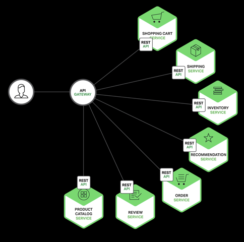
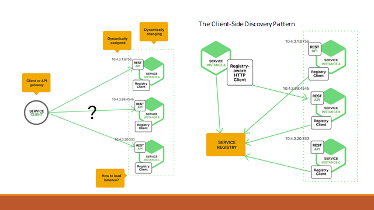
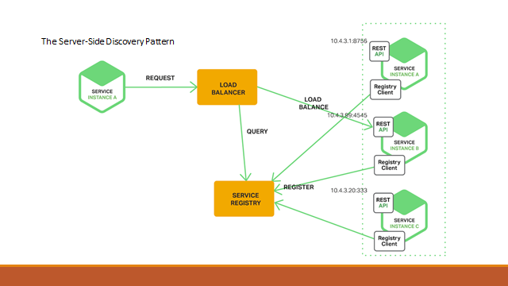

前面兩篇，分別介紹了微服務架構的規劃方向，還有實際切割的案例探討。這篇 (Part 3) 的重點就要擺在微服務到底該在甚麼樣的基礎建設上面
運行? 維運過去單體式架構的 application, 所需要的基礎建設，會跟微服務架構下可能會有數十個 service instances 同時執行，甚至上百個
service instances 一樣嗎?

我只能說，考量是完全不一樣的。因為細粒度的關係，也許你的使用規模並不算大，但是你仍然得面對十來個 service instances 維運的考量。
這篇則會針對這樣的狀況，來探討一下開發上的基礎建設，還有部署時的做法有何不同。

<!--more-->



--

# 微服務需要那些基礎建設?

在介紹基礎建設之前，我大力推薦 Nginx 的這本電子書:

[Microservices: From Design to Deployment, a Free Ebook from NGINX](https://www.nginx.com/blog/microservices-from-design-to-deployment-ebook-nginx/)

這本電子書的深度跟複雜度，拿捏得剛剛好。沒有深入到太多實作細節，也沒有淺顯到空談一堆你看完還是不知道怎麼做。
長度也剛好，只有 70 頁，不需要花很多時間就能看完。這 ebook 介紹了微服務系統中幾個關鍵的基礎建設，以及為何需要它的原因，
推薦大家都先去看一下這本書的內容。

想看網頁版也有.. 當初還沒出電子書時，我就是看網頁版連載的文章:
[Introduction to Microservices](https://www.nginx.com/blog/introduction-to-microservices/)

這份電子書裡面，提到跟 microservices infrastructure 有關的有這幾個部分:

* API Gateway
* IPC (Inter-Process Communication)
* Service Discovery
* Event-Driven

其他講微服務架構與觀念的，還有如何重構既有的 application, 我們在前面兩篇其實都帶到了，這裡就針對基礎建設來探討。
基礎建設通常也是某個(微)服務，用來解決多個微服務互相協同合作必要的基礎。例如通訊、代理、服務註冊語組態管理等等。
這類基礎建設的服務，你通常都能找到成熟可靠的現成服務來使用，而不用自己從頭開發。

因此，進入實作微服務架構的第一件事，不是捲起袖子開始寫 code, 而是先把你需要的基礎建設與開發環境搭建起來。這段我主要的
目的，是介紹每類基礎建設的服務是要解決那些問題，只有知道這些東西存在的目的，你才能做出最正確的判斷與選擇 (該挑選哪一套?
還是要自己開發? 該如何評估?)。

## API Gateway

不論你的服務是單體式架構 (Monolitch)，服務導向 (SOA)，還是微服務 (Microservice), 最終終究是要開放 API 給別人使用的。
這時最基本的防火牆 (Firewall), 反向代理 (Reverse Proxy), 以及負載平衡 (Load Balancer) 等等我就略過不談了。我們先來談談
API 特有的對外關卡: API Gateway

其實 API Gateway 很多時候它跟上述的幾種基礎建設，功能上都有部分重疊。你可以視你的服務規模跟需求來搭配。在開始談論 API Gateway
之前，先來看看實際的應用情境:

假設 Amazon 網站已經微服務化了 (實際上也真的是沒錯)，來想像一下這個 APP 為了實現畫面上的所有功能，進入這個購物 APP 首頁時，
究竟要從後端呼叫多少微服務的 API 才能湊齊這個畫面所需的所有資訊?

按照圖上的標號，分別有:

1. 訂購紀錄: 要從訂購管理的服務 API 取得
1. 商品評價: 評價系統 API
1. 商品資訊: 商品上架管理系統 API
1. 推薦商品: 採購行為與紀錄分析 (big data?)
1. 商品庫存: 庫存管理系統 API
1. 購物車:   訂購流程管理 API

如果這個 APP 真的這樣寫，我看打開 APP 時，轉圈圈至少會轉個半分鐘以上吧。微服務要解決的是內部軟體開發架構的維護，擴展等等架構問題，
這些對外面的客戶及系統是非必要的。對外界來說，只要把整套系統當成單一應用程式就好了。這時要呼叫這麼多次 API 才能湊齊足夠的資訊，
這做法還蠻蠢的...。

於是... 開始出現了 API Gateway 這樣的處理模式。APP 只要對 API Gateway 做一次 API call, 由 API Gateway 代勞，到後端各個服務
個別取得所需資訊之後，統一匯集起來傳回前端 APP。這麼一來，對於 APP 來說，他只要一次的呼叫就能取得所有的資訊。

這兩個模式有哪些差異? 我列舉幾個最明顯的特徵:

模式  |   直接呼叫    |   透過 API Gateway
------|--------------|--------------------
1. | 效率差，須經過多次往返 | 效率好，只需一次往返
2. | 不易管理，內部服務架構異動會影響 APP 設計 | 好管理，將內部服務架構的細節隔離在內部
3. | 難以最佳化 | 容易最佳化，API Gateway 能妥善做好 output cache
4. | 安全性差，跨服務的溝通細節暴露在外界 | 安全性佳，不需將不必要的細節傳遞到外面。API Gateway 甚至能負責處理認證及授權等等問題，不須交由每個服務自行處理

API Gateway 除了單純的替 APP 呼叫後端 API 時做好 reverse proxy 以及 API call aggration 之外，有些架構師甚至這樣應用 API Gateway, 這是我覺得 API Gateway 在架構上最關鍵的一項應用，就是認證。

(找圖)

跨越服務的認證，一直都是件麻煩的事情。在沒有有經驗的架構師的情況下，團隊往往會做出很糟糕的設計: 每個服務都有自己的認證跟授權機制，
A -> B 有一套轉移認證資訊的作法，B -> C 又一套... 有 N 套服務在運作時，就有 N x (N-1) 種組合要處理... 這時 API Gateway 可以額外
跟負責任證的服務整合，所有 request 統一先取得認證資訊之後，再交由 API Gateway 轉發給內部各個服務。由 API Gateway 統一處理認證
失敗，認證過程的 log 等等動作，後端的服務則在安全的保護傘之下，只要憑著 API Gateway 傳過來的憑證，提供 APP 各種服務即可。

其實這部分實作的原理，在這系列的這篇 [API Token] 就已經說明過實作細節了。

## Service Discovery

# Docker, 最佳的微服務部署方式

# Immutable Services

