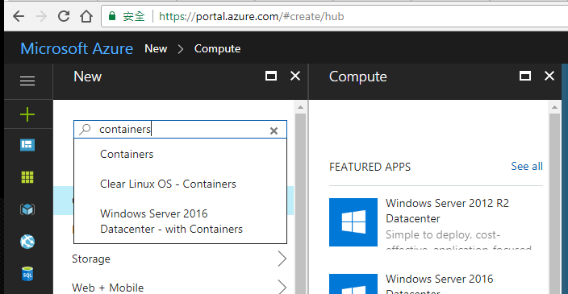
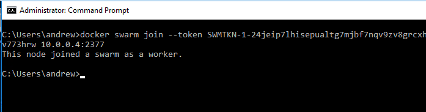
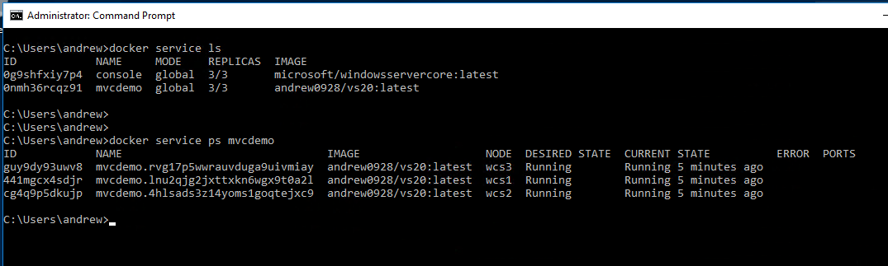
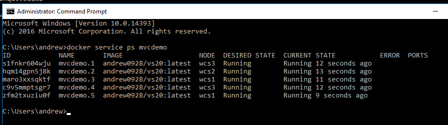

為了使用 Docker Swarm 來部署 Windows Container, 卻遲遲等不到 Microsoft 官方的 Azure Container Services 的 Windows Container 支援 (windows container support 到現在還在 private beta), 我只好自己來土炮了。不過得力於 Azure 實在太方便，其實自己土炮一個
Windows Container Swarm Mode 的 Cluster 也只是五分鐘的事情啊! 要等下一篇文章出來再寫，大概又是一個月過去了，於是我就順手先把這篇
紀錄一下，想在 Azure 上面體驗 Windows Container Cluster 的可以先參考這篇~

<!--more-->

# Setup

設定步驟其實很簡單，你只要先準備好一個有足夠餘額的 Azure Subscription, 沒有的話去註冊一個就好。初次註冊 Microsoft 會給你免費的
額度 (記得是 NTD 6000 ?)，要做這次的 Labs 其實很夠用了...

訂閱帳號搞定後，就開始吧!

## Create Windows 2016 VM (with containers)



這步驟其實還蠻無腦的，因為 Microsoft 早就幫你準備好了。Microsoft 早在 Azure 上面準備好 "Windows Server 2016 Datacenter - with Containers" 這個 VM image, 你只要選用這個 template 來建立 VM 即可。同樣的 VM 我們需要三台，分別命名為 wcs1, wcs2, wcs3。我這邊
就用 wcs1 當作示範:


其中 1, 2, 3 的步驟都只是選擇規格而已，我直接跳到第四個步驟 Summary 就好了。我這邊選用的是 Basics 系列的 VM, 全部的 VM 我都放在
wcsdemo 這個 Resource group, VM 規格是 Standard DS2 v2, SSD, 除了 VM Size 之外其他都是用預設值就可以了。同樣規格 VM 開三台，
訂購的按鈕用力按下去就好了。只要你手腳快一點，其實花不了多少錢的 XDD

開好 VM 之後就先放著吧 (反正等他跑起來也要幾分鐘)... 趁這空檔先進行下個步驟。


## Create Azure Container Registry

既然都要用 Docker 了，能在同樣的環境下準備一個自己專用的 Registry 是一定要的。這邊要大推一下 Azure Container Registry 服務，真是
佛心啊，你只要支付 Storage 的費用就夠了，你 push 多少 images 在上面，付多少錢就可以了。Azure Container Registry 服務本身是不用錢的。如果一開始你都還沒 push 甚麼東西進去的話，那等於是 0 成本就可以有自己的 Registry 可以用了。於是我想都沒想就弄了一個... 


新增服務的地方，搜尋一下，就會看到 "Azure Container Registry" ... 選這個就對了。


除了取名字還有選機房地點之外，其實沒什麼要煩惱的，我都採用預設值就好了。以後有進階的需求再回來研究這些設定是幹嘛的..
這邊我取名為 wcshub, 請記好這名字，後面會用到。

"Create" 按下去，設定步驟就完成了。這時前面的三台 VM 應該都跑完了，我們可以繼續進行下一個步驟了。


## Setup Swarm Cluster

接下來，就用 RDP 逐一連到剛才建立的三台 VM (wcs1, wcs2, wcs3)。Windows Container 微軟已經預先安裝好了，我們只需要設定 Docker Swarm Cluster 即可。

我這邊會把 wcs1 當作 master node. 先 RDP 到 wcs1, 開個 DOS command prompt 出來:


Docker Swarm 的架構是，Cluster 內至少需要挑一台出來做 Manager, 初次建立 Swarm Cluster 時，第一台就會是 Manager.
在 wcs1 下這道指令:

```shell
docker swarm init --advertise-addr 10.0.0.4 --listen-addr 10.0.0.4:2377
```

其中 10.0.0.4 是 wcs1 這台 VM 的 ip address, 成功之後就會看到如下的畫面，也會列出其他 node 要如何加入 cluster 的指令。
SWMTKN-xxxxx 那串 ID 就是要加入 swarm cluster 必要的 TOKEN，這段指令可以先保留下來...


第一台 (wcs1) 搞定後，把另外兩台加進來就好。同樣的 RDP 到 wcs2 及 wcs3, 開 DOS command prompt 下這道指令 (其實就剛才那指令
複製貼上而已):



看到 ```This node joined a swarm as a worker.``` 就代表成功了。

這兩台都做完這道程序之後，就.... 就全部完成了。老實說沒有 ACS 整個包一包，好像也沒有差多少... 哈哈!
設定步驟現在已經全部完成，接下來就可以真的 deploy service 到你專屬的 docker swarm cluster 了。


# Deploy Service On Docker Swarm

接下來就是真的把 container 丟上去跑看看了。原本我打算拿 hello-world, 不過這個例子實在顯示不出 docker swarm 的威力啊，
於是我就把之前 Visual Studio Everywhere - 20th 週年紀念的研討會，講 Windows Container 場子用的範例拿出來獻醜了.. :D

這個 container image 早以放在 hub.docker.com 上面, source code 則已經放上 github.com 了。他就是個標準的 ASP.NET MVC
範例而已，只是在這個 web app 的 about 頁面，會標記 server ip address, 方便我們驗證 cluster 的效果。

正常情況下，我要執行這個 container, 會用這道指令啟動它:

```shell
docker run -d --name mvcdemo -p 80:80 andrew0928/vs20
```

現在改成部署到 docker swarm cluster, 我們可以在 manager node 用這道指令來部署並啟動:

```shell
docker service create --name mvcdemo --mode global -p 80:80 andrew0928/vs20
```

在一般的 docker run 指令裡面, 邏輯上是把一個 image 透過 "run" 的指令，同時建立 container 並且啟動 (start) 他。
這觀念搬到 docker swarm, 則改成把一個 image 透過 "create service" 的指令，在 cluster 內建立這個 "service" 。
因此這邊的幾個參數，意義就跟 docker run 的情境下有些不同:

* --name: service name, not container name
* --mode: 服務的模式。global 代表在這個 cluster 內的每個 node (包含 manager) 都要部署一份 container, 若 mode 是 replica (預設值), 則代表由 manager 替你分配要在哪幾個 node 啟動你的 container (會按照後面指定的啟動份數 --replicas nnn 決定)。
* -p: publish port settings, 這個就沒什麼不同了，不過發布 ports 的規則在 cluster 環境下就有點複雜，後敘
* <image>: 最後面依樣是 container image name + tags, 後面也可以加自訂的 command + arguments, 這部分跟 docker run 一樣，都是啟動 container 的參數


接下來，要查詢所有的 service 有哪些, 跟執行的狀態，就不再是 ```docker ps``` 了，改成這兩個:



查詢 cluster 到底有多少 service:

```
docker service ls
```

查詢某個 service 的 container 執行狀況:

```
docker service ps {service name}
```

最後，服務都正常啟動了，我們就直接來開瀏覽器確認看看 (記得打開 Azure VM 的防火牆)


結果，我沒辦法透過瀏覽器看到 vs20 這個 container 執行的結果啊... 之前在這裡卡關卡了一陣子... 先講解法:

原本建立服務 (service create) 的指令，把 publish port 的部分改成這樣:

```
docker service create --name mvcdemo --mode global --publish mode=host,target=80,published=80 andrew0928/vs20
```

這時用瀏覽器，分別連到三個 node 的 public ip address, 可以看到三個 container 都正常的執行:


* wcs1


* wcs2


* wcs3

可以看到三個 instance 的 ip address 都不大一樣。這個沒有 load balance 的效果，三個 container 跟三個 node 是一對一的，
你重新整理後還是會看到一樣的 server side ip address, 不會亂跳。

# Overlay Network

前面的 network 設定是怎麼回事? 老實說這個指令的背後藏了很多東西啊，我也是花了些時間才搞懂。這也是 docker swarm 的精隨，值得
花些時間了解 & 掌握他的用法。

首先，先來談談什麼是 "overlay network" 吧。在單機版的 docker engine, 我們最常用的就是 nat, 每個 container 都可以拿到一個
內部的 ip address, 如果你需要的話, 再透過 -p 的指令，在 NAT 上面開個 port, 轉接到 container 內部的 port.

同樣的架構，換成 docker swarm 就行不通了, 因為你的 node 不只一個, nat network 的 lan 是無法跨機器的。這個部分沒打通的話，
在 cluster 內的多個 container 就無法無障礙的互相溝通了。為了解決這個問題，docker swarm 在 init 時，就會自動建立一個名為
"ingress" 的 overlay network:


顧名思義，他是 "overlay" 在實體網路上，建立的虛擬私有網路, scope 是在整個 swarm 內都可以看的到，意思是整個 swarm cluster
都可以共用這個 overlay network。

所以，我們第一次使用的指令，只是單純地用 -p 80:80 代表甚麼? 就是我前面提到的 "routing mesh", 意思是每個 node 的 public port 80,
都會對應到這個 service 的每個 instance 的 port 80...

有點抽象? 看這張圖就懂了:


* from: https://docs.docker.com/engine/swarm/ingress/#publish-a-port-for-a-service

docker swarm 會替你把這個 service 發佈到每個 node 的 port 80, 同時用內建的 load balancer, 替你把負載分散到所有的 service instance. 這種模式之下，你可以指定任意個數的 service instances, 這個例子之中，我們有 3 個 nodes, 你可以部署 1 個 instance, 也
可以一次部署 10 個 instance。對外不論你連到哪一個 node 的 80 port, routing mesh 的機制都會替你搞定他，讓你可以正確地連到指定的服務。

聽起來很棒，唯一美中不足的是....

https://docs.microsoft.com/en-us/virtualization/windowscontainers/manage-containers/swarm-mode

> **Note:** The second argument to this command, `--endpoint-mode dnsrr`, is required to specify to the Docker engine that the DNS Round Robin policy will be used to balance network traffic across service container endpoints. Currently, DNS Round-Robin is the only load balancing strategy supported on Windows.[Routing mesh](https://docs.docker.com/engine/swarm/ingress/) for Windows docker hosts is not yet supported, but will be coming soon. Users seeking an alternative load balancing strategy today can setup an external load balancer (e.g. NGINX) and use Swarm’s [publish-port mode](https://docs.docker.com/engine/reference/commandline/service_create/#/publish-service-ports-externally-to-the-swarm--p---publish) to expose container host ports over which to load balance.


實在是很 OOXX 啊... 研究到這邊，正很興奮地要使用他的時候，才看到這段... "Routing mesh for Windows docker hosts is not yet supported, but will be coming soon." 這時只能很忠誠的相信 Microsoft 說的 "coming soon" 了... 官網這篇文章是 2017/02/09, 現在是 2017/07/26, 就看看還要多久...


# DNSRR (Docker Native DNS Round Robin)

好，既然這樣只能退而求其次。Microsoft 看來還是給了另一條出路啊，透過 Docker 內建的 DNS，可以用 DNSRR (DNS Round Robin) 搭配
你自己建立的 load balancer (例如我之前用的 NGINX for windows) 一樣可以做到類似的效果。不過按照文件，我應該可以用 Docker 內建的
Native DNS Server 取得其他 container instances 的相關資訊才對，不過這邊我卻怎麼試也試不出來 @@

這邊就分享一下我的研究過程吧，有專家的話，幫忙看看我是漏了哪個環節...


先把前面所有的 service 清掉，重新建立 docker swarm services, 指定 dnsrr, 在這 3 個 nodes 中啟動 5 個 instance:

```shell
docker service create --name mvcdemo --network ingress --endpoint-mode dnsrr --replicas 5 andrew0928/vs20
```

啟動完成後，看看執行狀況:

```shell
docker service ps mvcdemo
```



這些 instance 被分配到 wcs1 ~ wcs3 個別執行中。另外再開個 console service:

```shell
docker service create --name console --network ingress --endpoint-mode dnsrr --replicas 3 microsoft/windowsservercore ping -t localhost
```

挑一台 console 的 instance, 開個 cmd 連進去 (xxxxxx 是 container id, 每次都不一樣，我就不列了):

```shell
docker exec -t -i xxxxxx cmd.exe
```

結果進去 query dns, 找不到所有的 mvcdemo instances 的 ip address 啊 @@


不過，如果先查好其他 container 的 ip address, 連進 console 用 ping 的就可以 ping 的到啊...


看來除了 DNS 不會動之外，其他一切正常.... 可是少了 DNS, 最關鍵的 service discovery 就沒辦法用了啊，如果我要用 nginx 當作
reverse proxy + load balancer, 我總不能每次 containers 啟動後都要手動去更新 upstream ip address 吧 @@

好吧，按照規格跟文件的話，上述的測試，應該可以在其他同個 docker network 內, 可以透過 dns (round robin) 的方式, 用 service name
找到其他 container instances 才對。這時其他服務就能正確地找的到對方。你也可以視需要，直接動態調整每個 service instances 數量，
對於大型服務的部署來說是非常方便的。

可惜這功能目前僅存在於文件及規格中，我還試不出來 T_T，我看我還是等等那個 "coming soon" 的 routing mesh 吧...


