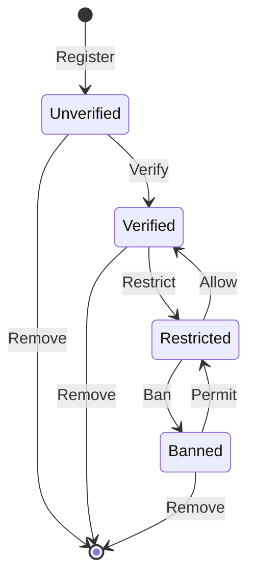
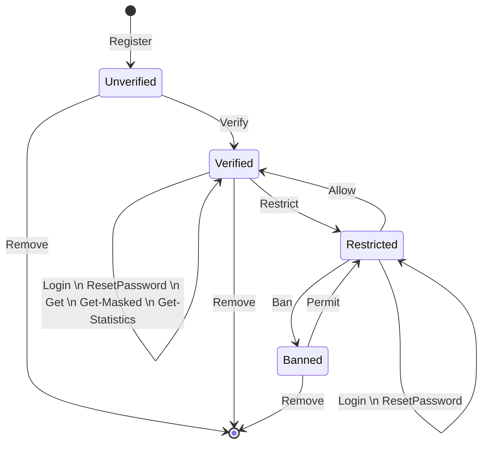
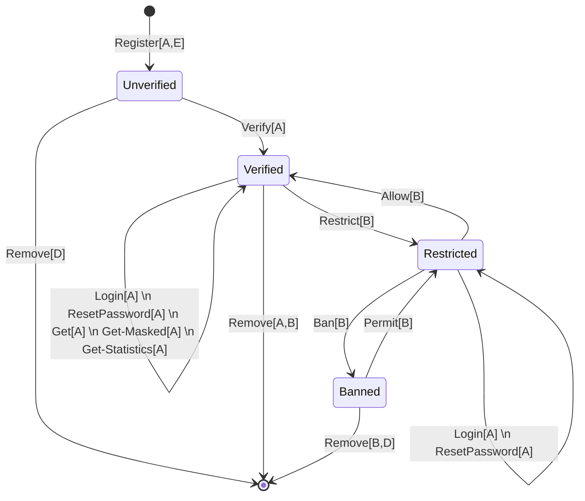

最近這陣子，我對外分享的主題，其實都集中在 "API First" 身上。碰到一些朋友給我的 feedback, 我覺得挺有趣，我挑一個，放在這篇實做篇的最前面:

> Andrew 你談的技巧 (例如: 狀態機, 認證授權, API 開發與測試) 其實我都懂，但是為何你能把這些技巧串再一起? 用這方法來開 API Spec, 我連想都沒想過，而且外面也沒多少人是像你這樣組合起來用的... blah blah (以下省略閒聊的 800 字)

是啊，這老兄講得沒錯啊，這的確是我自己的經驗談。我擅長的就是只靠幾樣精通的基本功夫，善加利用組合，就能拿來面對許多未知的問題。先前一篇聊職涯發展的文章，我就談到 "知識的連結"，這就是我展現出來的應用。當你每一項技巧都熟練到某種程度以上，你就有自由變化的能力了。能夠達到這種層次的技能不用太多，但是你只要多掌握一個，你能應付的範圍就是別人的好幾倍。我拿來應用在 API First 這主題，就是其中一個案例。

API 的成功與否，規格定的好不好 (這是設計議題) 占了 70% 以上，規格定對了，後面的實做 (效能，可靠度等等) 做得好才有加分。而 API 的規格怎麼定，講白了很吃設計者的經驗。前陣子 FB 都在分享一篇 "一流工程師可以用很簡單的方法解決問題"，這情境套用在 API 的設計上再洽當也不過了。你如果能看透 API 背後要解決的問題，開出適合的介面，並且用恰到好處的技術跟工具把她實現出來，這就是個成功的 API。對我而言，我的手法就是 OOP，如何用物件導向的想法去分析 API 背後要處理的問題，然後把物件的介面 (interface) 翻譯成 API 的規格。

因此，正文開始之前，我就加一段在正式演講都沒有談到的內容: 物件導向的思考方式 吧!


<!--more-->





# 前言: 習慣物件導向的思考方式

先講, 其實我是很討厭一堆方法論的人, 並不是說那些方法論是錯的，而是現在太多專家歸納出太多方法論了，我沒辦法每種問題都學一套方法論來解決，因此我往往傾向用最基礎的理論或是技巧拿來組合應用, 屬於只練基本功夫那種類型的人。因為我覺得大部分的問題這樣就足以解決了，剩下的就像背公式一樣，是拿來加速過程效率的方法，讓你面對規模更大更複雜問題時使用的，但是大部分情況下你還不需要面對 "規模"，而是要先面對 "正確" 的思考。因為如此，有好的方法論我當然會用他，但是當我發現他不適用時，我也可以很果斷的放棄他，改用我的基本技能來修正或是補足。

因此，我面對問題時，相對於 DDD 等這些更有系統的方法論，我會優先考慮使用基本的物件導向 (OO, Object Oriented, 對岸翻作: "面向對象"... 我還是講英文好了) 觀念，來思考這問題，該用什麼樣的類別，產生那些物件，然後讓他們交互作運作，來執行這個需求? 當這點我想通之後，我就開始有能力用各種我順手的 OOPL (OOPL, 支援 OO 概念的 Programming Language, 我自認能掌握的語言只有這幾個: C#, Java, C++) 來做 POC 了。當我能定義出執行這些需求必要的 class, object, interface, 或是 struct 之後，這世界一切就都變得簡單了。API First? 對我來說只是 OOP 裡面提倡的 Interface 優先的思考方式而已 (其實就是 OOP 三大權杖之一的 "封裝"，或是所謂的 "抽象化", Abstract 的想法)。

想清楚 interface / class 之後, 我開始能用很工整的對應方式, 開出 API spec 了。舉幾個例子:

```csharp

public class Man
{
    public static Man Create(...) {...}
    public static Man Get(int id) {...}
    public int ID { get; set; }
    public string Name { get; set; }
    public decimal Balance { get; private set; }
    public decimal Work(TimeSpan duration) {...}
}

```

很簡單的例子，只是宣告一個類別，用 Man 這個 class 來表達這個類別能有哪些操作。其中包含了 static method, properties, method 等... 在把它對應成 API 之前，先別急，示範一下我怎麼 "使用" 這個 class:

```csharp

var m = Man.Create(...);
Console.WriteLine($"Hello {m.Name}(id: {m.ID}), your balance: {m.Balance}.");
m.Work(...);

```

或是:

```csharp

var m = Man.Get(100);
Console.WriteLine($"Hello {m.Name}(id: {m.ID}), your balance: {m.Balance}.");
m.Work(...);

```

只有幾行，代表了我怎麼操作這個 class ... 如果我對應成 REST API, 那麼大概就長得像這樣:


```

// Man.Create()
POST /api/man:create

// Man.Get()
GET  /api/man/{id}

// m.Work()
POST /api/man/{id}:work

```

當你找到對應的邏輯時，就不難理解這對應的規則了。拆解一下 REST API path 的定義:

> /api/{class name}/[{instance id}]:{method name}

如果碰到 class method, 例如上例的 Create, 那就省略掉 {instance id} 這層, 語意上就能直接對應起來了。剩下的 request / response, 就直接對應到 method 的 paramenters 跟 return value.

當這些對應很容易做到時，我自然會把最複雜的設計議題，簡化成我最容易思考的 OOP 了，所以核心問題剩下，我如何定義出正確的 class 該長成什麼樣子? 我會從分析物件的狀態機開始。因為狀態機控制了整個物件的生命週期，改變狀態的通常都是被封裝起來，並且是很重要的 method，於是，我就很習慣拿狀態機當作一切設計的起手式，以狀態機為基礎，一路把我需要的資訊一一標記上去，並且先在腦袋裡面轉過幾個案例，確認可行後才開始花時間把程式碼跟規格寫出來...。

有那些東西是物件在意的? 我自己的慣例是要分析這幾項:

1. 狀態
1. 操作 (會改變狀態的)
1. 操作 (不會改變狀態的)
1. 物件相關資訊 (附加於物件身上的資訊)
1. 事件 (外界關注物件本身的變化，而對應的反應)

這些資訊分析好之後，我相信熟 C# 的人都有能力寫出對應的 class 出來，你的任務就完成 90% 了。寫的出 class, 剩下的就按照上面的原則對應成 API spec 就完成了。以上，就是我這篇 API Design Workshop 背後主要的思考脈絡。如果你看懂了我的思路，你就會發現這件事其實很容易啊，困難的是你有沒有掌握好 OOP 的基本精神跟設計方式。

也許有人會問，如果我不熟 OOP 怎麼辦? 我會認為這是當開發人員的基本功，也許個別的 case 你有別的方法可以替代，但是長期下來你不大閃的掉的，不如早點把他練好吧! 我真正搞懂 OOP，是大學時代 (當年我入門的 OOPL 是 C++) 看的那本 "[世紀末軟體革命](https://www.ithome.com.tw/article/38577)"，裡面有一句話我到現在還記的:

> 物件導向技術，就是模擬世界，加以處理

就是這句話，打通了我所有物件導向的觀念 (當年第一次接觸 OOP 時我是直接抱著 C++ 的語法來看，完全看不懂..) 整本書看懂這句話就值得了，看懂這句話，也跟著保障了我接下來廿幾年都有飯可以吃 XDD，如果你還找的到這本書，大推，就算你不熟 C++ 也推薦去弄一本來看。

最後，在做這類對應，除了對物件導向的觀念要有清楚的理解之外，你還需要知道這些 OOPL 背後是怎麼運作的。舉例來說，我就花過時間嘗試用不支援 OO 的程式語言，來實做 OOP 的語言特性 (例如前面提到的，封裝、繼承、多型等等)，這時了解 OOP 的機制如何運作的就很重要。例如 [virtual table](https://www.learncpp.com/cpp-tutorial/the-virtual-table/) 之類的做法就是其中之一... 2000 年前後，當時 Microsoft 平台的主流技術 OLE (Object Linkage & Embedded), 或是到後來的 COM (Component O
bject Model), 非微軟陣營的 Open Doc, 分散式的物件通訊協定 CORBA (Common Object Request Broker Architecture) 等等，都是在做這些事情。在 Binary Code Level (就是 win32 api 層級)，讓不具備物件導向特性的 system call，建構跨越 process 能互通的物件標準，VB，Office，IE 之類的的技術就是這樣發展起來的。如果你能搞清楚這些結構，要把物件的運作機制搬到 REST API 就完全是小菜一碟了。

如果你懶得看我落落長的文章，那看到這邊就夠了 XDD, 以上是本篇文章背後的想法, 我就先破題, 把重點都擺在這段了。如果你還是對實做的 workshop 過程有興趣，那歡迎繼續往下看 :D


# 0. 正文開始

前面那段 OOP - REST 對應的心得，是我這次額外加上去的，正式的演講時間有限，沒有講這段內容啊! 算是關注部落格文章朋友們的專屬內容 XDD, 接下來的內容，我就用我在 .NET Conf Taiwan 2022 的投影片為主來說明吧。這個主題是延續 DevOpsDays Taipei 2022 Keynotes，將 API Spec Design 的部分擴展成 Workshop 的內容。

接續上一篇講完 PI First 的 "為什麼 (WHY)", 這篇的重點就轉移到 "如何 (HOW)" 了。因為設計的方式不同，API 的規格變成第一順位，流程上就完全不同了。這篇我從這四個面向:


1. 規格優先: 開發流程上的改變
1. 設計方式的改變與標準化
1. 從設計階段就考慮安全性
1. 思考是否過度設計


我截了一個常見的畫面，各位可以思考一下背後隱含的問題與思考的要點:


各位應該都看過這種授權確認的畫面了，支援 OAuth2 跨服務跟使用者確認授權時，大都會跳出這種確認畫面。請問，在你 (使用者) 決定按下 "確定" 之前，你要掌握哪些資訊你才放心的按下去? 反過來說，如果你自己就是 API 的設計者，你要怎麼設計 (規格) 才能讓你的 user 也放心?

這一連串問題，如果你都沒想過的話，那現在是時候了。有些人對於資訊安全是敏感的，資訊安全除了技術上的考量之外 (有沒有加密，有沒有遮罩等等)，另一部分也是你對開發者的信任 (這公司取得我的個資是否會拿去濫用?)。這畫面上的內容，代表徵求授權的廠商 (XiaoMi) 想要取得你選擇認證的廠商 (Google) 上面存放的個人資訊，而 Google 接到這請求，要回應 access token 給 XiaoMi 之前，必須先取得你的確認。

在你決定按下 [繼續] 之前，我試問這幾個問題:

1. 傳輸方式你放心嗎? (規格問題)
1. API 實作的品質你放心嗎? (對 Google 信任問題)
1. 當你反悔後，Google 是否真的會停用 XiaoMi 的存取授權? (對 Google 信任問題)
1. 當你反悔後，XiaoMi 是否會真的刪除所有已取得的資料? (對 XiaoMi 信任問題)

這一切的行為跟資訊的流動，在我按下按鈕之後完全都看不到，因此這些信任只能透過兩個方式來建立:
1. 從技術規格上來保證 (這就是我這篇文章想聊聊的 API Spec 設計)
1. 從品牌的信譽來保證 (品質做的好才能累積信譽)

最後，角色對調一下，如果提供這機制或是這 API 的不是 Google 而是你，你有信心對你的使用者作出一樣的保證? 這篇文章我想探討的，就是集中在第一點，你的 API 是否在設計階段就考慮好安全性?

設計跟實做的差異，我舉個類似的案例大家就懂了。大家常常討論哪些網站會儲存你的密碼 "明碼"，這類網站都會被視為不夠安全的網站。會被認為 "不夠安全"，因為他 "有機會" 能夠還原密碼，就有機會被有心人士利用，洩漏，因此就存在一定的風險。如果你採取連你自己都無法還原密碼的設計，(例如只儲存密碼的 Hash)，就保證你只能驗證密碼對不對而已，你完全沒有能力也沒機會洩漏密碼明碼給其他人 (包含你自己)。這就是從設計或是架構上就考慮安全性的例子。

API 設計困難的地方在於: 你無法預期別人要拿你的 API 做甚麼事情，呼叫的時機，呼叫的順序各種組合都有可能發生，因此你必須對於你要開放的服務領域 (後面通稱 domain) 有一定的掌握，直接思考這些 domain service / data 如果要開放，你需要提供什麼操作行為，從這角度來設計 API spec 才會到位。這些，不就都回到前面談的 OOP 了嗎? 你該封裝那些運作的細節? 你該開放那些細節別人才能使用? 最有效的方式，就是世紀末軟體革命那本書講的那句話:

> 模擬世界；加以處理

只要你模擬的夠到位，現實世界運作的原則不大會改變，但是客戶的需求會改變。如果你對齊的是世界運作的原則，而不是只對準需求，那麼你的 API 就有能力能適應未知的需求變化 (因為需求也是圍繞著世界運作的原則)。掌握這點非常重要，因為你開發的是 API，SDK，需要被高度重複使用。如果看懂了，那就繼續往下吧! 有心好好掌握 API 設計的技巧的話，花時間想通這脈絡是絕對有幫助的。


# 1. 開發流程上的改變


大部分的人，都是從 "Hello World" 開始學寫 code 的... 每個人都是先讓 code 會動，才開始學怎麼把重複的程式碼封裝成 function 等等的步驟開始學程式語言的。也因此，要學習先忘掉實做，先訂介面在寫程式，對所有 developer 都是需要適應的過程，勢必也會需要改變一些你習慣的流程。

我拿 Ruddy 老師，在他的部落格上有一篇文章，就是在講 Contract First, 我拿這頁當案例來說明:


左半部是一般的做法，標上 1,2,3 是順序:

1. 先寫 code, 讓他會動, 功能正常
1. 接著開始重構, 拆出 function, 拆出 API, 補上 WebAPI Controller 之類的 code 讓外部能透過 HttpClient 使用你的 API
1. 接著再開發要使用你 API 的 Client Side Code, 可能是直接開發 Client, 或是有的團隊功夫一點會先開發 SDK ..

這是典型的作法，並沒有一個通用的名字來代表這方法，我就自己取 "Code First" 來代表好了..


而右半部，說明的就是 API-First 的模式，或是用我更習慣的用語: Contract First, 你先訂好 "Contract"，並且花一點時間確定 Contract 能夠運作，定案下來後前後端就按照合約，各自進行開發，最後再合併一起進行整合測試的過程，就是所謂的 Contract First.

一樣，右半部標記的是執行順序，有些不同:

1. 先定義 API Spec, 同時用最少的資源來準備 Mock, 讓這個 API 是真的能被呼叫使用的 (可能傳回值是假的，只是看起來能按照規格動作而已)
2. 完成 Contract & 能動的 Mock, 前後端就能同時行動了，因此都包含在 (2) 這項。後端開始按照 Contract 來實做 database / service, 前端可以按照 Contract 來開發 SDK / Client

單就順序的不同，對整個開發流程的影響可大了。如果 contract 越早確認，後面的一連串作業就能同步進行。如果你的團隊分工較細，有專屬的前後端、測試等等，這些任務就能同時進行，加速最後交付的時間。我把角色跟任務擺在一起對照看:

1. **架構師 / SA / SD**:  
可以開始收集潛在案例，並且用 mock 來驗證各種情境的可行性。
1. **RD / QA**:  
可以開始寫可執行的各種測試案例。
1. **Tech Writer**:  
在規格確認後就能開始撰寫 API 的文件與範例程式碼。
1. **Developer**:  
可以開始開發各種語言需要的 SDK。

這些顯而易見的好處，其實都是把事情 "做的更好" 的改變。而我自己認為 contract first 更重要的是: 能提早確認 contract 正確，我可以做到 "把事情做對" 的改變。把事情做好，跟做對的事情是不同的層次，不是二選一的題目啊 (鄉民: 我全都要)，但是當你要取捨時，規模越大、越複雜、系統需要服務的年限越長遠 (產品化)，越需要先確認 "要做的是對的事"。從 contract first 來確認有沒有做對，我在三年前寫過 [一篇文章](/2020/03/10/interview-abstraction/) 可以清楚地傳達這想法。這篇文章說明電商網站折扣機制的設計方式，其中運用到大量抽象化的概念。我擴大了 Mock 的應用範圍，讓我自己越早能驗證關鍵的邏輯，越早確認我的設計可行，後續開發的風險就越低。我用這頁投影片來說明:


我的目的，是越早證明抽象化的折扣計算引擎能正確地替我計算出結帳金額，其餘實做的細節我都可以以後再說 (例如開資料庫，實做安全機制等等)。我採用的方法就是盡可能的 Mock 其他跟計算邏輯無關的部分，讓我能把關注點放在計算，同時用大量的測試案例，優先確認我最在意的結帳金額計算的結果都是正確的。


我用 "降級" 的方式，省略了這幾個部分:

1. **我不急著寫出真正的 API 規格**  
(例如 swagger)，我只要開出單純的 C# interface 即可
1. **我不急著實做資料庫存取的部分**  
我只要用 C# 的 collection (例如 List<T>, 或是 Dictionary<int, T> 這些資料結構) 來模擬基本的 Repository, 搭配 Linq 我就可以開始寫 code 驗證情境了。
1. **我不急著實做 UI 操作**  
我用最簡單的 Console I/O，可以輸入，可以觀察輸出，這樣就夠了
1. **我移除大部分開發框架的依賴**  
例如 DI, Logging, Configuration, Security 等等，只用最基本的 C# 語法即可，這些框架不影響我的設計 "對不對"，會影響的是以後正式開發夠不夠可靠，好不好維護。在設計階段要驗證可行性，這些都不必要

經過這一系列的簡化，通常再複雜的問題，我大概都能在一兩百行 C# source code 的範圍內，把核心機制設計出來。這樣對我的任務幫助很大，我的責任之一就是確保主軸的設計結構可行，如果程式碼簡化到這種程度，我甚至能在會議上直接拿 source code 跟開發團隊溝通。碰到有爭議的案例，我也能在短短幾分鐘之內讓他能執行，並且當下跑出結果來跟 stakeholder 確認這是否是她預期的結果?

人腦的思考能力有限，因此我面對複雜問題的方法，就是高度抽象化，經過訓練，我能熟練的 "降級"，避開不必要的細節，把有限的思考能力用在我要關注的問題身上，讓配合你的開發團隊一次就做對 (過去大部分情況下，都要等開發團隊做出第一版 MVP 後才能開始驗證)。我這邊只先講我的思考脈絡，如果你對這案例有興趣，歡迎直接看我當時的文章:

* 抽象化設計:  [折扣規則的設計機制](/2020/03/10/interview-abstraction/)


# 2. API Design Workshop


這段落我就實際舉一個網站開發的案例，從頭開始跑一次設計 API 的方法。首先，來看一下這截圖，我想跟我一樣宅的朋友們，應該都對這網站不陌生吧:


我擷取的是某電玩動漫社群網站的會員註冊流程。很標準的設計，我用文字描述一下流程:

1. [**使用者**] 輸入 email, 啟動註冊程序
1. [**系統**] 寄出驗證信, 確認 [**使用者**] 是 email 持有者，後再繼續註冊程序
1. [**使用者**] 收到驗證信, 點選包含驗證碼的連結
1. [**使用者**] 通過驗證後, [**系統**] 才開始要求 [**使用者**] 輸入必要的資訊, 完成註冊程序

知道我為何要說明這流程嗎? 這流程很普通，幾乎每個需要註冊帳號的網站都有，你要自己寫一個也不困難。但是回想一下上一篇，講到你的老闆為何會想要推動 API First? 


回到你為何需要開發 API 這原始目的了。你期待 API 解決什麼問題? 如果這網站的業務不斷擴大，老闆開始期待把外圍的功能外包了，包含網站首頁 (可能隨著業務發展，網站每隔幾個月就想要大改版的話)，卻又不想動到核心功能 (例如會員註冊機制)，很自然而然地就會把這部分 API 化，然後外包網站，讓外包商呼叫你的 API 來完成這功能的整合。

老闆這樣決定，自然是希望核心的開發團隊，應該要顧好最重要的資產啊 (社群的最大資產就是會員跟內容了)，這些資產應該好好的保護資料庫，不讓外包商輕易存取他 (如果他把資料刪光了，或是把資料都偷走了怎麼辦?)，而是透過設計良好的 API 讓外包商來使用他才是正途。良好的 API，讓你可以授權給他必要的能力，交付他的工作，而又不會危及你的核心系統、資料、業務 (因為你不見得 100% 信任你的外包商，你只願意給他最基本能完成任務的權限...)。

這時，上述的四個步驟，你就該開始思考，這些功能你該如何 API 化? 你該怎麼設計 API 規格才能滿足老闆的期待? (再講一次，不是開出 API 讓畫面能動就了事了)


這頁我把重點都標出來了。你要訂定 API 規格之前，一定要先想清楚，這 API 的目的是要把 "什麼價值" 透過 API 公開? 資料嗎? 運算嗎? 流程嗎? 要是你沒想清楚，你就會把所有的功能都變成 API，結果到最後 API 並沒有簡化什麼，也沒有發揮前後端解耦的效果，因為只要網站小改版，你的 API 可能就得跟著改版了。

我自己認為，對社群相關服務而言，掌握會員資訊，以及會員的識別方式 (email, name, 喜好, 關聯 content) 才是最主要目的啊! 而 "會員註冊" 的過程，就是會員生命週期的第一步 (建立) 啊。

試想一下前面聊到的 OOP，你要怎麼模擬這個情境，並且加以處理? 撇開 API 通訊，資料庫等等細節，你會怎麼寫這段 code?

整個過程，其實就是這服務的主體 - **會員資料** 的生命週期管理。註冊是會員資料從無到有的過程，如果你按照需求來開發，你會很自然的對註冊過程開出 API。但是我背後的目的如果是會員資料生命週期管理 (記得嗎? API 是要把你背後的資料或服務開放出去的管道)，你只思考註冊等於只做一半。這時我就會擴大一點，整個會員資料從產生到消滅會經歷那些過程? 這過程的分析盤點，最標準的方式就是狀態機 (狀態機, State Machine, 或稱: 有限狀態機, FSM, Finite State Machine)

所以，接下來的步驟就很明確了。我習慣做法是找出 FSM, 然後把物件相關的資訊 (資料 + 狀態、行為、事件、參與互動的其他角色) 也一併標示上去，方便後面的設計與驗證:

1. 找到**主體** (物件)，並且定義他的生命週期，畫出**狀態圖**。狀態圖會標示出所有可能的**狀態** (state), 以及那些動作會驅動**狀態轉移** (transit)。
1. 從轉移的過程找出有哪些**角色** (人 or 系統) 會參與其中, 在狀態轉移 (transit, 就是狀態圖上面的箭頭) 標示參與互動的角色
1. 其他外部系統可能會關注主體的行為，間接的有對應的動作產生。這時只要標示出會有那些**事件** (event) 即可，不需理會事件發生後連動的後續行為

當你這些基本的分析完成後，你的類別就出來了。你的物件會有自己的識別 ID, 會有一個狀態欄位 (列舉型別，可能的值就是你盤點出來的所有狀態)。狀態不能任意設定，只能由驅動狀態轉移的行為來改變 (這就是主要的 metthod)。改變的過程會發出對應的事件 (這就是 event)。當這些都盤點出來後，不就通通都跟 C# 基本語法能對應嗎? 

OK, 想通的話，不急著看程式碼，我就真的照著跑一次，然後看看我們長出來的 C# 類別來驗證是否符合期待。第一步就先從找出狀態圖開始...

## 2-1. 找出狀態圖

先來第一版狀態圖，請參考下圖:


如果有人需要 mermaid code 的話，歡迎自取:

```
stateDiagram-v2
    [*] --> Unverified
    Unverified --> Verified
    Unverified --> [*]
    Verified --> Restricted 
    Verified --> [*] 
    Restricted --> Banned 
    Restricted --> Verified 
    Banned --> Restricted 
    Banned --> [*]
```

我根據我想像的會員生命週期，定義了幾個狀態:

* (```Create```), 我用 ( ) 代表狀態圖上應該要有這狀態存在，但是實際物件應該不會在這狀態下被保存下來 (資料庫)。```Create``` / ```Deleted``` 都屬於這類。
* ```Unverified```, 未通過驗證, 此狀態下該會員還不能被視為正式會員，因此有些行為應該要備受到限制
* ```Verified```, 已通過驗證, 可以使用正式會員能被賦予的功能跟權限
* ```Restricted```, 已通過驗證，但是因為管理或是安全問題，仍然可以登入，但被限至行使權限的帳號狀態。這跟 Unverified 狀態的結果類似，但是原因不同，由不同的狀態來區別
* ```Banned```, 封鎖或停用該帳號，帳號無法登入，只能由管理者解鎖
* (```Deleted```), 帳號已被刪除 (所以你在資料庫不應該再看到這筆資料)


## 2-2. 標示能改變狀態的行為

延續 2-1 的基礎，我接著繼續把動作標上去，直接看投影片說明:




盤點一下所列出來的動作:

1. ```Register```
1. ```Verify```
1. ```Restrict``` / ```Allow```
1. ```Ban``` / ```Permit```
1. ```Remove```

我就不逐一說明每個動作了，這邊要留意的是 "狀態改變的規則" 。從這個步驟開始，就是以狀態機為基礎的 API 設計，跟從 CRUD 為基礎的 API 設計最大的分水嶺。把狀態圖想像成一張地圖，你要從 A 地點走到 B 地點，只能走鋪好的道路 (除非你有自己開路的能力)。如果 A 沒有路直達 B，那麼你就該找出路徑才行。

想像一下，如果你要用你的 API 描述某個會員註冊成功的過程，你用 CRUD 的角度會怎麼寫?

1. ```CREATE``` 一筆資料，將狀態標註為 ```Unverified```, 填入還未確認過的 email address, 產生驗證號碼寄出確認信
1. 收到正確驗證碼之後，UPDATE 這筆資料的狀態為 ```Verified```

看來很直覺，但是想看看，CREATE / UPDATE 後面那一連串的描述，都是交給 API 的呼叫者來決定的... 只要有一個 developer 亂給狀態，就天下大亂了。你當然可以在 CRUD 加上一堆檢查，但是你可以想像一下這樣 API 的 code 會變得多難維護，我就不舉例了...

換成狀態轉移為基礎的 API 會變成怎樣? 想像一下我們盤點的動作都是獨立的 API:
1. 呼叫 ```Register```, 給必要的參數, 檢驗通過後系統會建立一筆狀態為 ```Unverified``` 的資料
1. 呼叫 ```Verify```, 給驗證碼, 檢驗通過後會變更狀態為 ```Verified```

差別出來了，你會發現每個 API 背後該做的事情都很簡單明確，呼叫端呼叫 API 的意圖也很明確，要做檢查，要執行的轉移都很單純，只要定義清楚應該也不大容易出錯。每個 API 要負責的 input / output 與職責都非常明確。

這邊就開始需要用到 OOP 的特性了: **封裝** (encapsulation)

物件的狀態，是公開可以讀取的，但是你想改變他不能直接改，只能透過定義過的 "動作"，執行成功後就會把狀態轉移成該有的新狀態。這是任何情況下都不應該被打破的原則 (請切記這一點)。連帶的你也必須做好必要的鎖定機制。一個物件有可能同時執行兩個動作，然後產生兩個不同的新狀態嗎? 當然不行啊... 因此狀態轉移你也必須用 ATOM 原子操作的角度來實做他。技巧有很多種我就不多說，悲觀或樂觀的鎖定都是可行的方案之一。

從這裡開始，你就會發現，API 的規格，不是你想要那些功能就順手開一個起來就好了 (我這句話是不是直接打到大部分的人了?)，而是要按照 **狀態圖** 來設計。

你也許會問，這樣設計出來的 API 可能很 "囉嗦"，我就不能設計出組合動作的 API 嗎? 例如我給足參數，我希望能一口氣執行 Register + Verify 的動作... 答案是可以的，這樣完全沒問題啊，只是這些連續動作也不能違背狀態圖就是了，你可以把它包裝成一個新的 API 來設計，內部可以做你希望的最佳化，但是他對系統造成的影響，應該跟分解的動作的結果一模一樣才對。我會把它當作核心 API 的組合，所以在談設計時我就不會特別考慮這種組合的需求，只要把持這原則，你可以任意組合沒問題。

其實，光是分析到這邊，你就已經能開出基本規格了。我用 C# 來表達 class definition:

```csharp

public enum MemberStateEnum : int
{
   CREATED = 0,

   UNVERIFIED = 1,
   VERIFIED = 2,
   RESTRICTED = 3,
   BANNED = 4,

   DELETED = -1
}

public class Member
{
   public int Id { get; private set; }
   public MemberStateEnum State { get; private set; }

   public static Member Register(string email)
   {
      var m = new Member(email);

      // do something to register this member
      m.State = MemberStateEnum.UNVERIFIED;
      return m;
   }
   public static bool Remove(int id) {...}

   private Member(string email)
   {
      this.State = MemberStateEnum.CREATED;
      // do something to initial this member...
   }

   public bool Verify(string code)
   {
      if (this.State != MemberStateEnum.UNVERIFIED) return false;

      // check verify code here
      this.State = MemberStateEnum.VERIFIED;
      return true;
   }

   public bool Restrict(string reason) {...}
   public bool Allow(string reason) {...}
   public bool Ban(string reason) {...}
   public bool Permit(string reason) {...}
}

```

我就先講一下，這段 code 如何把狀態轉移 "封裝" 起來的作法吧! 當年學 OOP 時學了套 [ADT](https://zh.wikipedia.org/zh-tw/%E6%8A%BD%E8%B1%A1%E8%B3%87%E6%96%99%E5%9E%8B%E5%88%A5) (Abstract Data Type), 抽象資料型別, 例如 Binary Tree 之類的資料結構封裝.. 另一個是我特別有印象的 [Smart Pointer](https://learn.microsoft.com/zh-tw/cpp/cpp/smart-pointers-modern-cpp), C 的指標是記憶體操作，但是記憶體是很難管理的東西 (就跟你現在手都直接伸到資料庫下 SQL 一樣的 fu..)，因此有人就用 OOP 封裝的技巧，弄出 "Smart" 的 Pointer (指標) 出來，都是類似的概念。

我這邊用了同樣的觀念 (有跟我同樣經歷的人應該不多了吧 XDD)，來封裝整個狀態機的行為。我只說明兩個地方就好，其一是 static method: ```Register```.

由於 ```Register``` 的起點狀態是 ```CREATED```, 他比較特別的是不只是狀態轉移，而且是從無到有的狀態轉移。因此我自然也不可能先拿到 ID 或是物件，再來執行轉移的動作。在 OOP 的世界裡，這應該算是對整個系統的操作，而非對特定物件的操作。在 C# 裡面最直接的方式就是宣告成 static method, 或是 OOP 裡面的用語: class method。你硬要套 design patterns 的話，他應該是 factory pattern ..

那麼，這跟 constructor 有何不同? 我特別宣告了一個 private ctor .. 我覺得還是有差別的。Constructor 比較貼近 CRUD 的 ```Create```, 而 ```Register``` 則是包含商業邏輯的 (例如產生驗證碼)， ```Register``` 實際上應該是包含 ```Create``` + ```Register``` 的邏輯兩個部分才對，因此 constructor 應該負責從無到有建立物件，狀態停在 ```CREATED``` (但是不應該寫入資料庫)，而接著執行 ```Register``` 動作，做必要的檢查跟設定，然後把狀態轉移成 ```UNVERIFIED```.


> 請特別注意:  
>  
> 在這邊，我尚未加入資料庫的考量，或是說我尚未把 Repository 跟 ORM 的設計放進來，暫時以純 OO 的角度來思考這件事。  
>
> 加入 Repository 後會有什麼改變? 加入 Repository, 背後隱含的概念, 就是你開始把物件的 data / method 分開處理了。加入之後, static method 會轉移到 Repo 的 method, 而不是 class method, 這是其一。物件的 method 也會因為 ORM 的引入，物件從有 method + data, 退化為 Entity, 只有以 data 為主的設計了。Entity 還是可以有 method, 不過他不大會包含商業邏輯，而是以處理 data (例如格式，檢查之類的) 為主。商業邏輯會被抽到 Business Object, 或是轉移到 API Controller 這些專門處理 business logic 的層級。
>  
> 總之，別急著把這段範例當作最終的版本，我想交代的是思考過程，請記得看到最後


接著，就是說明一般的已存在的物件，狀態轉移的作法。我就拿 Verify() 當例子就好，其他 method 其實結構都雷同，我就用 ... 省略。


```csharp

public bool Verify(string code)
{
   if (this.State != MemberStateEnum.UNVERIFIED) return false;

   // check verify code here
   this.State = MemberStateEnum.VERIFIED;
   return true;
}

```

為了保證 100% 符合狀態機的要求，其實 code 寫起來很工整的，就是長這付樣子。

首先，一開始就先確認狀態。按照狀態機，只有在 ```UNVERIFIED``` 狀態下才允許執行 ```Verify()```, 如果初始狀態不正確，那就一切免談，直接 ```return false;```。


接著，狀態正確後 (理論上平行處理還要額外做好鎖定 + 鎖定後重新檢查一次狀態，不過這邊我省略掉了) 才開始真正執行 ```Verify``` 該做的事。驗證正確後才開始更新物件的狀態，如果驗證失敗也是 ```return false;``` 結束這回合，驗證通過就要異動狀態跟其他資訊， ```return true;``` 結束。

這邊衍伸出狀態的管理，不過這後面再談就好，我這邊先示範到這裡為止，我主要的目的是先讓大家有個手感，知道狀態機 (FSM) 跟程式碼 (OOP) 該怎麼對應。


## 2-3. 標示 "不能" 改變狀態的行為

物件並非所有的操作，都會改變狀態的。不改變狀態的操作，一樣可以在狀態機上面標示的。

我的目的是在狀態機上面，把所有跟類別設計關鍵的資訊都標記出來，因此也包含這部分。不改變狀態的操作怎麼標記? 很簡單，就是初始狀態跟最終狀態一樣就好了。你會看到有些狀態有箭頭出去，又回到本身，就屬於這種。

我用這頁投影片來說明:




除了不會改變狀態之外，其他通通都跟 2-2 一樣。因此我列舉出來相關操作之外就省略相關說明了。範例程式碼最後再一起補上。

1. ```Login``` (check password & create login token)
1. ```ResetPassword```
1. ```Get``` (從 id / email 取得 Member 物件本身)
1. ```Get-Masked``` (取得加上遮罩過的個資)
1. ```Get-Statistics``` (取得統計資訊)


## 2-5. 標示相關角色

我開始一圈一圈的擴大狀態機標記的範圍。到目前為止，我們標記了:

1. 狀態
1. 能改變狀態的行為
1. 不會改變狀態的行為

接下來，要標記的是 "**互動的角色**"。上述的 (2), (3) 的行為，並非任何無相關的人都能夠執行的，可能只有指定的系統 (透過 APIKEY)，或是特定的人 (透過登入後才有的 session token) 才能進行的互動行為。


一樣，狀態機上面我們已經標示了所有的行為操作，我在每個行為的旁邊再標上角色。為了方便標示，我用 A ~ E 的代號來表達 (不然字太多，寫不下了)。狀態圖可以參考投影片，或是你熟悉的話可以直接看底下我附上的 mermaid script:



所有標示的角色清單我整理在這邊:

| ID  | ROLE            | DESC         |
|-----|-----------------|--------------|
|A.   | Guest, User     |(使用者)      |
|B.   | Staff           |(客服人員)    |
|C.   | Staff Manager   |(客服主管)    |
|D.   | System Service  |(系統服務)    |
|E.   | Partners        |(外部協力廠商)|

這邊我先討論 "期待" 就好。這裡列出的每個 "操作行為"，其實都可以對應到物件的 method... 雖然在正統 OOPL 沒有 "A 呼叫 B 物件的 XXX method" 這回事 (OOP 的觀點是 A 傳遞 message 給 B, B 做出適當的反應)，但是在大部分的 OOPL 語言的設計，都把它簡化成 method 呼叫了，這樣比較符合程式語言的慣用方式。如果真的都用 message passing, 實際執行的效率大概要再慢個好幾倍吧。

真正變成 code 的話，不論你是用 C# class, 還是真正變成 API，應該都有 execution context, 會代表執行者身分的安全機制。跨系統的可能是 APIKEY, 或是 login token, 如果是在 .NET runtime 內的範圍，Microsoft 則是都把這些身分認證授權的結果抽象化為 ```IIdentity``` / ```IPrincipal``` 介面了。ASP.NET Core 內很常見的 JWT 的作法: ```ClaimsPrincipal```, 也是從 ```IPrincipal``` 衍生出來的機制。這我們後面再探討。

這邊狀態圖要標示角色，目的就是希望 domain expert, 在設計你的 domain object 行為時, 就能將安全問題一併考慮進去。那些角色你 (domain expert) 認為能夠執行那些操作，定義好之後，後面負責寫成 code 的角色 (Architect, SA, SD, Developer ... etc) 就有明確的規格來設計了。後面我們就來示範一下，如何用 ASP.NET Core 的 ```Middleware```, 承接 APIKEY / Login Token (我用 JWT), 抽象化成 ```IIdentity``` / ```IPrincipal``` 後，然後在 Controller 上面的每個 method, 直接把這邊分析的授權結果標示上去 (用 ```AuthorizeAttrib``` 來標記)，整套系統就會替你確保授權機制會如你預期的那樣執行了。

* [IIdentity](https://learn.microsoft.com/zh-tw/dotnet/api/system.security.principal.iidentity?view=net-7.0)
* [IPrincipal](https://learn.microsoft.com/zh-tw/dotnet/api/system.security.principal.iprincipal?view=net-7.0)
* [ClaimsPrincipal](https://learn.microsoft.com/zh-tw/dotnet/api/system.security.claims.claimsprincipal?view=net-7.0)

## 2-6. 標示事件

終於到最後一步了，標示 "事件"。

其實，在我最初準備的 Workshop，是沒有這個步驟的。因為不是所有的 API / OOPL runtime 都支援這機制的。舉例來說，C# 在語言層級就明確的支援 ```delegate``` 跟 ```event```, 很適合拿來做 objserver pattern 的設計, 而 Java 則是在 class library 的層級來支援這行為。而如果你把它對應到 API 層級來看，那就是 WebHook 這類的 callback 機制了。

由於這部分的變化比較大，各位可以斟酌決定需不需要分析到這一步。你的應用很單純的話，可以略過 event 的盤點，直接往下開始實做。

我定義一下 "事件" (event)。以 domain object 來看，前面盤點的，都是這個 domain 自己要負責處理的事情，定義好之後由其他角色或是自己決定是否執行。然而有些狀況則是反過來，domain object 以外的 object 或是系統，可能默默地在關注你，當你做了某些事情 (執行特定的操作，或是狀態完成轉移)，他發現了之後就會有對應的行為要跟著執行。別人關注你之後會做甚麼事情，可能不是你這個 domain expert 能決定的，你只需要 "通知" 對你有興趣的對象，你本身發生了甚麼 "事件" 即可。

Domain object 必須公開發生了那些 "event", 而其他人則可以關注 (hook, subscribe, listen 等等用語都是表達類似概念) 你發生的 event 而做出對應的反應。

這邊我就不一個一個盤點該有哪些事件了，我給原則就好。大部分會發出事件的時機，只要記得這三種狀況，應該就能涵蓋 99% 的情境了。如果你不熟悉的話，我建議你就按照這三個原則把所有的 event 都列出來，然後再刪除你認為不必要的就好。大部分系統不需要那麼多事件的，只是對於人腦而言，列出全部再刪除，相對是簡單的多的，可以省去你不少設計與討論的時間。

我提到適合發出事件的三種情況，分別是:

1. 狀態轉移完成之後, 例如: ```StateChangedEvent```, 然後你可以在 event payload 內標記是從哪個狀態，成功的轉移到哪個狀態。是被哪個行為改變的，你願意也可以標示。
1. 上面盤點的行為執行中的事件，例如 ```RegisterExecutingEvent```, 這操作已經通過基本的狀態檢查，也取得鎖定之後，在真正進行註冊動作前就可以發出這事件了。通常用來給外界系統有機會先做好準備，甚至給你一些 feedback 讓你有機會取消這個操作時使用。
1. 上面盤點的行為，成功執行後的事件，例如 ```RegisterExecutedEvent```, 操作成功執行完畢後發出。如果你的核心系統不想處理註冊成功後的通知信寄送，透過這事件讓外部系統承接來觸發就是很適合的選擇。

按照這原則，上面盤點的狀態機，你應該可以列出幾十個事件名稱了，列出來挑出你要支援的，把它變成公開規格即可。


## 2-7. 轉成 API Spec (REST)


整個會員主體的生命週期盤點，從狀態、到行為、參與角色、事件定義盤完一輪之後，API 必要的準備資訊都已經齊備了，開始把這些資訊都集中在一起吧! 在 2-2 的例子，我用 C# 的 class 定義方式先讓大家想像從 OOP 的角度來與狀態機的分析結果作對應，現在則是要進一步的跟 API Spec 對應了。還記得 OOP (class definition) -> API (spec) 的對應方式嗎? 這邊我就直接跳過過程，直接從分析結果到產出 API 規格了。

我重複一次最終分析的結果狀態圖，也附上精確的 mermaid code, 有需要的人能夠拿去做進一步的運用:

```meriaid

stateDiagram-v2
    Unverified: 
    Verified: 
    Restricted: 
    Banned: 

    [*] --> Unverified : Register[A,E]
    Unverified --> Verified : Verify[A]
    Unverified --> [*] : Remove[D]

    Verified --> Restricted : Restrict[B]
    Verified --> [*] : Remove[A,B]
    
    Restricted --> Banned : Ban[B]
    Restricted --> Verified : Allow[B]

    Banned --> Restricted : Permit[B]
    Banned --> [*] : Remove[B,D]

    Verified --> Verified : Login[A] \n ResetPassword[A] \n Get[A] \n Get-Masked[A] \n Get-Statistics[A]
    Restricted --> Restricted : Login[A] \n ResetPassword[A]

```

把整個 class 完整的定義出來。不過我在 2-2 有註記，實際上還有 domain 行為，跟資料庫分離的設計考量，因此這邊我會把重點擺在 interface 身上，實做的議題我會挪到 MVC 那邊再來探討。(原本物件該有的 data + method, 在實際的開發，data 會往 entity / repository / ORM 的領域偏斜, 而 method 則會往 business object / domain object / WebAPI controller 方向偏斜)


我把最終要產出的 API Spec 分成四個部分:

1. 實體的定義 (**Entity**), 我用 json 的型態來描述，這是對應到物件資料部分的規格定義。
1. 行為的定義 (**Action**), 我用 uri + parameters 的型態來描述，這是對應到物件行為部分的規格定義。
1. 授權的定義 (**Authorize**), 我用 scope 的方式來描述，這是對應到權限管控部分的規格定義。
1. 事件的定義 (**Event**), 我用 webhook 的方式來描述，其實就是 action, 只不過實做的對象是其他 developer 參考用的規格而已，實做的對象是這些 developer, 而不是你 (你要按照規格呼叫這些 webhook)

這些規格，不是 100% 都能用 open api / swagger 表示 (其實我沒有很熟悉 open api 的語法，如果我理解錯誤請留言給我)。最後我會產出一版 swagger 定義檔，其他不足的地方我會用說明的方式來補足。


### A. Entity

其實這個部分就像是開 database schema 一般，把你需要的資訊列出來，逐一開欄位，然後調整結構 (正規化) 就差不多了。差別在於我們用的是 json 角度來設計，不是用 table, 因此請用 NoSQL 的角度來思考，別掉入了過度正規化的陷阱。

其實我很想花點篇幅聊聊 NoSQL 這議題，不過篇幅不允許 XDD, 我列兩篇我在 2022/12 MongoDB 自己舉辦的 [MDB Day Taipei](https://www.mongodb.com/events/mongodb-days-apac-2022/taipei) 的 session 內容。裡面講到很多如何從 RDB 轉換到 NoSQL 的設計思考觀念轉移，這很重要，對於你如何掌握 NoSQL 的特性很有幫助。REST API 先天就是對特定的 resource 設計的，沒有帶著太多 "正規化" 的概念在裡面；正規化是為了儲存跟資料維護的一致性為主要訴求設計的方法，相對地就必須靠非常靈活的 Query Language 將被正規化的資料碎片，重新 "join" 成你要的結構。雖然沒有人說 REST API 背後 "一定" 要用 NoSQL 才行，但是它們先天的設計理念是契合的 (REST API 強調的 resources, 其實就是 NoSQL 的 entity, 或是 document 類型的資訊)，多了解背後的設計理念是有幫助的。

因此，我特別從 MongoDB 舉辦的 [MDB Day Taipei 2022](https://www.mongodb.com/events/mongodb-days-apac-2022/taipei) 挑了兩個 session, 有興趣的朋友可以花點時間研究一下:

* 轉型策略：[如何從關聯式資料庫轉型](https://view.highspot.com/viewer/63932a1027c2284180469198)
* 進階分享：[在MongoDB上的資料模型設計](https://view.highspot.com/viewer/639329ed04af90251b1cda6d)

回到 entity 的設計，剩下的就讓各位自行發揮了。實際應用的會員資料一定有相當多的欄位想要一起塞進來，抱歉這不是我這篇想談的主題，因此我只把為了讓 API 能正常運作，整個 member 的 entity 中必要資訊跟結構定義好就好，剩下就讓各位自行補充。


```json

{
   // 第一層放維持系統運作必要的資訊

   "_id": 000123,          // READ-ONLY, 系統內部自行產生的 unique id
   "email": "andrew@123.com",
   "state": "unverified",  // READ-ONLY, 允許的值有: unverified | verified | restricted | banned
   
   "fields":
   {
      "_schema_version": "1.0.0",
      // 自行擴充的區域
   },

   "masked-fields":
   {
      // 自行擴充
   },

   "statistics-fields":
   {
      // 自行擴充
   }
}

```

Entity 定義好之後，後面的 API 所有面對 Entity 的處理需要 input / output ；或是 Event Payload 需要描述 Entity 的時候，時就不再個別定義 API 的 request / response 了，會直接採用 entity 的規格。

這部分會跟我們分析結果的狀態機有直接關聯的地方，就是 json 的 ./state 欄位。這欄位無法經由 CRUD 讓 API 的呼叫者自由指定，只能在 API 執行對應操作時由背後的實作來處理。允許出現的數值，就狀態機所有可能出現的狀態。


### B. Action

OOP 的物件包含了資料與行為，但是在系統實做上還沒辦法分的這麼清楚，資料會被擺在資料庫或是各種儲存體，而行為大都會保留在 API 的實做上。把這兩者包裝起來的 domain service, 才是形式上比較接近 "物件" 的存在。而這個 "service", 就是各位必須自行設計的 API, 因此搞清楚資料跟行為的關連與互動，就是在座各位的責任了。

資料就是前段提到的 Entity, 而行為就是這段要說明的。前面我先提示了 static method / instance method 兩這的差別，這邊我直接用大家習慣的 REST API 型態來呈現。狀態機分析出來的行為 (分為: 會改變狀態，與不會改變狀態的)，我直接用 API 的方式重列一次。

這邊，我會按照特性，個別條列。這樣分類的用意，我會個別說明:

1. **不需要指定 id 就能使用的操作** (一次只處裡一筆)  
對應 OOP 的 static method, 或是 constructor 之類的操作
1. **需要指定 id 才能使用的操作** (會影響狀態, 一次只處理一筆)  
會影響狀態的操作，通常會直接與生命週期有關。需要妥善控制狀態的變更，交易鎖定等等問題都需留意
1. **需要指定 id 才能使用的操作** (不影響狀態, 一次只處理一筆)  
其他一般的操作，不影響狀態變更，能省去不少鎖定與檢查的要求，在授權控制也能較寬鬆的處理
1. **不需要指定 id, 一次處裡多筆資料的操作**  
多筆的操作通常要留意傳輸 (例如 paginate), 效能 (例如 async, 搭配 webhook, 或是 rate limit), 資安 (沒有 id 就能取得資料, 有被列舉資料的風險)

因為，不同特性的 API，會在規格，以及實做上有所區別。分類有助於後面的安全機制設計，也有助於實做的方式統一。


一次只處裡一筆，不需要指定 id, 或是不需 "直接" 指定 id 就能使用的操作:

```
POST /api/members/register
POST /api/members/login
POST /api/members/verify
POST /api/members/reset-password
```

需要明確指定 id 的操作:

```
POST /api/members/{id}:restrict
POST /api/members/{id}:allow
POST /api/members/{id}:ban
POST /api/members/{id}:permit
POST /api/members/{id}:remove
```

需要明確指定 id 的操作 (不改變狀態):

```
GET  /api/members/{id}
GET  /api/members/{id}/masked
GET  /api/members/{id}/statistics
```

一次呼叫，處理多筆資料的操作:

```
// 從缺, 通常是 export 或是 query 的應用, 這次案例沒有提到
```


### C. Authorize

這段我先提一下授權的規格該怎麼開，不過整個授權的模型跟概念，我留到下一段落再談。業界常用的 API 授權管理的模型，一種是 http 基本驗證，或是 api key 靠 authorization header 的驗證方式，基本上這種方式是檢驗你是 "誰" 為主的管理，決定開不開放存取；而 oauth2 這類較完整的授權機制，除了基本的 "誰" 之外，授權的範圍也較細緻，開始引入了 scope 的觀念，除了確認你是誰，也附帶了給你那些權限的管制。這些 "權限"，就是用 scope 來表達。

每個 scope 都代表了你對背後的操作或是資料，能有哪些存取的定義。前端授權時就按照 scope 的定義來進行，後面 API 的行為也按照 scope 來開發，這是基本的管理模型。前面我們在狀態機，已經把不同的角色(誰)，跟不同的操作(行為) 的對應關係盤點出來了，接下來你可以照樣開規格，或是做一些分析收斂成更精簡的 scope 清單後再訂規格都行。如果你的角色定義很明確，每種角色都有不同的授權範圍沒有太大重疊，其實你可以簡單設計即可，如果你發現你的角色很多，而且有數個角色的授權其實都雷同，那代表你需要多一層分析找出管理的最小單位，那就有必要多一層，並且找出 role - scope - operation 的對應關係再開規格了。

我自己慣用的原則，大致上是這樣:

1. 抓出主體 (Entity)，按照主體的資料 CRUD + 其他特性 (例如這次案例的會員資料，除了 CRUD 之外還有存取未遮罩個資、存取統計資料的授權)。
1. 按照 (B) 區分的 API 分類與操作列表，找出 CRUD 以外的管理需求 (例如你想要個別管控註冊的行為，不想給異動資料的權限，但是給 create / update 又給太大，你就需要額外定義 scope)。特別一提的是: 我會把一次處理多筆資料的操作特別定義一個 "QUERY" 或 "EXPORT" 的 SCOPE。因為這類操作會有 "列舉" 資料的能力 (其他操作都必須直接或間接先掌握到 ID 才能使用)。這類操作隱含著能把你的資料庫都爬走的風險，特別區分出來你才有能力 "管控"

其他，我就會從結果倒著推回去 (有點像數學推導最大公因數一樣，你要找出能組合出所有需求的 "最大" 單位，才不會過度設計)，看看 SCOPE 的設計是否能組合出所有你需要的權限管控細緻度。

我先列出結果，安全模型後面再深入探討。我按照上面原則列出 SCOPE，但是事後發現有過度設計的，我會用刪除線標記讓各位知道:

1. **基本**: ```CRUD``` (~~CREATE~~, READ, ~~UPDATE~~, DELETE)
1. **建立**: ```REGISTER```, ```IMPORT``` (取代被我刪除的 CREATE)
1. **異動**: ```BASIC``` ( "會員本人" 可以執行的異動), STAFF (服務人員可以執行的異動), ADMIN (只有特殊狀況下才能從後台執行的操作)
1. **系統**: ```SYSTEM``` (只有系統自動化，或是排程的操作，沒有人員登入介入互動的操作)

請注意，上面的清單就是所有權限控制的 "最小" 單位。每個 SCOPE 都包含定義，當你定義好 SCOPE 後，整個管理體系，包含 API 本身的實做，都應該按照規格來開發才對。過去我看過一些案例，有些 API 的設計很仰賴類似 API Gateway 這類的基礎建設來管理授權。這是個簡單好懂得方法，但是控制的細緻程度不依定能滿足商業需求 (基礎建設的角度不依定能完全涵蓋商業需求的角度)。舉例來說，基礎建設可以根據 (B) 每個 API 操作的 "開關" 來管理，但是有些 SCOPE 則是 "會員本人" 的維度，你可以改變會員的狀態，但是前提是你只能改變你自己的那筆資料 (怎麼界定 "你自己"? 就是看你是否已經成功登入取得該會員的 login token)。這樣的權限控制粒度，需要在 API 的實作層面才可能做得到，你無法單純靠 API Gateway 擋下，這時就看得出作法的差異了。


### D. Event

最後一段，事件 (Event) 的規格定義，這段就容易理解的多。API 背後的服務要開放 Event 的話，規格定義大致分三個面向:

1. **Event Type**, 到底有哪些不同的事件需要被定義?
1. **Event Payload**, 事件發生後，需要準備哪些資訊通知外部系統?
1. **Event Subscribe**, 外部系統如何註冊那些事件需要通知? 要如何通知?

其中 (3) 我這篇文章會略過，他很偏實做的選擇，甚至是你選用了洽當的基礎服務就能幫你搞定了。例如各大公有雲 (Azure, AWS, GCP) 都有 message bus 的 PaaS 可以選用，你只要選定對應的平台，這些事情都有標準作法。不想綁定特定平台，那你也可以選擇自己架設，Kafka, RabbitMQ, NATS 等等 Open Source 的系統也都能讓你很快地架設支援 topic 的 message bus, 實現 subscribe 的機制。

剩下的 Event Type 跟 Payload 就明確的多。我直接列出狀態機分析，需要定義的 Event 清單。

狀態改變事件 (type: state-changed) 的 payload 定義，連同 event type, 必要的關鍵資訊有這五個:

```json
{
   "type":           "state-changed",
   "entity-id":      "member/000123",
   "origin-state":   "create | unverified | verified | restricted | banned | deleted",   // 所有可能的狀態，包含起始與結束狀態
   "final-state":    "create | unverified | verified | restricted | banned | deleted",   // 所有可能的狀態，包含起始與結束狀態
   "action":         "register | verify | allow | restrict | permit | ban | remove", // 只包含會改變狀態的操作
}
```

另外，Action 執行的相關事件就單純的多，必要的資訊只有這三個:

```json
{
   "type":        "action-executing | action-executed",
   "entity-id":   "member/000123",
   "action":      "register", // 可以包含改變狀態與不會改變狀態的操作。但是要排除組合的操作，否則會無限擴張無法收斂。事件過多可能會造成困擾，可在這範圍內保留必要的即可。請在規格文件內明確註明
}
```

通常，事件發生後，訂閱的 worker 都希望拿到 entity 的相關資訊，直接進行後續的處理 (例如本案例: 註冊成功後要發出驗證信件)，所以 payload 通常會直接附上事件發生當下瞬間的 entity 完整內容。

最終的 event payload 規格如下:

```json
{
   "event":
   {
      "type":           "state-changed | action-executing | action-executed",
      "entity-id":      "member/000123",
      "origin-state":   "create | unverified | verified | restricted | banned | deleted",   // 所有可能的狀態，包含起始與結束狀態
      "final-state":    "create | unverified | verified | restricted | banned | deleted",   // 所有可能的狀態，包含起始與結束狀態
      "action":         "register | verify | allow | restrict | permit | ban | remove", // 只包含會改變狀態的操作
   },
   "entity":
   {
      // 直接拿 (A) 的部分填進來，共用規格定義
   }
}
```

至於這些 event 實際上會怎麼被使用? 這就跟我們略過的 (3) 有關聯了。假設我們採取的是 webhook 的機制實作, 事件發生後都會由系統 call-back 到指定的 URL ( https://myapp.com/mycallback ), 那麼這個 URL 在事件發生當下應該會收到這樣的 http request:

```
POST /mycallback HTTP/1.1
Host: myapp.com
X-WebHook-Token: 12341234123412341234123412341234
X-WebHook-Version: 1.0.0
Content-Type: application/json
Content-Length: 9527

{
   "event":
   {
      "type":           "state-changed",
      "entity-id":      "member/000123",
      "origin-state":   "create",
      "final-state":    "unverified",
      "action":         "register"
   },
   "entity":
   {
      ...
   }
}
```

我省略掉不少細節，例如 http headers 應該會有一些基本的識別資訊，例如 token, 或是 signature, 確保這個 callback 真的是由可信賴的來源 (就是我的 API server) 發出的，不是其他人隨便偽造的 webhook. 另外嚴謹一點的也會替 event payload 規格給定版本號碼。將來規格異動時，API 設計端至少應該維持一定的時間還能發送舊版的 payload 格式，以確保所有的 subscriber 不論新舊都能正常運作。在約定的修正期限內升級後才能廢除。這時 headers 或是 payload 就應該有額外的附註資訊來標記 event payload spec version.


### E. OpenAPI & AsyncAPI

這段我原本要刪掉的 (演講的投影片完全沒有這段 XDD)，我雖然很清楚每種技術的優缺點與適用時機，但是我不見得有足夠熟練的技巧把每個東西都實做出來啊... 接下來這段，我要講的就是如何把這些設計變成最終的規格，會帶到的標準有兩個: Open API 跟 Async API 。

講到 API 規格的標準化，我想大部分的人都想到 swagger 這規範與它衍生出來的相關服務與工具鏈。Swagger 發展到 3.0 後就正式變成 Open API 了, 不過對照一下我一路設計過程產生的結果再列一次，同時我在括號後面說明一下要被標準化的東西與技術:

1. **Entity** ( json schema, open api - data model )
1. **Action** ( open api )
1. **Authorize** ( open api - security, oauth2 scope )
1. **Event** ( async api )

(1) ~ (3) 都在 open api 的涵蓋範圍內，而 (4) 就不大夠了。Event (更正式的說法是 EDA, Event Driven Architecture, 事件驅動架構) 要表達的概念遠比 REST API 還廣，除了呼叫的規格之外，呼叫的方向也不同 (一般都是 callback), 各角色負責的範圍也不同, 甚至在使用前還有註冊或是訂閱的動作要先行, 因此如何處理訂閱的規格也是個議題。最後是 callback 帶來的改變，非同步變得更重要了，一般同步的呼叫方式跟通訊管道也更多樣化，除了 http 之外, 各種 message queue 的協定也浮上檯面... 這時, 對於 EDA, 跟 open api 對等的技術規範, 就是 async api 這套標準跟工具鏈。有興趣的朋友可以參考它的官方網站，這篇文章也做了蠻清楚的比較:

* [AsyncAPI vs OpenAPI: Answers to Your Burning Questions About Two Leading API Specs](https://www.asyncapi.com/blog/openapi-vs-asyncapi-burning-questions)

我仗著過去的經驗，其實查了一些文章跟介紹，大概就能搞清楚定位與使用時機了。不過沒有真正花時間上手練習, 要在文章內給出正確的 open api / async api 定義檔，還要交代細節跟設計脈絡，對我是有點困難的 XDD, 我趁熱潮，也祭出了 AI - ChatGPT 出來助陣，果然沒有讓人失望，他給了我很精準地回答.. 我就比照學術界的 AI 使用規範吧，明確的標註我在那些地方使用了 AI 輔助...

以下是我的提問與得到的回覆 (我用中文問竟然給我英文回覆, 後面我就直接用英文問了) .., 我主要是要確定 scope 怎麼在 open api 內宣告，另外我也疑惑 open api 跟 async api 之間的關係 (open api 是否包含 async api, 或是兩者是對等的之類) ，結果 AI 的回答還蠻切中我的意圖的。我把原文對話貼出來給各位參考，這段我就到這裡告一段落, 若有朋友自己有練習試著拿這案例寫出 API 定義檔, 願意發 PR 給我的話我很歡迎的 :D

----

Q: **Open api 的 security schema 怎麼定義 scope ?**

> In OpenAPI, you can define a security scheme that requires certain scopes in order to access a specific endpoint. To do this, you can use the security property in the endpoint definition and reference a security scheme that defines the required scopes.
> 
> Here is an example of how you might define a security scheme with scopes in an OpenAPI specification:
>
> ```yaml
> securitySchemes:
>   api_key:
>     type: apiKey
>     name: api_key
>     in: header
>     scopes:
>       read: Allows read access
>       write: Allows write access
> ```
>
> And then, you can use this securityScheme in your endpoint like this:
>
> ```yaml
> paths:
>   /api/members/register:
>     post:
>       summary: Register a new member
>       operationId: registerMember
>       security:
>         - api_key: [read, write]
>       responses:
>         '200':
>           description: Successful registration
>         '401':
>           description: Unauthorized - invalid API key or missing required scopes
> ```
> 
> In the security property, you need to reference the securityScheme defined above, and list the required scopes for the endpoint, in this case the endpoint "/api/members/register" requires read and write scopes.
> 
> It's important to note that, this is just an example and you can customize it as you want, you can even create different security schemes or different scopes if your API need it.
> 

Q: **What's different between open api and async api ?**

> OpenAPI and AsyncAPI are both specifications for describing and documenting APIs, but they are used for different types of APIs.
> 
> OpenAPI, also known as the OpenAPI Specification (OAS), is a specification for building RESTful APIs. It is used to describe the structure of an API, including its endpoints, request and response types, and any other information that is needed to interact with the API. OpenAPI is language-agnostic, which means it can be used to describe APIs written in any programming language.
> 
> AsyncAPI, on the other hand, is a specification for building event-driven and message-based APIs, such as those that use protocols like MQTT and AMQP. It is used to describe the structure of an event-driven API, including its messaging patterns, topics, and event types.
> 
> In summary, OpenAPI is for REST APIs and AsyncAPI is for event-driven and message-based APIs.
> 
> Both OpenAPI and AsyncAPI are used to document and describe the structure of an API, but they are used for different types of APIs. OpenAPI is used for RESTful APIs, while AsyncAPI is used for event-driven and message-based APIs.
>


## 2-8, 用狀態機驗證情境

前面 (從 2-1 ~ 2-6) 連續做了一連串的分析與設計的動作，請問: 你如何確認這設計 "可行" ?

我先不急著探討 "好" 或 "不好" 的問題，那包含主觀的成分在內；我先探討你的設計 "可行性" 有多高，這個比較基本。無法使用的設計，再好都沒用... 最理想的方式，就是直接拿實際案例來沙盤推演。如果光是在架構圖上面標示，就足以拿來驗證情境，那你就有機會做到前面講的: 設計好 contract 就能同步驗證、前後端開發、QA 等等階段同時進行的工作流程了。

我的作法很簡單，我常常在講，驗證狀態機的方式，就像在玩大富翁一樣 (現在的年輕人還有玩過這東西嗎? XDD)，把狀態機當作地圖，在起始狀態放個棋子；把你的情境要做的動作一條一條列出來，當作步驟。你只要讓情境往下走一步，同時把棋子在狀態機上面移動，每次移動都驗證是否符合狀態機的約束 (你走的 "操作"，跟目前的 "狀態"，還有下一步的 "狀態" 是否都一致)? 如果通通都符合，那恭喜你，至少代表你的設計已經通過基本的可行性驗證了。

這樣的驗證方法，也許你會覺得不夠精準 (因為還缺了很多細節，例如參數)，也不夠自動化 (還需要靠人腦 + 實體道具)，不過設計階段主要都是跟 "人" 溝通啊，要檢討的是 "人" 的設計，而不是真的要開始 DEBUG 細部的規格，因此這我反而認為是優點才對。而且到目前為止，設計都還停留在紙上作業，你沒有太多前期的作業需要投入大量的人力 (主要都還是靠 SA 這樣的角色做到這一步)，就足以驗證設計跟情境的符合程度了。我覺得可以 ASAP 就確認設計方向是否正確，對整個開發專案的風險管控來說是很重要的，因為比起跑得快，走對方項還更重要。方向對了你遲早都會到目的地；方向錯的話你跑的再快都沒有用。

這邊我就示範一小段驗證的過程。先來看看這個案例:


團隊裡 PO (Product Owner) 應該都能寫出這樣的 story 吧? 這串案例描述了步驟，也替每個步驟標示了 **caller** (誰) 做了什麼 **action** (操作)，完成後的 **state** (狀態)。執行前的狀態沒有特別標示，不過這是連續動作，前一動的完成狀態就是下一動的起始狀態了。

接下來就是分解動作，我們一動一動來看:

> (S0-01), 會員本人 (A) 尚未成為巴站的會員，在好好買網站上註冊。

初始狀態是會員資料尚未建立的情況，因此這動作前的狀態應該是 created, 按照情境表的標示應該走 register 這操作，並且會到達完成狀態 unverified，操作的對象是 A-會員本人。從狀態機來看，的確存在這條路徑，並且角色也都符合，這步驟驗證通過。


> (S0-01.1), 系統偵測到註冊成功的事件後，自動發出 email 送出驗證連結

這邊不影響狀態圖，單純 S0-01 完成後發出的 action-executed (action: register) 事件觸發後, 執行發送 email 的動作即可。這步驟驗證了有對應的事件就能完成這個操作，這步驟驗證通過。


> (S0-02), 會員本人 (A) 註冊帳號後，透過 email 驗證帳號。

透過 email 點選驗證連結，會執行 verify 的操作。從狀態機上面可以看到存在這條路徑 (起始狀態: unverified, 最終狀態: verified, 操作: verify)，這個步驟驗證通過。


> (S0-03), 會員本人 (A)買完商品，選擇到超商取貨。成立訂單後由系統本身發送簡訊通知

購買商品後，銷售系統會呼叫 API: Get 取得會員資訊。從狀態機上面可以看到，起始狀態: verified, 允許執行 Get 這個 action，這個步驟驗證通過


> (S0-04), 超商需要會員的手機末三碼及姓氏 (不須完整姓名)。

訂單成立列印標籤時，需要讓協力廠商透過 API 取得個資列印標籤。但是這些協力廠商不一定能 100% 信任，因此 API 最好只提供剛好夠用的資訊即可。
透過狀態機可以確認，在目前狀態 verified, 可以執行操作: Get-Masked 取得遮罩後的個資。這個步驟驗證通過


## 2-9, 設計小結

寫到這邊，雖然還不到最終的 API Spec, 但是從分析的角度來看，API 必要的每個環節的結果都已經出來了，該有的 State / Entity / Action / Authorize / Event 其實都已經定義清楚，下一步就是按照你實際的開發技術 (例如: 你的 API 是想要採取 REST 風格，還是 GraphQL，亦或是 gRPC 等等) 對應成具體的規格文件了。

本來想要繼續寫下去，不過還有一段 security 的分析還沒聊到，這部分就挪到下一篇吧! 下一篇聊完 security 之後，開始把所有的分析結果都寫成 ASP.NET Core WebAPI !

這篇的內容，我大部分都是引用我先前兩場分享 ( DevOpsDays, .NET Conf )，以及一場直播的場合分享的內容。相關的資源我也都一起列在下面:


感謝各位讀到這裡，也請期待下一篇 :)


<!-- 
-----

也因為我在 2022 下半年，幾次公開演講講了這個主題，也讓我重新整理了一次 API Design 的設計脈絡，上半年寫了兩篇相同主題的文章，我也決定重新論述一次我的想法了。文章我不會拿掉，但是我會在整個微服務架構的目錄裡面，用新的文章取代。

RDB vs NOSQL -->