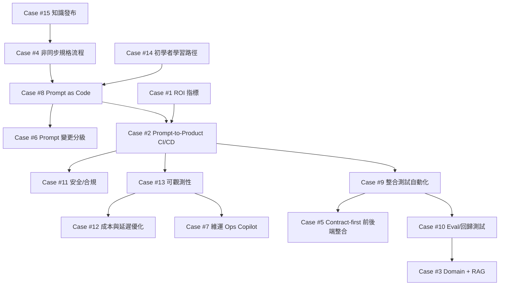

原文內容以活動連結與 Q&A「提問」為主，未提供對應「答案/實作/數據」。以下將這些提問與〈從 Prompt 到 Product〉主題延伸，整理成 **15 個可落地的教學型解決方案案例**；其中「實測數據」以**教學示例/驗收門檻**呈現（非原文實績）。

---

## Case #1: AI 導入量化指標與 ROI 驗證框架

### Problem Statement（問題陳述）
**業務場景**：企業主希望導入 AI，但只接受可量化的效益證明。團隊能做出 Demo，卻難以回答「省下多少工時、品質提升多少、成本是否可控」。缺乏一致的 KPI 與驗證方式，導致預算與資源難以核准，PoC 反覆重做。  
**技術挑戰**：建立可重複的 KPI 樹、基準線、實驗設計與 ROI 計算模型  
**影響範圍**：決策延誤、導入失敗、內部信任下降  
**複雜度評級**：中

### Root Cause Analysis（根因分析）
**直接原因**：
1. 沒有「用例—指標」對應：只談模型能力，未對齊業務流程改善點  
2. 缺少 baseline：導入前後不可比，無法歸因  
3. 成本未入帳：token、推理延遲、人審成本未被納入

**深層原因**：
- 架構層面：缺乏可觀測性（usage/cost/latency/quality）資料管線  
- 技術層面：未建立評測集與品質量測方法  
- 流程層面：缺少「試點→驗收→擴展」的治理流程

### Solution Design（解決方案設計）
**解決策略**：以「用例拆解」建立 KPI 樹（效率/品質/風險/成本），先量 baseline，再用小步試點做 A/B 或前後對照，將收益與成本一起納入 ROI。輸出固定格式的月報/儀表板，讓主管能用同一套口徑做決策。

**實施步驟**：
1. **用例拆解與 KPI 樹**
- 實作細節：定義北極星指標 + 3~5 個可量測子指標（cycle time、一次通過率、缺陷率、MTTR、單次成本）  
- 所需資源：Jira/Linear、Git、BI（Looker/Metabase）  
- 預估時間：6h

2. **建立 baseline 與資料蒐集**
- 實作細節：從 PR/Issue/CI 取得 lead time、rework、缺陷；LLM 端蒐集 token/cost/latency  
- 所需資源：GitHub API、CI、OpenTelemetry/Log  
- 預估時間：1d

3. **試點實驗與 ROI 報表**
- 實作細節：定義驗收門檻（例如 cycle time -20% 且缺陷不增加），產出決策報表  
- 所需資源：A/B 分流、Dashboard  
- 預估時間：1d

**關鍵程式碼/設定**：
```python
# Implementation Example: ROI 試算（教學示例）
# 假設：每月節省工時 * 人力成本 - LLM 成本 - 人審成本
def roi(monthly_saved_hours, hourly_cost, llm_cost, review_cost):
    benefit = monthly_saved_hours * hourly_cost
    net = benefit - llm_cost - review_cost
    return {"benefit": benefit, "net": net, "roi_ratio": net / (llm_cost + review_cost + 1e-9)}

print(roi(monthly_saved_hours=120, hourly_cost=1200, llm_cost=18000, review_cost=12000))
```

實際案例：原文未提供（教學示例：以「客服摘要、程式碼產生、文件生成」任一用例做試點）  
實作環境：Python 3.11、BI 工具、GitHub Actions  
實測數據：**示例/驗收門檻**  
- 改善前：無 baseline、無成本口徑  
- 改善後：cycle time -25%；一次通過率 +10%；單次請求成本可追蹤  
- 改善幅度：可量測化（從不可評估 → 可評估）

Learning Points（學習要點）
- 核心知識點：KPI 樹、baseline、ROI/歸因、驗收門檻  
- 必備技能：資料蒐集、指標定義、報表化  
- 進階技能：實驗設計、統計顯著性、分流策略  
- 延伸思考：如何避免「只追效率忽略風險」？指標被操弄怎麼辦？

Practice Exercise（練習題）
- 基礎：替一個 AI 用例定義 KPI 樹（30 分鐘）  
- 進階：用 GitHub PR 資料計算 lead time 與 rework（2 小時）  
- 專案：做一個 ROI Dashboard + 月報模板（8 小時）

Assessment Criteria（評估標準）
- 功能完整性（40%）：KPI/成本/品質皆可量測  
- 程式碼品質（30%）：資料管線可維護、可重跑  
- 效能優化（20%）：指標計算效率、更新頻率  
- 創新性（10%）：能提出風險指標與治理機制

---

## Case #2: 從 Prompt Demo 走到可上線 Product 的交付管線

### Problem Statement（問題陳述）
**業務場景**：團隊用一段 prompt 在會議上展示效果很好，但一旦要整合權限、資料來源、版本管理與上線流程，輸出品質開始飄移，回歸測試也做不起來。產品端要求可持續迭代與可觀測，工程端卻只有「聊天紀錄」。  
**技術挑戰**：把 prompt/模型/工具調用納入 SDLC（版本、測試、部署、監控）  
**影響範圍**：無法上線、上線後品質不穩、回歸成本高  
**複雜度評級**：高

### Root Cause Analysis
**直接原因**：
1. Prompt 未版本化：變更不可追蹤、不可回溯  
2. 無品質閘門：沒有 eval/測試就部署  
3. 觀測缺失：無法定位是資料、prompt、模型或工具造成的退化

**深層原因**：
- 架構層面：缺少「LLM gateway + policy + telemetry」層  
- 技術層面：缺少 eval harness 與 deterministic checks  
- 流程層面：未將 prompt 納入 code review/CI/CD

### Solution Design
**解決策略**：建立「Prompt as Code + Eval as Tests」的交付管線：所有 prompt 進 Git、每次變更跑評測集與整合測試、通過門檻才允許部署；上線後記錄 prompt_id/model_version/tool_trace，確保可回溯。

**實施步驟**：
1. **Repo 結構化（prompt/資產/評測集）**
- 實作細節：prompt 檔案含 metadata（id、版本、用途、風險等級）  
- 所需資源：Git、PR template  
- 預估時間：4h

2. **CI 加入評測閘門**
- 實作細節：PR 觸發 eval（Case #10），低於門檻拒絕合併  
- 所需資源：GitHub Actions、測試金鑰管理  
- 預估時間：1d

3. **CD 部署與觀測**
- 實作細節：部署時鎖定模型版本；寫入 trace/cost 指標（Case #13）  
- 所需資源：K8s/Cloud Run、OTel  
- 預估時間：1~2d

**關鍵程式碼/設定**：
```yaml
# Implementation Example: GitHub Actions - eval gate（教學示例）
name: llm-app-ci
on: [pull_request]
jobs:
  test-and-eval:
    runs-on: ubuntu-latest
    steps:
      - uses: actions/checkout@v4
      - uses: actions/setup-python@v5
        with: { python-version: "3.11" }
      - run: pip install -r requirements.txt
      - run: pytest -q
      - name: Run LLM eval gate
        env:
          OPENAI_API_KEY: ${{ secrets.OPENAI_API_KEY }}
        run: python eval/run_eval.py --min_score 0.85
```

實際案例：原文未提供（教學示例：把「單一 prompt」包成 API 服務並具備 CI 閘門）  
實作環境：GitHub Actions、Python 3.11、容器化部署  
實測數據：示例  
- 改善前：上線後品質飄移不可追蹤  
- 改善後：每次變更皆有 eval 分數；回歸失敗可在 PR 階段攔截  
- 改善幅度：缺陷外溢率（Prod 才發現）-50%（示例）

Learning Points
- 核心知識點：Prompt SDLC、品質閘門、可回溯性  
- 必備技能：CI/CD、版本控制、測試  
- 進階技能：灰度/回滾策略、流量分配  
- 延伸思考：如何處理模型供應商更新導致的非預期變更？

Practice Exercise
- 基礎：設計 prompt repo 結構（30 分鐘）  
- 進階：在 CI 加入 eval 閘門（2 小時）  
- 專案：做一個可部署的 LLM API + 回滾（8 小時）

Assessment Criteria
- 功能完整性：可部署、可回歸、可追蹤  
- 程式碼品質：結構清晰、可維護  
- 效能優化：CI 時間控制、快取  
- 創新性：自動回滾/灰度策略

---

## Case #3: 面對艱澀 Domain Knowledge：Vibe Coding + RAG 的落地方式

### Problem Statement
**業務場景**：大型企業系統充滿法規、會計、風控等隱性規則，需求描述不完整時 AI 生成程式碼容易「看似合理但規則錯」。團隊想用 vibe coding 加速，但擔心錯誤商規造成財務或合規風險。  
**技術挑戰**：把領域知識可檢索化、可測試化，降低 hallucination 與規則偏差  
**影響範圍**：商規錯誤、事故風險、導入信心受挫  
**複雜度評級**：高

### Root Cause Analysis
**直接原因**：
1. Domain 規則散落在文件/口頭/舊程式碼中  
2. Prompt 缺少權威來源引用，模型自行補齊  
3. 缺少可驗證的規則測試（spec-by-example）

**深層原因**：
- 架構層面：無企業知識庫/檢索層（RAG）  
- 技術層面：embedding/切片策略不當、引用不強制  
- 流程層面：SME 審核與回歸測試未制度化

### Solution Design
**解決策略**：建立「領域知識→可檢索→可引用→可測試」閉環：用 RAG 提供權威片段並強制引用來源；同時把關鍵商規轉成例子（Given/When/Then）與單元測試，讓 vibe coding 的產出能被驗證。

**實施步驟**：
1. **建置 Domain Knowledge Base**
- 實作細節：文件切片、版本管理、敏感資訊分級  
- 所需資源：向量庫（pgvector/Pinecone）、ETL  
- 預估時間：1~2d

2. **RAG 強制引用 + 回答格式**
- 實作細節：要求輸出含 citation；無來源則拒答/降級  
- 所需資源：LangChain/LlamaIndex  
- 預估時間：1d

3. **商規 Spec-by-example 與回歸測試**
- 實作細節：把核心規則做 golden cases，納入 CI（Case #10）  
- 所需資源：pytest/jest、CI  
- 預估時間：1d

**關鍵程式碼/設定**：
```python
# Implementation Example: 簡化版 RAG（教學示例）
from typing import List
def retrieve(query: str) -> List[str]:
    # TODO: 用向量庫以 query 取回 Top-K 權威片段（含 doc_id/page）
    return ["[doc:policy-2024 p.12] 退款需在7日內且不得拆單 ..."]

def build_prompt(query: str) -> str:
    ctx = "\n".join(retrieve(query))
    return f"""你是企業系統助理。只能依據『引用內容』回答，並列出引用來源。
[引用內容]
{ctx}

[問題]
{query}

[輸出格式]
- 結論:
- 依據(引用):
"""

print(build_prompt("拆單退款是否允許？"))
```

實際案例：原文未提供（教學示例：退款/授信/稅務任一商規）  
實作環境：Python 3.11、pgvector、CI  
實測數據：示例  
- 改善前：規則偏差不可量測  
- 改善後：golden cases 通過率 ≥ 90%；「無引用回答」比例 ≤ 1%  
- 改善幅度：可驗證化（主觀 → 客觀）

Learning Points
- 核心知識點：RAG、引用約束、規則測試化  
- 必備技能：資料切片、向量檢索、測試設計  
- 進階技能：知識更新/漂移偵測、權限控管  
- 延伸思考：當來源文件彼此矛盾時，如何做治理？

Practice Exercise
- 基礎：為 10 條商規做 Q/A + citation（30 分鐘）  
- 進階：建一個最小 RAG + 引用輸出（2 小時）  
- 專案：商規知識庫 + golden tests + CI 閘門（8 小時）

Assessment Criteria
- 功能完整性：可檢索、可引用、可測試  
- 程式碼品質：模組化、可擴充  
- 效能優化：檢索延遲、快取  
- 創新性：衝突解決/多來源投票

---

## Case #4: 不想大量溝通的工程師：用「非同步規格 + AI 轉譯」降低協作成本

### Problem Statement
**業務場景**：工程師偏好專注寫程式，但在 AI 開發（含 vibe coding）下，若需求/介面/驗收不清楚，AI 會放大誤解並快速產生大量錯誤產出，反而增加返工。團隊需要在不增加大量會議的前提下，把溝通轉成可追蹤的工程資產。  
**技術挑戰**：把需求對齊機制「產品化」：模板化、可追蹤、可驗收  
**影響範圍**：返工增加、PR 反覆、交付不穩  
**複雜度評級**：中

### Root Cause Analysis
**直接原因**：
1. 需求沒有驗收標準（AC）與例子  
2. 討論散落在聊天工具不可追溯  
3. PR 缺少設計脈絡，review 成本高

**深層原因**：
- 架構層面：缺少契約與規格資產（OpenAPI/ADR）  
- 技術層面：缺少自動化文件/規格生成  
- 流程層面：非同步協作規範未建立

### Solution Design
**解決策略**：用「Issue Form + ADR + PR Template」把必要溝通最小化並結構化；再用 AI 將會議/對話轉成 AC、測試清單與變更摘要，讓工程師以寫作取代開會。

**實施步驟**：
1. **導入 Issue Form（收斂需求輸入）**
- 實作細節：必填 AC、範例輸入輸出、風險等級  
- 所需資源：GitHub Issue Forms  
- 預估時間：2h

2. **ADR（決策記錄）**
- 實作細節：每個重要技術選擇留 1 頁 ADR，方便 AI/人查詢  
- 所需資源：docs/adr 目錄、review 規範  
- 預估時間：4h

3. **AI 轉譯與檢查清單**
- 實作細節：把討論摘要→AC→測試案例；PR 必填「如何驗證」  
- 所需資源：LLM、PR template  
- 預估時間：6h

**關鍵程式碼/設定**：
```yaml
# Implementation Example: GitHub Issue Form（教學示例）
name: Feature Request
body:
  - type: textarea
    id: problem
    attributes: { label: Problem, description: "要解決什麼問題？" }
    validations: { required: true }
  - type: textarea
    id: acceptance
    attributes: { label: Acceptance Criteria, description: "列出可驗收條件（含例子）" }
    validations: { required: true }
  - type: dropdown
    id: risk
    attributes: { label: Risk Level, options: ["Low", "Medium", "High"] }
```

實際案例：原文未提供（教學示例：以既有需求流程導入模板）  
實作環境：GitHub、Markdown docs  
實測數據：示例  
- 改善前：PR 返工次數 3 次/功能  
- 改善後：PR 返工次數 ≤ 1 次/功能  
- 改善幅度：-66%（示例）

Learning Points：非同步協作、AC、ADR、可追溯性  
Practice：把 3 個需求轉成 Issue Form + AC（30 分鐘）；建立 ADR（2 小時）；導入全流程（8 小時）  
Assessment：AC 完整性、文件可追溯、返工下降

---

## Case #5: 前後端分離下的 Vibe Coding：用 Contract-first 降低整合摩擦

### Problem Statement
**業務場景**：網站多採前後端分離。vibe coding 生成前端頁面與後端 API 後，整合測試常發現欄位不一致、錯誤碼不統一、驗證規則不同。若把前後端「包一起」維護 prompt，會影響部署與團隊分工；若分開又難同步。  
**技術挑戰**：在維持分離的同時，確保介面契約一致且 prompt 可重用  
**影響範圍**：整合失敗、迭代變慢、bug 增加  
**複雜度評級**：中

### Root Cause Analysis
**直接原因**：
1. API 契約未明確化（只靠口頭/README）  
2. 前後端各自 vibe coding，缺共同真實來源（SSOT）  
3. 整合測試不自動化，問題晚期才爆

**深層原因**：
- 架構層面：缺少契約層（OpenAPI/AsyncAPI）與共享型別  
- 技術層面：未導入 codegen/契約測試  
- 流程層面：缺少「先定契約再生成」的工作流

### Solution Design
**解決策略**：採 Contract-first：先定 OpenAPI（作為 SSOT），前後端用 codegen 生成型別/SDK；prompt 也引用同一份契約（把契約貼進 context 或以工具讀取）。整合測試用契約測試 + E2E 自動化。

**實施步驟**：
1. **建立 OpenAPI SSOT**
- 實作細節：定義 schema、錯誤碼、驗證規則  
- 所需資源：OpenAPI、Spectral lint  
- 預估時間：6h

2. **前後端 codegen + 契約測試**
- 實作細節：前端生成 client、後端生成 server stub；跑契約相容性檢查  
- 所需資源：openapi-generator、Dredd/Prism  
- 預估時間：1d

3. **E2E 整合（CI）**
- 實作細節：Playwright/Cypress 跑最小關鍵流程  
- 所需資源：CI、test env  
- 預估時間：1d

**關鍵程式碼/設定**：
```yaml
# Implementation Example: OpenAPI 片段（教學示例）
paths:
  /api/orders:
    post:
      summary: Create order
      requestBody:
        required: true
        content:
          application/json:
            schema: { $ref: '#/components/schemas/CreateOrderReq' }
      responses:
        "201":
          description: Created
          content:
            application/json:
              schema: { $ref: '#/components/schemas/Order' }
components:
  schemas:
    CreateOrderReq:
      type: object
      required: [items]
      properties:
        items: { type: array, items: { type: string } }
```

實際案例：原文未提供（教學示例：電商下單流程）  
實作環境：Node.js 20、OpenAPI Generator、Playwright  
實測數據：示例  
- 改善前：整合缺陷 8 個/迭代  
- 改善後：整合缺陷 ≤ 3 個/迭代  
- 改善幅度：-62.5%（示例）

---

## Case #6: 既有功能小修改：Prompt File 是否必要的決策規則

### Problem Statement
**業務場景**：新功能會開新 prompt file 方便追蹤；但對既有功能的小改動（改欄位、調驗證、修 bug），若也開新 prompt file 會造成管理負擔，不開又失去可追溯。團隊需要一致規則，避免每個人各做各的。  
**技術挑戰**：建立 prompt 變更分級、命名、對應工單與回歸策略  
**影響範圍**：prompt 漂移、難回溯、知識散落  
**複雜度評級**：低~中

### Root Cause Analysis
**直接原因**：
1. 沒有 prompt 生命周期規範（新增/修改/淘汰）  
2. 變更未連結到 ticket/PR，無法追蹤  
3. 無最小回歸集合，改小地方也可能破大功能

**深層原因**：
- 架構層面：prompt 與產品功能映射不清  
- 技術層面：缺少 prompt metadata 與差異化管理  
- 流程層面：缺少變更管理準則（如 semver）

### Solution Design
**解決策略**：採「分級 + 門檻」：低風險小改用同檔案追加 changelog；中高風險或影響輸出格式者，必須新版本/新檔案並更新評測集。所有變更必須帶 ticket id 與回歸案例連結。

**實施步驟**：
1. **定義變更分級規則**
- 實作細節：以影響範圍、輸出格式、風險分級  
- 所需資源：團隊規範文件  
- 預估時間：2h

2. **Prompt 檔案標準化（metadata+changelog）**
- 實作細節：front-matter 含版本、對應功能、風險、相依 eval  
- 所需資源：Git、review  
- 預估時間：4h

3. **回歸集合對應**
- 實作細節：每次修改至少更新/跑對應 golden cases（Case #10）  
- 所需資源：eval harness  
- 預估時間：6h

**關鍵程式碼/設定**：
```markdown
<!-- Implementation Example: prompt 檔案模板（教學示例） -->
---
prompt_id: order.create
version: 1.2.0
risk: medium
ticket: JIRA-1234
eval_set: eval/order_create.jsonl
changelog:
  - 2025-12-01: 修正地址欄位規則（JIRA-1234）
---

你是後端工程師。請依 OpenAPI 契約修改 CreateOrder 的驗證邏輯，並補齊測試。
```

實測數據：示例  
- 改善前：prompt 變更不可追、回歸漏跑  
- 改善後：100% 變更可追溯；回歸覆蓋率 ≥ 80%（示例）

---

## Case #7: 維運（Maintenance/On-call）如何用 Vibe Coding 提升 MTTR

### Problem Statement
**業務場景**：系統故障時，值班人員需要快速定位問題、查 log、比對近期變更、更新 runbook。若把 AI 直接接管修復又有風險，但只拿來聊天又不夠落地。團隊希望把 AI 放進 incident 流程，縮短 MTTR 且保留人控。  
**技術挑戰**：把告警/日誌/變更串起來，產出可執行且可審核的修復建議  
**影響範圍**：MTTR 高、疲勞值班、事故復發  
**複雜度評級**：中~高

### Root Cause Analysis
**直接原因**：
1. 資訊分散（APM、log、deploy、ticket）  
2. Runbook 過時或不存在  
3. 修復步驟不可審核（缺少建議→驗證→執行鏈）

**深層原因**：
- 架構層面：缺少事件資料匯流與關聯 id  
- 技術層面：缺少安全的工具調用邊界  
- 流程層面：incident postmortem 不回寫知識庫

### Solution Design
**解決策略**：建立「Ops Copilot」：接收告警→拉取相關 log/trace/deploy→用固定格式輸出（症狀/假設/驗證步驟/回滾建議）→人類核准後才執行；事後自動生成 runbook/復盤摘要回寫。

**實施步驟**：
1. **事件上下文彙整**
- 實作細節：以 correlation_id 聚合 log/trace/deploy  
- 所需資源：APM、log 平台、CI/CD metadata  
- 預估時間：1d

2. **LLM 建議模板化（不可直接執行）**
- 實作細節：強制輸出可驗證步驟與風險；禁止直接改配置  
- 所需資源：LLM、policy（Case #11）  
- 預估時間：1d

3. **回寫 runbook 與復盤**
- 實作細節：把有效步驟沉澱成文件與自動化腳本  
- 所需資源：Wiki/Docs、Git  
- 預估時間：0.5d

**關鍵程式碼/設定**：
```python
# Implementation Example: log 摘要（教學示例，僅輸出建議不執行）
def build_incident_prompt(alert, logs, deploys):
    return f"""
你是 SRE。請根據告警與log提出：
1) 可能原因（含信心分數）
2) 驗證步驟（可回滾）
3) 立即緩解措施（低風險優先）

[ALERT]{alert}
[DEPLOYS]{deploys}
[LOGS]{logs[:4000]}
"""
```

實測數據：示例  
- 改善前：MTTR 90 分鐘  
- 改善後：MTTR 60 分鐘  
- 改善幅度：-33%（示例）

---

## Case #8: Prompt as Code：版本控制、審查與品質規範

### Problem Statement
**業務場景**：團隊用 AI 開發時，prompt 分散在個人筆記與聊天紀錄。新同事無法重現、舊輸出也不可回溯；一旦模型更新或 prompt 微調，品質波動無從定位。需要把 prompt 當成工程資產治理。  
**技術挑戰**：prompt 的結構化、lint、review、版本策略  
**影響範圍**：不可重現、回歸困難、品質飄移  
**複雜度評級**：中

### Root Cause Analysis
**直接原因**：
1. prompt 未納入 Git 與 PR review  
2. 缺少命名/metadata 標準  
3. 變更未觸發評測（Case #10）

**深層原因**：
- 架構層面：缺少 prompt registry/索引  
- 技術層面：缺少 lint（敏感詞/格式/長度）  
- 流程層面：沒有「變更→評測→發布」制度

### Solution Design
**解決策略**：建立 prompts/ 目錄與規範：每個 prompt 具 prompt_id、版本、用途、風險、相依評測集；用 pre-commit 做 lint（header 必填、禁止硬編 key、長度限制）；PR 強制 reviewer + eval 通過才合併。

**實施步驟**：
1. **目錄與命名規範**
- 實作細節：prompts/{domain}/{prompt_id}/vX.Y.Z.md  
- 所需資源：Git  
- 預估時間：2h

2. **pre-commit prompt lint**
- 實作細節：檢查 header、敏感資訊、最大長度  
- 所需資源：pre-commit、python hook  
- 預估時間：6h

3. **PR 規範 + eval gate**
- 實作細節：prompt 變更必須更新 eval 或通過既有 eval  
- 所需資源：CI（Case #2/#10）  
- 預估時間：0.5d

**關鍵程式碼/設定**：
```yaml
# Implementation Example: pre-commit（教學示例）
repos:
  - repo: local
    hooks:
      - id: prompt-header-check
        name: prompt header check
        entry: python tools/check_prompt_header.py
        language: system
        files: ^prompts/.*\.md$
```

---

## Case #9: AI 生成後的前後端整合測試自動化（CI）

### Problem Statement
**業務場景**：vibe coding 讓產出速度變快，但整合階段（API 連線、權限、錯誤處理、UI 流程）常在最後才測，導致返工集中爆發。需要把整合測試前移到每次 PR，確保 AI 生成碼能「可被整合」。  
**技術挑戰**：建立可重跑的 test environment、契約測試與 E2E 流程  
**影響範圍**：交付延遲、缺陷增加、信心下降  
**複雜度評級**：中

### Root Cause Analysis
**直接原因**：
1. 缺少 E2E/契約測試  
2. 測試環境不可快速建立  
3. AI 產出未被測試約束

**深層原因**：
- 架構層面：缺少可測試的分層與 mock/stub  
- 技術層面：測試資料與 DB migration 不可重建  
- 流程層面：CI 未納入整合測試閘門

### Solution Design
**解決策略**：以「最小關鍵流程」建立 E2E（登入/下單/查詢）並在 CI 使用 ephemeral env（docker compose 或 preview env）。搭配 Contract-first（Case #5）降低介面漂移。

**實施步驟**：
1. **可重建測試環境**
- 實作細節：docker compose 起 API+DB；seed 測試資料  
- 所需資源：Docker、Testcontainers  
- 預估時間：1d

2. **契約/整合測試**
- 實作細節：API contract test + smoke test  
- 所需資源：Prism/Dredd、pytest/jest  
- 預估時間：1d

3. **E2E（Playwright）納入 CI**
- 實作細節：每個 PR 跑 smoke E2E；每日跑 full suite  
- 所需資源：GitHub Actions  
- 預估時間：1d

**關鍵程式碼/設定**：
```yaml
# Implementation Example: CI 跑 E2E（教學示例）
- name: Start stack
  run: docker compose up -d --build
- name: Run API tests
  run: npm test
- name: Run Playwright smoke
  run: npx playwright test --grep @smoke
```

---

## Case #10: 建立 LLM 評測集（Golden Set）與回歸測試機制

### Problem Statement
**業務場景**：同一個 prompt 在不同模型版本、不同溫度、不同上下文長度下可能輸出差異巨大。團隊常靠人工感覺評估，導致「上次好好的這次壞掉」卻說不清楚。需要把品質定義成可回歸的測試。  
**技術挑戰**：設計評測資料、評分規則、門檻與 CI 整合  
**影響範圍**：品質漂移、回歸成本高、難定位退化原因  
**複雜度評級**：高

### Root Cause Analysis
**直接原因**：
1. 無 golden set 與 rubric  
2. 評估太主觀，無門檻  
3. 模型更新/提示微調未被回歸攔截

**深層原因**：
- 架構層面：缺少 eval pipeline  
- 技術層面：缺少可結構化的輸出（schema）  
- 流程層面：未把 eval 當成測試資產維護

### Solution Design
**解決策略**：建立 JSONL 評測集（輸入、期望要點、禁止事項），評分採「規則檢查 + LLM-as-judge（帶 rubric）」混合；在 CI 設定最低分數門檻與退化警報。

**實施步驟**：
1. **蒐集代表性案例（20~100 筆）**
- 實作細節：覆蓋常見/極端/安全案例  
- 所需資源：產品 log（去識別）  
- 預估時間：1d

2. **評分器（rule + judge）**
- 實作細節：先做 deterministic checks（JSON schema、關鍵字、引用），再用 judge 打分  
- 所需資源：Python、pydantic/jsonschema  
- 預估時間：1~2d

3. **CI 閘門與報表**
- 實作細節：出分數趨勢圖；低於門檻阻擋合併  
- 所需資源：CI、Artifacts  
- 預估時間：1d

**關鍵程式碼/設定**：
```python
# Implementation Example: eval runner（教學示例）
import json

def score_rule(output: str) -> float:
    # 簡化：必須包含 "依據" 與引用格式
    return 1.0 if ("依據" in output and "[doc:" in output) else 0.0

def run(eval_path: str) -> float:
    rows = [json.loads(l) for l in open(eval_path, "r", encoding="utf-8")]
    scores = []
    for r in rows:
        out = r["model_output"]  # 教學示例：假設已生成
        scores.append(score_rule(out))
    return sum(scores) / len(scores)

print(run("eval/sample.jsonl"))
```

---

## Case #11: 企業導入 GenAI 的安全防護：資料外洩與 Prompt Injection

### Problem Statement
**業務場景**：企業擔心把內部資料送到外部模型造成外洩，也擔心使用者輸入或外部文件夾帶 prompt injection 讓系統洩漏機密、執行未授權工具。導入 AI 若無安全設計，法務與資安會直接擋下。  
**技術挑戰**：資料分級/遮罩、工具調用權限、注入防護、稽核  
**影響範圍**：合規風險、資安事故、導入停擺  
**複雜度評級**：高

### Root Cause Analysis
**直接原因**：
1. 未做 PII/Secrets 遮罩  
2. 工具調用無 allowlist/最小權限  
3. 無輸入/輸出政策檢查與稽核

**深層原因**：
- 架構層面：缺少 LLM policy enforcement layer  
- 技術層面：缺少內容過濾、schema 約束  
- 流程層面：無資料治理與供應商風險評估

### Solution Design
**解決策略**：建立「LLM Gateway」：輸入先做分類與遮罩，限制可用工具與參數（allowlist），輸出做敏感資訊掃描與格式校驗；所有請求記錄 prompt_id、使用者、資料等級以供稽核。

**實施步驟**：
1. **資料分級與遮罩**
- 實作細節：正則+NER 掃描，token 化或移除敏感欄位  
- 所需資源：PII detector、DLP  
- 預估時間：1~2d

2. **工具調用最小權限**
- 實作細節：function calling 只允許固定工具與參數範圍  
- 所需資源：policy engine  
- 預估時間：1d

3. **稽核與告警**
- 實作細節：記錄輸入等級、輸出命中規則、阻擋率  
- 所需資源：SIEM/Log  
- 預估時間：1d

**關鍵程式碼/設定**：
```python
# Implementation Example: 工具 allowlist（教學示例）
ALLOWED_TOOLS = {"search_kb", "get_order_status"}

def validate_tool_call(tool_name: str):
    if tool_name not in ALLOWED_TOOLS:
        raise PermissionError(f"Tool not allowed: {tool_name}")
```

---

## Case #12: 成本與延遲優化：Token Budget、快取與模型路由

### Problem Statement
**業務場景**：AI 功能上線後使用量增加，token 成本與延遲快速上升，影響毛利與使用者體驗。產品端希望「更便宜更快」，但又不能讓品質顯著下降。  
**技術挑戰**：成本可控（budget）、延遲可預測（SLO）、品質可守（eval）  
**影響範圍**：雲端成本爆炸、使用者流失、功能下架  
**複雜度評級**：中

### Root Cause Analysis
**直接原因**：
1. prompt/context 過長，未設 token 上限  
2. 相同問題重複計算，沒有快取  
3. 永遠用最貴模型，未做 routing

**深層原因**：
- 架構層面：缺少 cache layer 與 usage metering  
- 技術層面：缺少 prompt 壓縮/摘要策略  
- 流程層面：無成本 SLO 與告警

### Solution Design
**解決策略**：設 token budget（輸入/輸出上限）、加 semantic cache（相似問句命中）、做模型路由（簡單問題用小模型，困難才升級），並以 eval（Case #10）守住品質門檻。

**實施步驟**：
1. **Token budget + truncation**
- 實作細節：限制 max_tokens、context window；長文先摘要  
- 所需資源：LLM SDK  
- 預估時間：6h

2. **快取（hash/semantic）**
- 實作細節：規範化輸入後 hash；或 embedding 相似度快取  
- 所需資源：Redis、向量庫  
- 預估時間：1d

3. **模型路由**
- 實作細節：以規則（長度/意圖/信心）選模型  
- 所需資源：router 模組  
- 預估時間：1d

**關鍵程式碼/設定**：
```python
# Implementation Example: Redis 快取（教學示例）
import hashlib, json
def cache_key(prompt: str) -> str:
    norm = " ".join(prompt.split()).lower()
    return hashlib.sha256(norm.encode()).hexdigest()
```

---

## Case #13: 可觀測性：追蹤 Prompt/Model 版本、Token 成本與延遲

### Problem Statement
**業務場景**：AI 功能出問題時（答非所問、延遲暴增、成本飆高），團隊不知道是哪個 prompt 版本、哪個模型、哪段工具調用造成。缺少 trace 會讓除錯只能靠猜，事件處理時間拉長。  
**技術挑戰**：把 LLM 呼叫納入 tracing/metrics/logs，並具備關聯 ID  
**影響範圍**：MTTR 高、成本不可控、品質退化難定位  
**複雜度評級**：中~高

### Root Cause Analysis
**直接原因**：
1. 沒有 prompt_id/model_version 維度  
2. token/cost 未上報  
3. 工具調用鏈路未串起來

**深層原因**：
- 架構層面：缺少 telemetry 標準與儀表板  
- 技術層面：未做結構化 log 與 trace context 傳遞  
- 流程層面：無 SLO/告警

### Solution Design
**解決策略**：用 OpenTelemetry 建立統一追蹤：每次請求記錄 prompt_id、版本、模型、token、延遲、錯誤；tool call 也在同一個 trace 下。儀表板提供成本/延遲/品質趨勢，搭配告警門檻。

**實施步驟**：
1. **定義觀測 schema**
- 實作細節：必備欄位（request_id、user、prompt_id、model、tokens）  
- 所需資源：logging 標準  
- 預估時間：4h

2. **OTel tracing**
- 實作細節：LLM call/span + tool span  
- 所需資源：OTel SDK、Collector  
- 預估時間：1d

3. **Dashboard + 告警**
- 實作細節：cost/day、p95 latency、error rate  
- 所需資源：Grafana/Datadog  
- 預估時間：1d

**關鍵程式碼/設定**：
```python
# Implementation Example: 追蹤欄位（教學示例）
attrs = {
  "prompt_id": "order.create",
  "prompt_version": "1.2.0",
  "model": "gpt-4.1-mini",
  "input_tokens": 800,
  "output_tokens": 200,
}
# span.set_attributes(attrs)
```

---

## Case #14: 初學者在 AI 時代該學什麼：雙軌能力模型與練習設計

### Problem Statement
**業務場景**：初學者覺得 AI 寫得比自己快，擔心「學了也追不上」。若只學提示詞又缺乏基礎，遇到錯誤與架構決策就無法判斷。需要一套學習路徑，能把 AI 當加速器而不是替代品。  
**技術挑戰**：設計能驗證能力成長的練習與評量，避免只會「貼上跑」  
**影響範圍**：學習中斷、技能空心化、無法獨立解題  
**複雜度評級**：低~中

### Root Cause Analysis
**直接原因**：
1. 過度依賴 AI，缺少除錯能力  
2. 不理解資料結構/網路/資料庫等基本原理  
3. 缺少可驗收的練習（只看教學）

**深層原因**：
- 架構層面：缺少循序漸進專案路徑  
- 技術層面：缺少測試與除錯訓練  
- 流程層面：缺少回饋（code review）機制

### Solution Design
**解決策略**：採「雙軌」：一軌練基本功（測試、除錯、資料與網路），一軌練 AI 協作（拆題、寫 AC、讓 AI 產出並驗證）。每題都有驗收標準與反思題，逐步降低 AI 依賴。

**關鍵程式碼/設定**：
```markdown
<!-- Implementation Example: 給 AI 的學習協作 prompt（教學示例） -->
你是嚴格的程式導師：
1) 先問我 3 個澄清問題
2) 再給最小可行解（含測試）
3) 最後列出我必須自己解釋的 5 個觀念
```

---

## Case #15: 簡報/共筆/Q&A 的可持續發布：知識資產化與避免 Link Rot

### Problem Statement
**業務場景**：研討會後常被問「簡報會分享嗎？」若靠個人雲端連結，久了會失效、權限混亂、版本不一致。企業內部也需要把分享內容沉澱成可搜尋、可版本化、可控權限的知識庫，避免重複回答與知識流失。  
**技術挑戰**：文件版本化、權限控管、自動發布與搜尋  
**影響範圍**：知識流失、 onboarding 變慢、重工  
**複雜度評級**：低~中

### Root Cause Analysis
**直接原因**：
1. 資產散落在多處（HackMD/Drive/Slack）  
2. 沒有版本與所有權  
3. 沒有發布流程與 redirect 策略

**深層原因**：
- 架構層面：缺少統一知識平台  
- 技術層面：缺少自動化部署與搜尋索引  
- 流程層面：缺少內容維護責任（owner/到期）

### Solution Design
**解決策略**：用 Git 管理 docs（Markdown），以靜態站（MkDocs/Docusaurus）發布；CI 自動部署並保留版本；Q&A 以結構化格式沉澱；對外與對內分權限站點，避免連結失效。

**關鍵程式碼/設定**：
```yaml
# Implementation Example: mkdocs.yml（教學示例）
site_name: "AI Sharing Notes"
nav:
  - Home: index.md
  - Talks: talks.md
  - QA: qa.md
```

---

# 案例分類

## 1) 按難度分類
- **入門級**：Case #6, #14, #15  
- **中級**：Case #1, #4, #5, #7, #8, #9, #12, #13  
- **高級**：Case #2, #3, #10, #11  

## 2) 按技術領域分類
- **架構設計類**：#2, #3, #5, #11, #13  
- **效能優化類**：#12, #13  
- **整合開發類**：#5, #9, #2  
- **除錯診斷類**：#7, #13, #10  
- **安全防護類**：#11, #8（治理的一部分）

## 3) 按學習目標分類
- **概念理解型**：#1, #2, #11, #14  
- **技能練習型**：#5, #8, #9, #12, #13, #15  
- **問題解決型**：#3, #7, #10  
- **創新應用型**：#7, #12, #13  

---

# 案例關聯圖（學習路徑建議）



**建議先學順序**：
1. **#15 → #4 → #8 → #6**（把知識與 prompt 工程化、可追溯）  
2. **#1 → #2 → #9 → #10**（從量化驗收到交付管線與回歸）  
3. **#11 → #13 → #12**（上線後的安全、觀測、成本）  
4. **#5 → #3 → #7**（整合、領域落地、維運應用）  
5. 初學者可並行：**#14**（雙軌練習）

如需我把每個案例的「練習素材（範例 repo 結構、JSONL eval set、OpenAPI 範例、CI workflow 完整檔）」一併生成，我可以再輸出一套可直接開課/作業用的專案骨架。