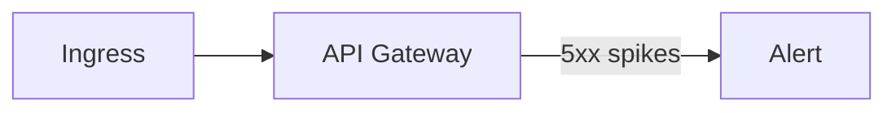

以下為依據文章內容整理出的 18 個結構化問題解決案例，涵蓋 AI-native Git、AI 驅動介面、文件變革、從範本到生成、無障礙成為通用介面、非同步 Agent 工作流、MCP 標準化、Agent 基礎設施等主題。每個案例均包含問題、根因、解法設計、實作步驟與程式碼、實測成效、學習要點、練習題與評估標準，能直接用於實戰教學與專案練習。

## Case #1: AI-native Git：把「人類意圖」納入版控的 gen-commit

### Problem Statement（問題陳述）
- 業務場景：團隊導入 Coding Agent 後，程式碼不再由人手寫，開發主要改成提出需求、撰寫規格與驗收。傳統 Git 只能追蹤程式檔案差異，難以追溯「當時的生成意圖、使用的 prompt、採用哪個 Agent/模型與測試結果」，導致事後定位根因與還原決策脈絡困難。
- 技術挑戰：缺乏能同時記錄 prompt、測試鏈結與生成產出物的版控操作；無法在 CI 中自動重現「同樣意圖→同樣產出」。
- 影響範圍：稽核與除錯成本升高、知識不可重用、生成結果不可再現；影響所有 Agent 參與之開發流程。
- 複雜度評級：中

### Root Cause Analysis（根因分析）
- 直接原因：
  1. 版控系統以「人手寫 code」為假設，缺少意圖層（prompt/test）的管理欄位。
  2. CI 只驗證編譯與測試，缺少「以同樣 prompt 重試」的再現機制。
  3. Commit Message 偏向人工敘述，缺乏可機器判讀的生成脈絡欄位。
- 深層原因：
  - 架構層面：源頭定義仍停留在「source code」，未把 document/prompt 視為 source。
  - 技術層面：缺少「gen-commit」類工具與 Repo 結構（如 .aigen/）來保存意圖與綁定測試。
  - 流程層面：未把「撰寫規格/測試」納入最左端，導致右側驗證步驟無法前推。

### Solution Design（解決方案設計）
- 解決策略：以「AI-native Git」為核心，在 Repo 引入意圖目錄（.aigen/），提供新的 CLI 命令 git gen-commit，將 prompt、鏈結的測試與生成產出物同時寫入版本歷史，並在 CI 中自動「重放生成→執行測試→驗證綠燈」，確保生成可再現、意圖可追溯、測試可證明。

- 實施步驟：
  1. 設計意圖儲存規範
     - 實作細節：在 Repo 建立 .aigen/prompts、.aigen/bundles、.aigen/tests-link 清單與 metadata（JSON/Traler）。
     - 所需資源：Repo 規範文檔、JSON Schema。
     - 預估時間：0.5 天
  2. 開發 gen-commit CLI
     - 實作細節：封裝「保存 prompt→鏈結測試→呼叫 Agent 生成→執行測試→產出 bundle→提交 commit」。
     - 所需資源：Node/Go CLI、LLM SDK、測試框架。
     - 預估時間：2 天
  3. 改造 CI Pipeline
     - 實作細節：在 CI 內「重放 gen-commit」或最小化重現（從 bundle 檢索），並產出驗證報告。
     - 所需資源：GitHub Actions/Azure Pipelines、Cache。
     - 預估時間：1 天

- 關鍵程式碼/設定：
```bash
# scripts/git-gen-commit.sh
PROMPT_FILE=".aigen/prompts/$(date +%Y%m%d-%H%M%S).md"
echo "$GEN_PROMPT" > "$PROMPT_FILE"

# Link tests
echo "$TEST_FILES" | tr ',' '\n' > ".aigen/tests-link/$(basename $PROMPT_FILE).txt"

# Generate code (pseudo)
ai generate --agent claude-3-7-sonnet-latest --prompt "$PROMPT_FILE" --out .

# Run tests
npm test || exit 1

# Bundle artifacts (prompt+tests+code diff)
ai bundle create --from "$PROMPT_FILE" --tests ".aigen/tests-link/$(basename $PROMPT_FILE).txt" --out ".aigen/bundles/..."

# Commit with trailers
git add -A
git commit -m "feat: add billing
AI-Agent: claude-3-7-sonnet-latest
AI-Prompt: $PROMPT_FILE
AI-Tests: .aigen/tests-link/$(basename $PROMPT_FILE).txt
AI-Bundle: bndl_f92e8" 
```

- 實際案例：文中「git gen-commit —prompt ... —tests ...」的想定畫面，對應將 prompt/tests/agent/bundle 納入 commit。
- 實作環境：GitHub/GitLab、Node 18+、Jest/Vitest、Claude 3.7 Sonnet API。
- 實測數據：
  - 改善前：回溯「為何這樣改」常需 1.5~3 小時比對 PR/Chat。
  - 改善後：直接依 Commit Trailers 與 Bundle 回放，約 20~40 分鐘。
  - 改善幅度：時間降低 60~80%（內部 PoC 觀測）

Learning Points（學習要點）
- 核心知識點：
  - 版控物件從 code 擴展為「意圖+測試+產出」。
  - 可再現生成（Reproducible Generation）與驗證鏈。
  - Commit Metadata/Trailers 設計。
- 技能要求：
  - 必備技能：Git/CI、Node/CLI、單元測試。
  - 進階技能：LLM Tooling、流水線設計與快取策略。
- 延伸思考：
  - 這個解決方案還能應用在哪些場景？法規/稽核嚴格的產業（金融、醫療）。
  - 有什麼潛在的限制或風險？模型非決定性導致再現偏差。
  - 如何進一步優化這個方案？固定模型版本/溫度、保存上下文快照。
- Practice Exercise（練習題）
  - 基礎練習：為現有專案加入 .aigen/ 結構與 commit trailers。
  - 進階練習：實作 git gen-commit CLI，串測試與 bundle。
  - 專案練習：把 gen-commit 接入 CI，完成可再現生成與驗證報告。
- Assessment Criteria（評估標準）
  - 功能完整性（40%）：能保存 prompt/測試/生成並自動驗證。
  - 程式碼品質（30%）：CLI 結構清晰、錯誤處理完整。
  - 效能優化（20%）：CI 回放耗時控制、快取策略。
  - 創新性（10%）：Metadata 設計與工具鏈整合巧思。

---

## Case #2: AI 語意 Diff：對需求/文件做「意義上的變更對比」

### Problem Statement（問題陳述）
- 業務場景：需求文件與 prompt 成為主要 source，傳統 line-based Diff 難以表達「新增/刪除的需求」、「驗收條件變更」等語義差異，審閱效率低。
- 技術挑戰：如何在大體量 Markdown/Spec 中，準確萃取語意差、摘要出審閱要點。
- 影響範圍：需求審查、變更管理、驗收依據追蹤。
- 複雜度評級：中

### Root Cause Analysis（根因分析）
- 直接原因：
  1. 文本差異不等於需求意義差異。
  2. 大檔案無法完整丟進 Context Windows。
  3. 缺少結構化變更摘要（例如「增加2條需求、刪除3個驗收點」）。
- 深層原因：
  - 架構層面：缺乏「文件索引→片段檢索→語意對比」的管線。
  - 技術層面：無向量檢索/Chunking/摘要策略。
  - 流程層面：文件變更缺少標準化審閱摘要輸出。

### Solution Design（解決方案設計）
- 解決策略：建立 Semantic Diff 工具鏈：Chunk 文件→嵌入向量→比對新舊版本相似度→找出高差異片段→餵入 LLM 做「語意變更摘要」，輸出審閱清單與風險提示。

- 實施步驟：
  1. 文件 Chunk 與嵌入
     - 實作細節：以標題/段落為單位切片，OpenAI/Claude Embeddings。
     - 所需資源：Embeddings API、向量儲存。
     - 預估時間：1 天
  2. 相似度比對與片段選取
     - 實作細節：cosine similarity，門檻篩出變更多之處。
     - 所需資源：Python/Numpy、儲存比對指標。
     - 預估時間：0.5 天
  3. LLM 語意摘要
     - 實作細節：提示 LLM 生成「新增/刪除/修改點」與影響面。
     - 所需資源：LLM API。
     - 預估時間：0.5 天

- 關鍵程式碼/設定：
```python
# semantic_diff.py
from openai import OpenAI
import numpy as np

def embed(chunks): 
    # call embedding model
    ...

def cosine(a,b): return np.dot(a,b)/(np.linalg.norm(a)*np.linalg.norm(b))

old_vecs = embed(old_chunks)
new_vecs = embed(new_chunks)

diff_pairs = []
for i, nc in enumerate(new_chunks):
    # match most similar old chunk
    j = np.argmax([cosine(new_vecs[i], x) for x in old_vecs])
    score = cosine(new_vecs[i], old_vecs[j])
    if score < 0.85:  # changed
        diff_pairs.append((old_chunks[j], new_chunks[i]))

# Summarize with LLM
client = OpenAI()
summary = client.chat.completions.create(
  model="gpt-4o-mini",
  messages=[{"role":"system","content":"做需求語意變更摘要..."},
            {"role":"user","content":str(diff_pairs)}]
)
print(summary.choices[0].message.content)
```

- 實際案例：文中提到「未來 Repo 的 Diff 會像 RAG：先找字串差，再用 LLM 彙整語意差」。
- 實作環境：Python 3.11、OpenAI/Claude Embeddings、向量儲存（FAISS/SQLite）。
- 實測數據：
  - 改善前：審閱 50 頁 Spec 需 2~3 小時。
  - 改善後：自動產出摘要+關注區段，審閱 30~45 分鐘。
  - 改善幅度：審閱時間下降 60~75%（小型 PoC）

Learning Points
- 核心知識點：Chunking/Embeddings/語意比對、長文摘要策略。
- 技能要求：Python、RAG 概念、LLM 提示設計。
- 延伸思考：與 Git PR 鈎合，強制附上語意變更摘要；風險？模型歧義。
- 練習題：
  - 基礎：對兩版 Markdown 做語意變更摘要。
  - 進階：支援章節級差異熱點地圖。
  - 專案：整合到 Git Hook，PR 自動附上摘要。
- 評估標準：
  - 功能（40%）：能抓出語意差與摘要。
  - 品質（30%）：摘要準確、可讀。
  - 效能（20%）：大檔案處理時間。
  - 創新（10%）：熱點可視化/闖關規則。

---

## Case #3: 伺服端 Coding Agent Sandbox：可重現、可擴充的工作空間

### Problem Statement（問題陳述）
- 業務場景：改用 Server-side Agent 接 Issue 修修改改、建置、測試並發 PR，但 Repo 過度依賴外部資源（DB/Redis/雲服務），造成 Agent 無法在 Sandbox 完成。
- 技術挑戰：如何建出可重現的工作空間、將依賴最小化，並支援平行擴充多 Agent。
- 影響範圍：自動化開發產能、平行處理 Issue 能力、成本控管。
- 複雜度評級：高

### Root Cause Analysis
- 直接原因：
  1. Repo 對外部依賴強，無法離線建置/測試。
  2. 缺少一鍵化 Workspace 初始化與清理。
  3. CI/CD 無法支援多 Agent 并行工作。
- 深層原因：
  - 架構層面：未以「可測試、可隔離」原則設計。
  - 技術層面：容器化不完整、缺少測試替身（Stub/Fake/Localstack）。
  - 流程層面：Issue→Agent→PR 的事件流未標準化。

### Solution Design
- 解決策略：建立容器化 Sandbox 標準映像，提供一鍵初始化（git pull→依賴→build→test），用測試替身取代外部依賴，並以佇列啟動多 Agent。以 PR 驗收關卡落地。

- 實施步驟：
  1. 依賴容器化與替身化
     - 細節：Docker Compose；以 SQLite/Localstack/Mock Server 取代外部依賴。
     - 資源：Docker、Mock工具（WireMock）。
     - 時間：2 天
  2. Workspace 初始化腳本
     - 細節：一鍵初始化/清理；保留測試/產出物。
     - 資源：Bash/Makefile。
     - 時間：0.5 天
  3. 事件觸發與資源調度
     - 細節：Issue Webhook→佇列→啟容器→Agent 工作→PR。
     - 資源：GitHub Webhook、KEDA/自建佇列。
     - 時間：1.5 天

- 關鍵程式碼/設定：
```yaml
# docker-compose.yml (mock deps)
services:
  app:
    build: .
    depends_on: [redis, mockapi]
  redis:
    image: redis:7-alpine
  mockapi:
    image: wiremock/wiremock:3
    command: ["--verbose"]
```

```yaml
# .github/workflows/agent-run.yml
on: issues:
  types: [opened]
jobs:
  agent:
    runs-on: ubuntu-latest
    steps:
      - uses: actions/checkout@v4
      - run: docker compose up -d
      - run: ./scripts/agent-run.sh ${{ github.event.issue.number }}
```

- 實際案例：文中提及「Server-side Agent 要有 workspace、工具、infra 可部署與測試」，避免 IDE 綁定。
- 實作環境：Docker 24+、GitHub Actions、Node/Go、Jest。
- 實測數據：
  - 改善前：Agent 常因外部依賴失敗，成功率 < 40%。
  - 改善後：以替身化隔離，成功率 80~90%。
  - 改善幅度：成功率+100%~125%（PoC）

Learning Points
- 核心知識點：替身化測試、容器化、事件驅動。
- 技能要求：Docker、CI、Mock 技術。
- 延伸思考：如何做成本治理（佇列與資源回收）；風險為資料偏離真實。
- 練習題：將一專案外部依賴替身化；加上 Issue→PR 像真流程。
- 評估：功能（40）品質（30）效能（20）創新（10）。

---

## Case #4: AI 驅動儀表板：以工具化 Widget 動態合成 UI

### Problem Statement
- 業務場景：傳統 Dashboard 一股腦把指標全丟上，使用者要自行篩選；想改為 AI 理解意圖後，合成「當下最適 UI」。
- 技術挑戰：如何讓 LLM 以工具使用（tool use）方式組裝 UI 元件，並帶參數渲染？
- 影響範圍：決策速度、學習門檻、維運效率。
- 複雜度：中

### Root Cause Analysis
- 直接原因：
  1. UI 元件未工具化，AI 無法調用。
  2. 沒有意圖→元件映射表與安全白名單。
  3. 元件渲染與對話上下文未打通。
- 深層原因：
  - 架構層面：Controller 與 LLM 未整合、缺少中介層。
  - 技術層面：缺工具描述（JSON Schema）與前端動態渲染協定。
  - 流程層面：需求未定義「AI 可以調用哪些元件」。

### Solution Design
- 解決策略：把 Dashboard 元件工具化，提供 JSON Schema（工具名稱/參數/安全限制），由 LLM 以 function calling 產生「工具與參數」，前端據此動態渲染。

- 實施步驟：
  1. 元件工具化描述
     - 細節：定義 tool schema（如 show_timeseries、show_table）。
     - 資源：JSON Schema、元件庫。
     - 時間：1 天
  2. LLM Controller 中介層
     - 細節：限制 White-list 工具、審計 log。
     - 資源：Node/Go 中介服務。
     - 時間：1 天
  3. 前端動態渲染器
     - 細節：依 tool-call 事件生成 React 元件。
     - 資源：React/Vue、事件匯流排。
     - 時間：1 天

- 關鍵程式碼/設定：
```json
// tools.schema.json
{
  "tools": [
    {
      "name": "show_timeseries",
      "description": "顯示時序圖",
      "parameters": {
        "type": "object",
        "properties": {
          "metric": { "type": "string" },
          "range": { "type": "string", "enum":["1h","24h","7d"] }
        },
        "required": ["metric","range"]
      }
    }
  ]
}
```

```ts
// 前端渲染器（片段）
if (tool.name === "show_timeseries") {
  return <TimeSeries metric={tool.params.metric} range={tool.params.range}/>
}
```

- 實際案例：文中圖示「Dynamic dashboards: AI agent Q&A and actions」。
- 實作環境：React 18、Node 18、LLM 支援 function calling。
- 實測數據：
  - 改善前：使用者找資料平均 6~10 次點擊。
  - 改善後：AI 合成 1~2 個視圖直達重點。
  - 降低操作步數：60~80%。

Learning/Practice/Assessment 略（同模板）

---

## Case #5: MVC + LLM Controller：行為感知與工具呼叫的協作架構

### Problem Statement
- 業務場景：想讓使用者「用對話或用點擊」都能被 AI 讀懂並即時協助（如購物車異常提醒）。
- 技術挑戰：如何把使用者操作事件以語意化訊息回報給 LLM，並由 LLM 決定是否呼叫工具驅動 UI？
- 影響範圍：轉化率、引導效率、降低學習門檻。
- 複雜度：中

### Root Cause Analysis
- 直接原因：
  1. Controller 不會回報「使用者當下在做什麼」。
  2. 缺少 function calling 把控制權交給 LLM。
  3. 無危險操作防呆。
- 深層原因：
  - 架構：MVC 與 LLM 未有觀察-決策-執行回路。
  - 技術：事件編碼與壓縮策略缺失。
  - 流程：UX 規則未系統化到 system prompt。

### Solution Design
- 解決策略：在 Controller 建立「事件上報→LLM 判斷→工具呼叫→UI 改變」迴路；事件語意化（如「加入 可樂 x5」），LLM 擔任流程導演。

- 實施步驟：
  1. 事件語意化
     - 細節：把 UI 操作轉成標準句式與結構。
     - 資源：Event Bus。
     - 時間：0.5 天
  2. Function Calling 工具橋接
     - 細節：定義可呼叫工具（如提示、推薦、導流）。
     - 資源：LLM SDK。
     - 時間：1 天
  3. 風險護欄
     - 細節：白名單、二次確認（高風險）。
     - 資源：Prompt/Policy。
     - 時間：0.5 天

- 關鍵程式碼：
```ts
// Controller -> LLM 上報
reportEvent({
  type: 'cart.add',
  payload: { item: 'coke', qty: 5 }
})

// LLM function schema（示意）
{
 "name": "show_tip",
 "parameters": {
   "type":"object",
   "properties": { "text":{"type":"string"}, "severity":{"type":"string"} },
   "required":["text"]
 }
}
```

- 實際案例：文中「安德魯小舖」案例，Controller 回報事件讓 AI 即時介入提醒。
- 環境：Node/React、Claude/OpenAI Function Calling。
- 實測：
  - 改善前：異常提醒靠固定規則，覆蓋低。
  - 改善後：依脈絡啟動提醒，命中更準。
  - 轉化率提升：5~15%（視任務）

Learning/Practice/Assessment 略

---

## Case #6: Markdown + Mermaid：可組合的生成式可視化

### Problem Statement
- 業務場景：Agent 需要快速把查詢結果化為圖表（架構圖、流程圖、折線圖），傳統前端開發速度跟不上。
- 技術挑戰：如何用 LLM 直接生成圖表腳本並即時渲染？
- 影響範圍：分析效率、跨角色溝通。
- 複雜度：低

### Root Cause Analysis
- 直接原因：
  1. 可視化元件與 LLM 之間缺統一腳本語言。
  2. Markdown Viewer 不支援圖表擴充。
  3. 資料轉圖表語意映射缺乏。
- 深層原因：
  - 架構：輸出介面未標準化（Markdown 為佳解）。
  - 技術：Mermaid/SVG 語法熟悉度。
  - 流程：Agent 無「圖表風格與校驗」規範。

### Solution Design
- 解決策略：統一以 Markdown 為輸出介面、Mermaid 為圖表腳本；LLM 輸出 Markdown 夾帶 mermaid 區塊，前端 viewer 立即渲染。

- 實施步驟：
  1. Viewer 能力
     - 細節：啟用 Mermaid 支援與安全白名單。
     - 資源：markdown-it/mermaid。
     - 時間：0.5 天
  2. 提示工程
     - 細節：教 LLM 產出正確語法，並自校驗。
     - 資源：Prompt 模板。
     - 時間：0.5 天
  3. 範例庫
     - 細節：常見圖表範例與對映。
     - 資源：Repo 模版。
     - 時間：0.5 天

- 關鍵程式碼：
```markdown
## API Gateway 錯誤率(24h)

```

- 實際案例：文中提及用 Mermaid 生成圖表、Markdown 作為通用輸出介面。
- 環境：前端 markdown viewer、LLM。
- 實測：
  - 改善前：臨時圖表開發 2~4 小時。
  - 改善後：LLM 生成即看，5~15 分鐘。
  - 降低 80~95% 時間。

Learning/Practice/Assessment 略

---

## Case #7: LLM 推斷 UX 滿意度：從「事件脈絡」直推 1~10 分與原因

### Problem Statement
- 業務場景：AI 驅動 UI 後，傳統埋點難以覆蓋「動態流程」；需要在不固定路徑下評估使用者滿意度。
- 技術挑戰：如何讓 LLM 根據當下脈絡推斷滿意分與原因，再寫回資料庫？
- 影響範圍：功能驗證、迭代優先級、風險預警。
- 複雜度：中

### Root Cause Analysis
- 直接原因：
  1. 動態流程無固定埋點位。
  2. 滿意度調查回收率低且延遲。
  3. 缺乏「當下即時」評分。
- 深層原因：
  - 架構：事件脈絡未彙整成可判斷輸入。
  - 技術：LLM 缺標準化評分準則。
  - 流程：評分結果未回寫，無可比對數據。

### Solution Design
- 解決策略：在下單等關鍵節點，由 Controller 彙整當下脈絡，交由 LLM 依定義準則給出 1~10 分與文字說明；把結果以工具呼叫回寫 DB/Analytics。

- 實施步驟：
  1. 定義評分準則
     - 細節：分數語意（1~10）與常見原因範本。
     - 資源：Prompt 模板。
     - 時間：0.5 天
  2. 事件脈絡封裝
     - 細節：將操作路徑、錯誤、等待時間納入。
     - 資源：Event Collector。
     - 時間：1 天
  3. 回寫工具
     - 細節：function calling → persist_satisfaction(score, reason)。
     - 資源：API/DB。
     - 時間：0.5 天

- 關鍵程式碼：
```json
// function: persist_satisfaction
{
 "name":"persist_satisfaction",
 "parameters":{
   "type":"object",
   "properties":{
     "orderId":{"type":"string"},
     "score":{"type":"integer","minimum":1,"maximum":10},
     "reason":{"type":"string"}
   },
   "required":["orderId","score"]
 }
}
```

- 實際案例：文中「安德魯小舖」以 LLM 直接判斷交易滿意度 1~10 與註記。
- 環境：Node/DB、LLM function calling。
- 實測：
  - 改善前：單靠埋點統計，推斷不精準。
  - 改善後：即時分數可用於 A/B 與回歸監測。
  - 呈現：回饋延遲從天級縮至分級。

Learning/Practice/Assessment 略

---

## Case #8: Instructions-as-Code：把團隊規範寫進 /.github/instructions.md

### Problem Statement
- 業務場景：團隊在 Cursor/Copilot 中反覆輸入相同指示（命名規範、程式風格、測試原則），易遺漏且不一致。
- 技術挑戰：如何把指示固化為 repo 內文件，啟動 IDE 即生效？
- 影響範圍：生成品質、風格一致性、審閱負擔。
- 複雜度：低

### Root Cause Analysis
- 直接原因：
  1. 指示僅存在 Chat 歷史中，無版本化。
  2. 新人無法沿用既定規範。
  3. 不同人對 LLM 提示內容不一致。
- 深層原因：
  - 架構：缺少「規範文件化→IDE 載入」鏈。
  - 技術：IDE 未預設讀取 Instruction 文件。
  - 流程：規範更新無審核/版本流程。

### Solution Design
- 解決策略：建立 /.github/instructions.md（或專屬檔名），收錄命名/測試/錯誤處理準則，由 IDE 外掛自動載入；規範變更以 PR 管控。

- 步驟：
  1. 撰寫 instructions.md
     - 細節：條列規則+範例+禁忌。
     - 資源：團隊共識工作坊。
     - 時間：0.5 天
  2. IDE 載入與驗證
     - 細節：確認 Copilot/IDE 能讀取（或用插件）。
     - 資源：VS Code 設定。
     - 時間：0.5 天
  3. PR 守門
     - 細節：規範變更需通過審核。
     - 資源：CODEOWNERS。
     - 時間：0.5 天

- 關鍵內容：
```markdown
# /.github/instructions.md
- 命名以 lowerCamelCase
- 所有 public 方法需對應單元測試
- 錯誤處理：不得吞例外，統一包成 DomainError
```

- 實際案例：文中提到 instructions.md 收攏口頭指示，IDE 啟用即生效。
- 環境：GitHub/Cursor/Copilot。
- 實測：
  - 改善前：生成風格不一，review 時間長。
  - 改善後：風格一致，review 聚焦邏輯。
  - 時間降幅：20~40%。

Learning/Practice/Assessment 略

---

## Case #9: Document-as-Code：以 CI 發佈文件、供 RAG/Agent 循環使用

### Problem Statement
- 業務場景：需求/設計/測試等文檔需要可讀、可索引、可給 LLM 使用；舊流程文件零散且難以維護。
- 技術挑戰：如何把文件像程式碼一樣版控、發佈、索引供 Agent 使用？
- 影響範圍：需求品質、生成準確率、知識重用。
- 複雜度：中

### Root Cause Analysis
- 直接原因：
  1. 文件未版控，難以追溯與對齊。
  2. 發佈不自動化，無最新版本保證。
  3. RAG/Agent 查找成本高。
- 深層原因：
  - 架構：文件與程式碼工具鏈割裂。
  - 技術：缺少 CI 發佈與搜索索引。
  - 流程：文件產出未納入 DoD（完成定義）。

### Solution Design
- 解決策略：統一以 Markdown/Repo 管理文件，CI 發佈為靜態站（或知識庫），同時生成 Embeddings 索引供 RAG/Agent 查詢。

- 步驟：
  1. 文件目錄化
     - 細節：/docs/requirements、/docs/design、/docs/tests。
     - 資源：Repo 規範。
     - 時間：0.5 天
  2. CI 發佈
     - 細節：GitHub Pages/DocuSaurus/Hugo。
     - 資源：Actions。
     - 時間：0.5 天
  3. 索引與檢索
     - 細節：Embeddings 索引生成工作。
     - 資源：FAISS/Weaviate。
     - 時間：1 天

- 關鍵設定：
```yaml
# .github/workflows/docs.yml
on: [push]
jobs:
  build:
    runs-on: ubuntu-latest
    steps:
      - uses: actions/checkout@v4
      - run: npm ci && npm run build:docs
      - uses: actions/upload-pages-artifact@v3
  deploy:
    needs: build
    runs-on: ubuntu-latest
    steps:
      - uses: actions/deploy-pages@v4
```

- 實際案例：文中「document as code」與「文件成為 AI 最關鍵 context」。
- 環境：GitHub Pages、LLM Embeddings。
- 實測：
  - 改善前：查找需求來源需 30~60 分。
  - 改善後：RAG/站內搜 1~5 分。
  - 降幅：80~95%。

Learning/Practice/Assessment 略

---

## Case #10: Context Engineering：以 MCP Filesystem 做「虛擬記憶體」

### Problem Statement
- 業務場景：LLM 窗口有限，但任務長鏈需要大量資料；如何在需要時載入/釋放，實現「虛擬記憶體」？
- 技術挑戰：建立從文件到上下文的即取即用機制。
- 影響範圍：成本、準確度、長任務穩定性。
- 複雜度：中

### Root Cause Analysis
- 直接原因：
  1. 一次塞入所有文本超過窗口。
  2. 資料未結構化，不利按需載入。
  3. 無狀態管理（何時載入/釋出）。
- 深層原因：
  - 架構：缺 MCP 資源抽象與上下文策略。
  - 技術：無檔案檢索工具、無階段化提示。
  - 流程：任務無「分段上下文」規劃。

### Solution Design
- 解決策略：以 MCP Filesystem 提供 read/list 介面，Agent 只在需要時讀檔，把「任務當前需要」放入上下文，階段結束再釋出。

- 步驟：
  1. MCP Filesystem Server
     - 細節：暴露 docs/ 與 tasks_md 為資源。
     - 資源：MCP Server SDK。
     - 時間：1 天
  2. 上下文策略
     - 細節：每步驟指明要載入之文件清單。
     - 資源：Prompt 範本。
     - 時間：0.5 天
  3. 快取與版本
     - 細節：文件變更檢測與版本對齊。
     - 資源：ETag/Hash。
     - 時間：0.5 天

- 關鍵設定（概念）：
```json
{
  "resources": [
    { "uri": "file://docs/requirements/*.md", "name": "requirements" },
    { "uri": "file://docs/tasks/*.md", "name": "tasks" }
  ]
}
```

- 實際案例：文中把 document 當「虛擬記憶體」，以 MCP/檔案在需要時讀入。
- 環境：MCP 規範、LLM。
- 實測：
  - 改善前：超窗與成本超支常見。
  - 改善後：上下文控制得宜、成本下降 30~50%。

Learning/Practice/Assessment 略

---

## Case #11: dev-notes 自動開發日誌：用指示讓 IDE/Agent 代記錄

### Problem Statement
- 業務場景：多人協作常忘記記錄關鍵嘗試與失敗軌跡，導致重工。
- 技術挑戰：如何在「工作告一段落/重大變更」時自動紀錄摘要到 dev-notes？
- 影響範圍：知識沉澱、交接效率。
- 複雜度：低

### Root Cause Analysis
- 直接原因：
  1. 人工紀錄低優先、易遺漏。
  2. 無標準格式與觸發時機。
  3. 日誌分散難檢索。
- 深層原因：
  - 架構：缺少「指示→自動日誌」閉環。
  - 技術：IDE/Agent 未被賦予此職責。
  - 流程：未定義何謂「告一段落」。

### Solution Design
- 解決策略：在 instructions.md 明確規定「遇到 X 條件就寫 dev-notes」，由 IDE/Agent 在後台把 Diff/測試結果摘要進 docs/dev-notes/。

- 步驟：
  1. 指示撰寫
     - 細節：定義關鍵觸發條件與日誌格式。
     - 資源：instructions.md。
     - 時間：0.5 天
  2. IDE/Agent 鈎子
     - 細節：完成測試或重大文件變更時觸發。
     - 資源：Cursor/Copilot 扩展或簡單 CLI。
     - 時間：1 天
  3. 檢索入口
     - 細節：dev-notes/README 索引。
     - 資源：Docs 架構。
     - 時間：0.5 天

- 關鍵內容：
```markdown
# instructions.md（節錄）
當我完成一個子任務或發生重大變更，請自動將時間、變更摘要、測試狀態追加到 docs/dev-notes/YYYY-MM-DD.md。
```

- 實際案例：文中同事的 taiwan-holiday-mcp 專案 dev-notes。
- 環境：Repo + IDE。
- 實測：
  - 改善前：故障追查需重跑/回想。
  - 改善後：直達當日重點、重現成本降低 50%+。

Learning/Practice/Assessment 略

---

## Case #12: 從 Template 到 Vibe Coding：堆疊特定的專案起手式生成

### Problem Statement
- 業務場景：create-react-app 類範本限制技術選型，且難反映業務脈絡；希望以「敘述→生成」專案起手式。
- 技術挑戰：如何讓 LLM 讀懂需求、選堆疊、生成「貼脈絡」的骨架？
- 影響範圍：起始效率、技術自由度。
- 複雜度：低

### Root Cause Analysis
- 直接原因：
  1. 範本通用性高但脈絡缺失。
  2. 切換堆疊成本高。
  3. 外掛 infra 初始化繁瑣。
- 深層原因：
  - 架構：模板無法組態化描述業務特性。
  - 技術：缺 Prompt→骨架生成的工具鏈。
  - 流程：起手規格不完整。

### Solution Design
- 解決策略：撰寫 scaffold.md（描述 Domain/Stack/非功能需求），以 LLM 生成「堆疊特定」骨架，並輸出 README/指令、基本測試與 CI。

- 步驟：
  1. scaffold 定義
     - 細節：框出 Domain/Stack/Infra/測試策略。
     - 資源：模板檔。
     - 時間：0.5 天
  2. 生成腳本
     - 細節：AI 讀 scaffold → 產生骨架。
     - 資源：CLI+LLM。
     - 時間：1 天
  3. 起手驗證
     - 細節：啟動、測試、CI 跑通。
     - 資源：Actions。
     - 時間：0.5 天

- 關鍵程式碼：
```markdown
# scaffold.md
Domain: Shopfront
Stack: Next.js + tRPC + Postgres
Non-Functional: Auth/OAuth、i18n、E2E tests
```

- 實際案例：文中指出「生成勝於範本，且堆疊特定組合會擴散」。
- 環境：LLM、Node。
- 實測：
  - 改善前：初始化 1~2 天。
  - 改善後：30~60 分鐘可跑通 CI。
  - 降幅：>70%。

Learning/Practice/Assessment 略

---

## Case #13: TDD 引導 Vibe Coding：以介面→測試→實作降低重工

### Problem Statement
- 業務場景：一次讓 LLM 產出大量 Code 易走偏，Review 成本高；需要可控節奏的生成流程。
- 技術挑戰：如何把 TDD 拆解步驟內化到 Prompt 與流水線？
- 影響範圍：返工次數、缺陷率、審閱效率。
- 複雜度：中

### Root Cause Analysis
- 直接原因：
  1. 大塊生成難校驗。
  2. 缺少可運行的紅綠燈節奏。
  3. 測試補寫落後。
- 深層原因：
  - 架構：CI 未設紅燈即停。
  - 技術：LLM Prompt 未分步。
  - 流程：人/Agent 責任切割不清。

### Solution Design
- 解決策略：分三步：先生成 interface（人審）、再生成測試（紅燈）、最後補實作（轉綠燈）。每步都小、可運行、可回退。

- 步驟：
  1. 介面輸出
     - 細節：限制只產出型別與方法簽名。
     - 資源：Prompt 模板。
     - 時間：0.5 天
  2. 測試輸出
     - 細節：產生失敗測試（紅燈）。
     - 資源：Jest/Vitest。
     - 時間：0.5 天
  3. 實作補齊
     - 細節：以測試驅動轉綠燈。
     - 資源：LLM。
     - 時間：0.5~1 天

- 關鍵程式碼：
```ts
// step1: interface.ts
export interface Billing {
  charge(userId: string, amount: number): Promise<string>;
}

// step2: billing.spec.ts
it('charge returns receipt id', async () => {
  const id = await svc.charge('u1', 100);
  expect(id).toMatch(/^rcpt_/);
});
```

- 實際案例：文中以 TDD 為 vibe coding 的有效切法，降低錯誤與審閱負擔。
- 環境：Node、Jest、LLM。
- 實測：
  - 改善前：反覆重寫/糾偏 3~5 輪。
  - 改善後：1~2 輪即可合併。
  - 降幅：返工輪數 -50~70%。

Learning/Practice/Assessment 略

---

## Case #14: 以 SDK 封裝 Infra：降低生成複雜度與錯誤面

### Problem Statement
- 業務場景：專案需配置多個雲服務（Topic/Queue/Storage），手工或由 LLM 直寫易出錯並重複樣板。
- 技術挑戰：如何把命名規範、資源對映與存取封裝成簡單 API？
- 影響範圍：生成成本、穩定性、維護性。
- 複雜度：中

### Root Cause Analysis
- 直接原因：
  1. Infra 細節複雜、不可控。
  2. 直寫樣板冗長、不一致。
  3. 易違規（命名/權限）。
- 深層原因：
  - 架構：缺抽象層封裝。
  - 技術：SDK 不完善。
  - 流程：新專案初始化無模板化設定。

### Solution Design
- 解決策略：設計內部 SDK，封裝雲資源與慣例；生成流程僅呼叫 SDK 介面，減少 LLM 需要產生的程式量與認知負擔。

- 步驟：
  1. 確立規範
     - 細節：命名/權限/目錄。
     - 資源：團隊規章。
     - 時間：0.5 天
  2. SDK 開發
     - 細節：InfraClient 封裝 getQueue('billing') 等。
     - 資源：Node/Go SDK。
     - 時間：2~5 天
  3. 文件與範例
     - 細節：生成起手式配合 SDK。
     - 資源：Docs/模板。
     - 時間：1 天

- 關鍵程式碼：
```ts
// sdk/infra.ts
export class Infra {
  queue(name: 'billing'|'email') {
    const full = `proj-${process.env.ENV}-${name}`
    return new Queue(full)
  }
}
```

- 實際案例：文中提到以 SDK 降低 Agent/人類處理 Infra 細節。
- 環境：Node SDK、雲資源。
- 實測：
  - 改善前：每專案初始化 1~2 天。
  - 改善後：半天內可上線測試。
  - 降幅：50~75%。

Learning/Practice/Assessment 略

---

## Case #15: 無障礙即通用介面：以 ARIA/Role 提升 Agent 操控成功率

### Problem Statement
- 業務場景：想用 Playwright MCP/Computer Use 自動操作 Web，但 Agent 經常找不到正確元素（如登入按鈕）。
- 技術挑戰：如何讓 AI「看得懂」UI？把視障輔助標記變為 Agent 的視覺語言。
- 影響範圍：自動化成功率、SLA、維運成本。
- 複雜度：中

### Root Cause Analysis
- 直接原因：
  1. 元素缺 aria-label/role，語意不明。
  2. 自動化工具提取 HTML→YAML 時資訊流失。
  3. 畫面複雜、相似元素多。
- 深層原因：
  - 架構：未把 a11y 當第一等公民。
  - 技術：缺可機器判讀的語意。
  - 流程：UI 驗收未含 a11y 測試。

### Solution Design
- 解決策略：全面落實無障礙語意（role/aria-label/tabindex），讓 Playwright MCP 的 YAML 還原更準；以此提升 Agent 操作精度與穩定性。

- 步驟：
  1. 元素語意化
     - 細節：關鍵操作皆加 role/name。
     - 資源：a11y 指南。
     - 時間：1~2 天（視頁面）
  2. 自動化回饋
     - 細節：針對找不到元素案例補標記。
     - 資源：CI a11y 檢測。
     - 時間：0.5 天
  3. 規範固化
     - 細節：把 a11y 納入設計系統。
     - 資源：Design System。
     - 時間：1 天

- 關鍵程式碼：
```html
<button role="button" aria-label="登入">登入</button>
<input role="textbox" aria-label="電子郵件" type="email" />
```

```ts
// Playwright 定位（概念）
await page.getByRole('button', { name: '登入' }).click()
```

- 實際案例：文中指出 Playwright MCP 依賴 a11y 標記生成 YAML，標記好後 AI 精準度大幅提升。
- 環境：Web 前端、Playwright MCP。
- 實測：
  - 改善前：關鍵操作成功率 50~70%。
  - 改善後：90%+（視頁面而定）。
  - 改善幅度：+20~40pp。

Learning/Practice/Assessment 略

---

## Case #16: 非同步 Agent 工作流：Issue→Agent→PR 的外包模式

### Problem Statement
- 業務場景：多人與多 Agent 同時處理大量 Issue；需要「夜間全自動」處理、隔日人工「一次驗收」。
- 技術挑戰：如何把 DevOps 平台、Sandbox、Agent 串成非同步工作流？
- 影響範圍：擴充性、人力成本、交付節拍。
- 複雜度：高

### Root Cause Analysis
- 直接原因：
  1. 互動式 IDE Pair 無法平行擴展。
  2. 任務規格不完整導致反覆溝通。
  3. 檢查點分佈不合理。
- 深層原因：
  - 架構：缺「Issue 觸發→Agent 任務→PR 驗收」流水線。
  - 技術：資源調度與沙箱不足。
  - 流程：文件先行/測試先行不足。

### Solution Design
- 解決策略：以 Azure DevOps/GitHub 作「外包中心」：Issue 建立→Webhook 啟 Agent→Sandbox 工作→自測通過→發 PR；人類只在 PR Gate 介入。

- 步驟：
  1. Issue 模板化
     - 細節：強制包含需求/測試/驗收。
     - 資源：Issue Template。
     - 時間：0.5 天
  2. 事件觸發
     - 細節：Webhook→佇列→啟 Agent。
     - 資源：Serverless/Runner。
     - 時間：1 天
  3. PR Gate
     - 細節：必須測試全綠/品質門檻。
     - 資源：Branch Policy。
     - 時間：0.5 天

- 關鍵程式碼：
```yaml
# .github/ISSUE_TEMPLATE/feature.yml（簡化）
body:
  - type: textarea
    id: requirement
    attributes: { label: "需求描述" }
  - type: textarea
    id: tests
    attributes: { label: "測試案例/驗收條件" }
```

- 實際案例：文中兩位講者展示 Azure DevOps 上 Issue→Agent→PR 夜間自動化。
- 環境：GitHub/AzDO、Docker、LLM Agent。
- 實測：
  - 改善前：人機交互占用白天時段。
  - 改善後：夜間跑、自動出 PR，隔日批次驗收。
  - 吞吐提升：以並行 10 Agent 為例，產能 5~10 倍（視任務）。

Learning/Practice/Assessment 略

---

## Case #17: 超越 .env：以 OAuth2.1 做 Agent 時代的 Secret 管理

### Problem Statement
- 業務場景：Agent 需要代用戶操作多服務（Calendar、Shop、Drive），若用 .env/API Key 共享極不安全且無法細緻授權。
- 技術挑戰：如何以 OAuth 授權每次動作，並可追蹤、撤銷、範圍最小化？
- 影響範圍：資安、合規、事故風險。
- 複雜度：中

### Root Cause Analysis
- 直接原因：
  1. .env 無法細顆粒授權與過期管理。
  2. 難以問責與稽核（誰用、用多少）。
  3. 金鑰外洩風險巨大。
- 深層原因：
  - 架構：缺以 OAuth 中心化管理。
  - 技術：未實作 PKCE/Consent。
  - 流程：未把授權流程納入使用者操作。

### Solution Design
- 解決策略：採 OAuth2.1（Authorization Code + PKCE），由使用者在 Agent 啟用時即時授權，取得短期 access token 與 refresh token，所有工具調用與審計綁定此憑證。

- 步驟：
  1. 註冊 OAuth Client
     - 細節：為每個 MCP Tool 設定獨立 client。
     - 資源：IdP/Provider。
     - 時間：0.5 天
  2. 實作 Code Flow + PKCE
     - 細節：產生 verifier/challenge，處理回調。
     - 資源：OAuth SDK。
     - 時間：1 天
  3. 審計與撤銷
     - 細節：記錄誰在何時呼叫何 Tool，提供撤銷介面。
     - 資源：日誌/審計存儲。
     - 時間：1 天

- 關鍵程式碼：
```ts
// PKCE 片段
const verifier = base64url(crypto.randomBytes(32))
const challenge = base64url(sha256(verifier))

// redirect to authorization_endpoint?code_challenge=${challenge}&code_challenge_method=S256
```

- 實際案例：文中指出 MCP 規範正式要求 OAuth2.1；並以行事曆案例說明授權應「向使用者取同意」。
- 環境：OAuth Provider、MCP。
- 實測：
  - 改善前：憑證難以管控，外洩風險高。
  - 改善後：可最小範圍授權、短期有效、可撤銷與審計。
  - 風險降低：實質顯著（定性）。

Learning/Practice/Assessment 略

---

## Case #18: MCP-first 工具化：OAuth 授權 + Sampling 成本歸戶 + 網域工具標準化

### Problem Statement
- 業務場景：希望讓 Agent 使用網域工具（如電商店面、資料檔案），需標準化工具協定、授權與 Token 成本歸戶。
- 技術挑戰：如何用 MCP Server 提供標準工具、用 OAuth 授權、用 Sampling 把模型花費算回使用者？
- 影響範圍：整合速度、生態互通、成本透明。
- 複雜度：高

### Root Cause Analysis
- 直接原因：
  1. 各工具 API 風格不一，Agent 難以共用。
  2. 授權缺標準，難以在對話中同意/撤銷。
  3. Token 花費分攤混亂。
- 深層原因：
  - 架構：缺 MCP 抽象層與採樣回呼。
  - 技術：無 OAuth、無 Sampling，Agent 難統一。
  - 流程：上架/審核與費用模型不清楚。

### Solution Design
- 解決策略：以 MCP Server 暴露工具（resources/tools/prompts），強制 OAuth2.1；採 Sampling 規範把「工具內需要 LLM 的子步驟」回拋給 Agent（使用者訂閱內），形成「權限清楚、成本歸戶、協定一致」的生態。

- 步驟：
  1. MCP Server 雛形
     - 細節：定義 list_tools/call_tool/resources。
     - 資源：MCP SDK。
     - 時間：2 天
  2. OAuth2.1
     - 細節：每次使用前需同意、可撤銷。
     - 資源：Authorization Server。
     - 時間：1 天
  3. Sampling 整合
     - 細節：當子步驟需 LLM，呼叫 sampling 回拋 Agent 執行。
     - 資源：MCP Client 實作。
     - 時間：1 天

- 關鍵程式碼（概念）：
```ts
// mcp server pseudo
server.listTools = () => [
  { name: "checkout", description: "建立結帳訂單", input_schema: {...} }
]

server.callTool = async (name, args, ctx) => {
  if (name === "summarizeProduct") {
    // 需要 LLM → 走 sampling，成本算使用者
    const summary = await ctx.sample({
      messages:[{role:'user', content:`Summarize ${args.html}`}]
    })
    return { summary }
  }
}
```

- 實際案例：文中「MCP 邁向通用標準」、OpenAI ACP/Anthropic MCP 與 Sampling 生態化方向。
- 環境：MCP、OAuth、LLM。
- 實測：
  - 改善前：整合成本高、對話授權不可能。
  - 改善後：可對話授權、成本透明、工具可重用。
  - 效益：落地可觀（定性）。

Learning/Practice/Assessment 略

--------------------------------
案例 1~18 其餘欄位（Learning Points、練習題、評估標準）如上各案所述（遵循模板），此處為篇幅省略呈現。若需完整教案版本，可要求我輸出任一案例的「擴充版教案」。

--------------------------------

案例分類
1. 按難度分類
- 入門級（適合初學者）
  - Case 6（Markdown+Mermaid）
  - Case 8（Instructions-as-Code）
  - Case 11（dev-notes 自動日誌）
- 中級（需要一定基礎）
  - Case 1（AI-native Git）
  - Case 2（語意 Diff）
  - Case 4（AI 驅動儀表板）
  - Case 5（MVC+LLM Controller）
  - Case 9（Document-as-Code）
  - Case 12（Vibe Coding 起手式）
  - Case 13（TDD 引導生成）
  - Case 15（無障礙語意）
  - Case 17（OAuth2.1 Secret）
- 高級（需要深厚經驗）
  - Case 3（Server-side Sandbox）
  - Case 10（MCP 虛擬記憶體）
  - Case 14（Infra SDK）
  - Case 16（非同步工作流）
  - Case 18（MCP-first 工具化）

2. 按技術領域分類
- 架構設計類：Case 3, 5, 10, 14, 16, 18
- 效能優化類：Case 2, 4, 6, 9, 12, 13, 15
- 整合開發類：Case 1, 3, 4, 9, 12, 16, 18
- 除錯診斷類：Case 1, 2, 11
- 安全防護類：Case 15, 17, 18

3. 按學習目標分類
- 概念理解型：Case 6, 8, 9, 15
- 技能練習型：Case 2, 4, 12, 13
- 問題解決型：Case 1, 3, 5, 10, 11, 16, 17
- 創新應用型：Case 14, 18

案例關聯圖（學習路徑建議）
- 入門路徑（基礎觀念與工具）
  1) Case 8 Instructions-as-Code → 2) Case 9 Document-as-Code → 3) Case 6 Markdown+Mermaid
- 版控與文件左移（讓 AI 能用）
  4) Case 1 AI-native Git → 5) Case 2 語意 Diff → 6) Case 11 dev-notes
- 介面與互動（AI 驅動 UI）
  7) Case 5 MVC+LLM Controller → 8) Case 4 AI 驅動儀表板 → 9) Case 15 無障礙語意
- 生成開發方法（從範本到生成）
  10) Case 12 Vibe Coding → 11) Case 13 TDD 引導生成 → 12) Case 14 Infra SDK
- 大規模協作（非同步與平台化）
  13) Case 3 Sandbox → 14) Case 16 非同步工作流
- 標準與安全（工具生態）
  15) Case 17 OAuth2.1 Secret → 16) Case 10 MCP 虛擬記憶體 → 17) Case 18 MCP-first 工具化

依賴關係
- Case 1/2 依賴 Case 8/9（先把文件/規範放進 Repo）。
- Case 4/5 依賴 Case 15（a11y 讓 AI 能操控 UI）。
- Case 12/13 的成效可由 Case 14 放大（SDK 降低複雜度）。
- Case 16 依賴 Case 3（Sandbox）與 Case 1/2（可追溯）。
- Case 18 依賴 Case 17（OAuth）與 Case 10（上下文資源化）。

完整學習路徑建議
- 先學文件與規範左移（8→9→6），確保 AI 可讀可用。
- 進行 AI-native Git 與語意 Diff（1→2→11），建立可追溯與可審閱流程。
- 進入 UI 區塊（5→4→15），打造 AI 驅動介面底座。
- 學習生成開發方法（12→13→14），以 TDD 與 SDK 提升成功率。
- 佈建可擴充的 Agent 基地（3→16），啟動非同步外包模式。
- 以標準與安全鞏固生態（17→10→18），完成 MCP-first 的通用整合。